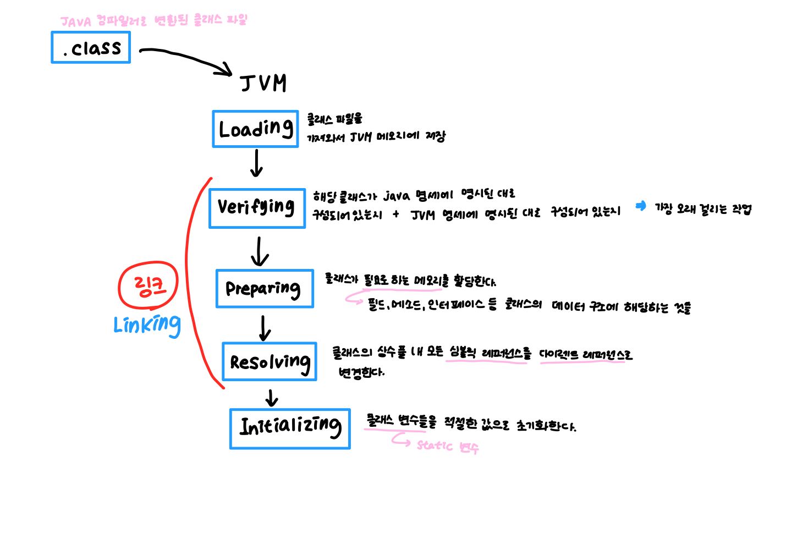

<details>
    <summary><b>Java 의 장단점에 대해 설명해주세요.</b></summary>

## 장점

- 운영체제에 독립적이다.
    - JVM에 의해 자바로 작성된 프로그램을 어디서든 실행 가능하다.
- 객체지향 언어이다.
    - 다형성, 상속 등의 객체 지향 개념을 통해 재사용성, 확장성이 높은 코드 작성이 가능하다.
- 언어를 사용해온 시간이 길고 자료가 많다.
    - 많은 개발자들이 오랜 기간동안 개발에 사용한 언어인 만큼 찾아볼 수 있는 자료가 많고 커뮤니티가 활발하다.
    - 많은 오픈 소스가 만들어지면서 이를 통해 많은 사람들이 쉽고 빠르게 개발이 가능해졌다.
- 멀티스레드 구현이 쉽게 가능하다.
    - 많은 라이브러리를 통해 멀티스레드 구현이 쉽다.
    - 운영체제에 독립적이어서 더욱 쉽게 할 수 있다.

## 단점

- 속도가 비교적 느리다.
    - 한번의 컴파일로 기계어로 변환되는 C, C++과는 다르게 한번의 컴파일이 아닌, JVM이 해석하고 실행하는 과정이 필요하기 때문에 확실히 속도는 느리다.
    - JIT 컴파일러의 도입으로 C, C++의 속도와 거의 비슷하게 개선되었다.
- 예외 처리가 불편하다.
    - 예외를 개발자들이 **직접** 처리해줘야 한다. 이를 해주지 않으면 컴파일 에러가 발생하여 프로그램이 실행되지 않는다.
</details>

---

<details>
    <summary><b>Java 의 데이터 타입에 대해 설명해주세요.</b></summary>

# Java의 데이터 타입

### 기본 데이터 타입

| 타입 종류 | 이름      | 크기     |
|-------|---------|--------|
| 정수형   | byte    | 1 byte |
|       | short   | 2 byte |
|       | int     | 4 byte |
|       | long    | 8 byte |
| 실수형   | float   | 4 byte |
|       | double  | 8 byte |
| 논리형   | boolean | 1 byte |
| 문자형   | char    | 2 byte |
- 기본 데이터 타입은 메모리의 Stack 영역에 저장된다.
- 기본값이 존재하며 null 값을 가질 수 없다.
- 운영체제에 독립적인 언어이기 때문에 기본 타입의 크기가 운영체제에 따라 달라지지 않는다.
- 기본 데이터 타입의 크기를 벗어나는 값을 할당할 경우 컴파일 에러가 발생한다.

### 레퍼런스 타입

- 위의 8가지를 제외하고 모두 레퍼런스 타입이다.
- 보통 클래스, 인터페이스, 배열, Enum을 저장하기 위한 용도로 사용된다.
- Heap 영역에 값이 저장된 곳의 주소값을 Stack 영역에 저장한다.
- 기본값이 없고, 빈 객체라는 표현으로 null 값을 가질 수 있어 NullPointException이 발생할 수 있다.
</details>

<details>
    <summary><b>Wrapper 클래스와 Boxing, Unboxing 에 대해서 설명해주세요.</b></summary>

# Wrapper 클래스

기본 데이터 타입을 객체로 다루어야 하는 상황에 사용하기 위해 만들어진 것으로 Integer, Chracter 등 기본 데이터 타입의 객체 타입을 통칭하여 Wrapper 클래스라고 부른다.

Wrapper 클래스는 기본 데이터 타입과 다르게 연산에 사용되지 않으며 값을 생성하고 객체가 가진 값을 참조할 수만 있다.

## Boxing

- 기본 객체 타입을 Wrapper 클래스로 변환하는 과정을 말한다.

## Unboxing

- Wrapper 클래스를 기본 객체 타입으로 변환하는 과정을 말한다.

보통 위의 두가지 과정을 클래스의 static 메소드를 통해 수행했지만, JDK 1.5부터 Boxing과 Unboxing 과정을 자동으로 처리해준다. 이것을 통해 기존의 조회만 가능했던 점을 극복하여 연산에도 활용할 수 있게 되었다.
</details>

---

<details>
    <summary><b>Java는 Call by Value인가요 Call by Reference인가요?</b></summary>

# Call By Value vs Call By Reference

## Call By Value

- 메소드를 호출할 때 전달되는 인자에 값이 복사되어 전달된다.
- 메소드에 전달된 인자는 바깥의 변수와 **완전히 서로 다른 변수**로 존재한다.
- 따라서 메소드 내부에서 값이 변경되어도 외부의 변수에 전혀 영향을 주지 않는다.

## Call By Reference

- 메소드를 호출할 때 전달되는 인자에 레퍼런스가 담겨 전달된다.
- 메소드에 전달된 인자와 바깥의 변수가 같은 레퍼런스를 가리키게 된다.
- 따라서 메소드 내부에서 값이 변경되면 외부의 변수도 동일하게 변경 사항이 반영된다.

## Java는 무슨 방식을 사용하나요?

Java는 항상 Call By Value로 작동한다.

1. 원시 타입의 경우

    ```java
    public class PrimitiveClass {
    
    	public void sum(int a, int b){ // 동일한 이름이지만 PrimitiveClass의 멤버 변수와 완전히 다른 변수
    		a += b;
    	}
    
    	public static void main(String[] args){
    			int a = 1;
    			int b = 2;
    
    			sum(a, b);
    
    			System.out.println("a : " + a);
    			System.out.println("b : " + b);
    	}
    }
    ```

   **실행 결과**

    ```
    a : 1
    b : 2
    ```

2. 레퍼런스 타입의 경우

    ```java
    public class User{
    	String name;
    
    	public User(String name){
    		this.name = name;
    	}
    
    	public String getName(){
    		return this.name;
    	}
    }
    
    public class ReferenceClass {
    
    	public void changeUser(User a){ // 동일한 이름이지만 ReferenceClass의 멤버 변수와 완전히 다른 변수
    		a = new User("kim");
    	}
    
    	public static void main(String[] args){
    			User a = new User("lee");
    
    			changeUser(a);
    
    			System.out.println("a name : " + a);
    	}
    }
    ```

   **실행 결과**

    ```
    a name : lee
    ```

   **🤔  reference를 전달하는데 왜 call by value 인거지?**

   위에 주석으로 적어놓은 것과 동일하게 현재 `changeUser` 라는 메소드에 인자로 전달되는 `a` 라는 변수는 `ReferenceClass` 가 멤버로 가진 `a` 변수와 서로 다른 변수이다.

   `changeUser`가 사용하게 될 `a`라는 변수에 User 인스턴스의 **주소값**이 복사되어 들어가게 되고, lee 라는 이름을 가진 객체에 접근이 가능하게 된다.

   하지만 완전히 다른 변수이기 때문에 a에 완전히 다른 새로운 인스턴스가 할당되게 되면 더이상 changeUser에서는 ReferenceClass의 멤버 변수 a에 접근이 불가능하다. 왜냐하면 주소값이 사라져버렸기 때문이다.

   즉, 주소값을 복사해서 전달한 것이지 레퍼런스를 그대로 전달한 것이 아니기 때문에 메소드 내에서 값이 변경되어도 기존의 값이 변경되지 않고 나오게 되는 것이다.


따라서, 자바는 항상 Call By Value로 작동하는 것을 확인할 수 있다.
</details>

---

<details>
    <summary><b>Java 의 접근제어자는 어떤 것이 있나요?</b></summary> 

# Java의 접근 제어자

| 종류        | 설명                                                                            | 접근 가능 범위                   |
|-----------|-------------------------------------------------------------------------------|----------------------------|
| private   | 그 어떤 외부 클래스에서도 접근이 불가능하며 동일한 클래스 내에서만 접근 및 사용이 가능하다.                          | 동일한 클래스 내                  |
| public    | 어디서든 접근이 가능하다.                                                                | 모든 패키지                     |
| protected | 같은 패키지에 존재할 경우 접근이 가능하며, 다른 패키지에 있더라도 상속 받은 자식 클래스는 접근이 가능하다.                 | 같은 패키지 혹은 패키지에 상관 없이 상속 관계 |
| default   | 아무것도 지정하지 않을 경우에 해당되며 같은 패키지 내에 있는 경우에만 접근이 가능하다. 그래서 pakage-private이라고도 부른다. | 같은 패키지                     |
</details>

---

<details>
    <summary><b>클래스, 객체, 인스턴스를 비교해주세요.</b></summary> 

# 클래스

- 객체를 구현하기 위한 설계도 및 틀
- 연관된 변수와 메서드를 가진다.

# 객체

- 소프트웨어 세계에 구현해야할 대상이다.
- 소프트웨어 세계에 구현하고자 하는 대상의 컨셉으로 이를 구현해내기 위해 클래스로 설계도를 만드는 것이다.
  - 그래서 클래스의 인스턴스라고 부르기도 한다.
- oop의 관점으로 클래스 타입으로 선언되었을 때 객체라고 부른다.

# 인스턴스

- 클래스가 소프트웨어 세계에서 구체적으로 실체화 된 것을 말한다.
- 실제로 메모리에 할당된다.
- oop의 관점으로 객체가 메모리에 할당되어 실제 사용될때 인스턴스라고 한다.

# 객체 vs 인스턴스

- 사실 객체는 인스턴스를 포괄하는 개념이다.
- 소프트웨어 세계에 더욱 가까운 개념이 인스턴스이고, 실제 개념에 가까운 것이 객체라고 할 수 있다.
- 코드상으로는 클래스 타입을 사용하여 선언된 것을 객체라고 하며,  객체에 실제 구체적인 구현체가 생성되면 그것을 인스턴스라고 한다.
</details>

---

<details>
    <summary><b>static 키워드에 대해 설명해주세요.</b></summary> 

- 객체 생성 없이도 접근이 가능하도록 만든다.
- static 키워드를 가지면 클래스가 로드되는 시점에 메모리에 적재된다.
- 클래스 로드 시점에 메모리에 적재된 후에 프로그램이 종료될 때까지 유지된다.
- 프로그램이 종료되면서 메모리에서 해제된다.
- GC의 관리 대상에서 제외되기 때문에 무문별한 static 사용은 메모리 낭비를 가져올 수 있으니 신중히 고려해야한다.
</details>

<details>
    <summary><b>static 멤버와 non-static 멤버는 무슨 차이가 있나요?</b></summary> 

## static 멤버 vs non-static 멤버

### static 멤버

- 객체 생성 없이 접근이 가능하다.
- JVM의 Runtime Data Area 중 Method Area에 들어간다.
- 컴파일 시점에 메모리에 적재되어야 하므로 정적 바인딩에 해당한다.
- static 멤버는 클래스 내의 non-static 멤버를 참조 할 수 없다.
- 클래스 당 하나로 관리된다.

### non-static 멤버

- 객체를 인스턴스로 생성하고 인스턴스를 통해 접근이 가능하다.
- non-static 멤버는 static 멤버를 참조 할 수 있다.
- 런타임 시점에 동적으로 할당되기 때문에 동적 바인딩에 해당한다.
- 생성된 인스턴스 별로 heap 영역에 객체와 함께 생성된다.


> 🚨 **클래스의 인스턴스 메소드는 객체별로 생성되지 않는다.**
> 
> 인스턴스 메소드는 메모리에 한 번 할당되고, 각 생성된 객체들은 그 메소드가 어디에 있는지 알고 있는 상태로 존재한다. 객체가 메모리의 주소를 알고 있고, 인스턴스를 통해 메소드를 호출할 때 알고 있는 메모리 주소를 통해 메소드를 호출하게 된다.

</details>
<details>
    <summary><b>main 메서드는 왜 static 메서드인가요?</b></summary> 

JVM의 실행에서 가장 먼저 호출하는 것이 main 메소드이다. JVM은 클래스의 인스턴스가 생성되지 않은 상태에서 main 메소드를 찾는다.

**따라서 실행 시점에 메모리에 main 메소드가 적재되어 있기 위해서 main 메소드는 static으로 선언된다.**
</details>

<details>
    <summary><b>자바 프로그램 실행 시 static 이 붙은 변수는 어떻게 처리되나요?</b></summary>

클래스 로더에 의해 static 키워드를 인식하여 클래스 로드 시점에 메모리에 적재합니다. JVM의 Runtime Data Area 중 로드된 클래스들이 저장되는 곳인 Method Area에 static 변수도 같이 적재됩니다. 이때 적재된 static 변수는 클래스 별로 하나만 적재됩니다.
</details>

---

<details>
    <summary><b>오버로딩과 오버라이딩을 비교해주세요.</b></summary> 

## 오버로딩

- 동일한 클래스 내 혹은 상속 관계에서 이루어진다.
- 동일한 메소드 명을 가지면서 전달되는 인자의 타입이나 갯수가 달라야한다.
- 같은 기능을 하는 다른 메소드를 하나의 동일한 메소드로 사용 가능하다.
- 타입 정보가 결정되는 시점에 정적으로 바인딩된다. = 정적 바인딩

## 오버라이딩

- 상속 관계에서만 이루어진다. 동일한 클래스 내에서는 이루어질 수 없다.
- 동일한 메소드 명을 가지면서 전달되는 인자의 타입과 갯수도 동일해야 한다.
- 부모가 가진 기능을 재정의 할 수 있다.
- 상속을 통해 이루어지기 때문에 컴파일 시점에 타입이 결정되지 못하고 동적으로 할당된 객체를 통해 메소드를 호출하기 때문에 오버라이딩은 동적 바인딩이다.
</details>

---

<details>
    <summary><b>인터페이스와 추상클래스를 비교해주세요.</b></summary> 

# 인터페이스

## 인터페이스 정의

- interface 키워드를 사용하여 클래스처럼 선언된 형태이다.
- 상수와 추상 메소드를 가진다.
  - 추상 메소드의 public abstract 키워드는 생략될 수 있다.
  - 상수의 public static final 키워드는 생략될 수 있다.
- 인터페이스는 인스턴스화 할 수 없다.
  - implements 키워드를 사용하여 클래스로 구현하여 인스턴스로 만들 수 있다.
  - 인터페이스를 상속 받은 클래스는 모든 추상 메소드를 반드시 구현해야 한다.

## 인터페이스 목적

- 인터페이스는 추상화와 다형성을 실천할 수 있는 핵심 개념이다.
  - 인터페이스를 통해 기능을 명세할 수 있으며, 즉 기능을 추상화 할 수 있다.
  - 인터페이스를 활용하여 객체를 선언하고 인스턴스를 사용할 때 내부 구현을 고려하지 않고 사용이 가능하다.
- 인터페이스는 서로 연관이 없는 클래스더라도 같은 기능을 동작하도록 보장한다.
  - 상속 받은 서브 클래스가 구현해야 할 메소드들의 원형을 알려주어 서브 클래스들이 모두 동일한 동작을 할 수 있도록 한다.

## 인터페이스의 다중상속

- 인터페이스는 추상 메서드만 가지기 때문에 여러 인터페이스에서 동일한 메소드를 가지고 있어도 실질적인 구현은 구현체에서 하기 때문에 문제가 발생하지 않는다.

> 🚨 **클래스에서 다중상속이 안되는 이유는 ?**
>
> A와 B, C 클래스가 있다고 할 때, C 가 A, B 를 모두 동시에 상속 받았다고 가정하자.
그런데 A와 B에 동일한 형태를 가진 메소드가 있다고 할때, C에서 그 메소드를 사용하게 되면 A, B 어떤 클래스에 속한 메소드를 가져와야 하는지 알 수가 없기 때문에 클래스는 다중 상속이 불가능하다.


# 추상 클래스

## 추상클래스 정의

- abstract 키워드를 사용하여 클래스를 선언한 형태이다.
- 추상 메소드를 가질 수도 있고 가지지 않을 수도 있다.
  - 추상 메소드를 가진다면 반드시 클래스도 추상 클래스로 선언해야 한다.
- 추상 클래스는 인스턴스화 할 수 없다.
  - 아직 구현되지 않은 추상메소드를 갖고 있기 때문이다.
  - 상속을 통해 구현하여 서브 클래스로 인스턴스를 만들 수 있다.

## 추상 클래스의 목적

- 상속을 위한 부모클래스로 활용하기 위한 목적이 있다.
  - 여러 클래스의 공통 기능을  추상화하여 상속 받는 자식 클래스에게 구현의 책임을 위임한다.
- 보통 연관된 클래스 간의 상속 관계에서 기능 확장을 위해 사용된다.
  - 클래스 간의 기능 구현을 각 클래스에게 위임하여 기능을 확장할 수 있다.

## 추상 클래스의 단일 상속

- 추상 클래스는 추상 메소드외에 구현된 인스턴스 메소드도 가질 수 있다. 따라서 클래스의 상속 관계에서 이루어질 수 있는 충돌의 발생 가능성이 있기 때문에 추상 클래스도 다중 상속을 허용하지 않는다.

## 추상 클래스 vs 인터페이스

`공통점`

- 모두 자체만으로 인스턴스화 할 수 없다.
- 추상 메서드를 가질 수 있다.
- 상속을 통해 모든 추상 메서드를 구현해야 하는 강제성을 가진다.
- 모두 다형성을 실현할 수 있다.

`차이점`

- 추상 클래스는 기능을 추상화하여 관련있는 클래스들 간의 기능 확장을 위해 사용되는 반면, 인터페이스는 연관이 없는 클래스더라도 같은 기능을 가진 것을 보장하기 위해 사용된다.
- 추상 클래스는 다중 상속이 불가능 하지만 인터페이스는 다중 상속이 가능하다.
</details>

---

<details>
    <summary><b>Java의 Error, Exception 구조에 대해 설명해주세요.</b></summary> 

# Error

- 주로 자바 가상 머신에서 발생한다.
- Java.lang.Error 클래스의 서브 클래스들로 시스템에 무언가 비정상적인 상황이 발생한 경우에 사용된다.
- 애플리케이션 코드에서 처리할 수 없는 예외이다.
- 대표적으로 StackOverFlowError, OutOfMemoryError가 있다.

# Exception

- 시스템이 아닌 개발자가 작성한 애플리케이션 코드에 의해 발생하는 예외이다.
- java.lang.Exception 클래스의 서브 클래스들인데, Exception을 상속하느냐, RuntimeException을 상속하느냐에 따라 예외 처리 방식이 다르다.
- Exception을 상속 받은 서브 클래스들은 Check Exception 이라고 하며, try-catch, throws를 통해 반드시 예외를 처리해야 하는 강제성을 가진다.
- RuntimeException을 상속 받은 서브 클래스들은 UnChecked Exception 이라고 하며, RuntimeException이 명시적인 예외 처리를 강제하지 않기 때문에 Unchecked Exception은 예외처리가 강제되지 않는다.

</details>

<details>
    <summary><b>CheckedException 과 UncheckedException 은 무슨 차이인가요?</b></summary> 

- Exception을 상속 받은 서브 클래스들은 Check Exception 이라고 하며, try-catch, throws를 통해 반드시 예외를 처리해야 하는 강제성을 가진다.
- RuntimeException을 상속 받은 서브 클래스들은 UnChecked Exception 이라고 하며, RuntimeException이 명시적인 예외 처리를 강제하지 않기 때문에 Unchecked Exception은 예외처리가 강제되지 않는다.

</details>

<details>
    <summary><b>예외처리의 세 가지 방법을 설명해주세요.</b></summary> 

## 예외 복구

예외 상태를 파악한 후에 문제를 해결하여 정상을 돌려 놓는 것이다.

```java
public sendFile(String fileName) {
    File file;
    try {
      file = FileFindService.find(fileName);
    }
    catch (FileNotFoundException e){
      file = FileFindeService.find("defalut.png");
    }

    send(file);
}
```

자주 사용되지 않는 방법이라고 한다. 예외가 발생하면 복구할 수 있는 경우가 거의 없기 때문이다.

예를 들어 유니크해야 하는 이메일 값이 중복되어 SQLException이 계속 발생한다면 RuntimeException을 발생시키고 사용자에게 다시 입력을 유도하는 것이 현명하기 때문이다.

따라서 복구를 해야할 일이 생긴다면 아래 처럼 코드의 흐름으로 제어하는 것이 좋다.

```java
public void sendFile(String fileName){
    if(FileFindService.existed(filename)){ // 파일의 유무에 따라 행동 제어
        send(FileService.find(fileName);
    } else {
        send(FileService.find("default.png");
    }
}
```

## 예외 처리 회피

예외를 직접 담당하지 않고 호출한 쪽으로 던져 회피하는 방법이다.

무작정 예외를 회피하는 것은 무책임한 방법이며, 전달할 객체에게 예외를 반드시 알려야 하는 상황에 사용된다.

```java
public Object someMethod() throws IOException {
    ...
}
```

## 예외 전환

예외 처리 회피와 비슷하게 메소드 밖으로 예외를 던지지만, 적절한 예외로 전환해서 넘기는 방법이다.

보통 예외 처리를 위해 RuntimeException을 상속받은 적절한 예외처리 핸들러를 만들어 그 예외 클래스로 전환하여 던진다.

복구를 위해 Unchecked Exception을 이용하는 방법이다.

```java
public int divide(int num1, int num2){
    try {
        return num1 / num2;
    } catch (ArithemeticException e){
        throw new CalculateException("0으로 나눌 수 없음!");
    }
}

public class CalculateException extends RuntimeException {
    public CalculateException(String message){
        super(message);
    }
}
```
</details>

---

<details>
    <summary><b>final 키워드는 왜 사용할까요? 어떤 이점이 있을까요?</b></summary> 

final 키워드를 선언하게 되면 한번의 초기화 후에 변경할 수 없음을 나타낸다.

# final 선언시 무엇이 달라질까?

## 클래스

클래스 이름 앞에 사용되면 클래스를 **상속 받을 수 없음**을 지정한다.

### 가장 대표적인 final 클래스 = String


> ☁️ Immutable Object : 하나의 인스턴스로 복제하여 공유할 수 있다.


String 클래스는 final로 선언되어 상속이 불가능하다. String의 특성을 잘 생각해보면 이 이유를 알 수 있다.

String 클래스는 String Pool에서 하나의 인스턴스를 공유하는 형태로 사용된다. 즉, 문자열 별로 인스턴스가 만들어지지만 동일한 값을 가진 인스턴스는 생성되지 않고 복제되어 공유된다는 것이다. 그렇기 때문에 String은 불변객체로 만들어져 관리된다.

만약 이렇게 공유되는 String 클래스가 상속이 가능한 형태라면 어떨까? String 을 상속받은 Sub Class가 만들어지고, String pool에서는 String 클래스인지, String 클래스처럼 보이는 Sub Class인지 알기가 힘들다.

따라서 String은 불변 객체이면서 상속이 불가능한 final 클래스로 정의된 것이다.

이런 식으로, 상속을 통해서 확장이 되지 않았으면 하는 클래스에 대해 final 키워드를 사용할 수 있다.

## 메소드

메소드에 선언되면 **오버라이딩 할 수 없는 메소드**임을 선언한다.

만약 상속받은 클래스의 부모 클래스에 final 메소드가 존재하면 오버라이딩 할 수 없으며, 해당 메소드를 상속받아서 사용해야만 한다.

## 필드

필드에 선언되면 **상수**가 된다.

상수 필드는 한번 초기화되면 값을 변경할 수 없으며, public static 키워드와 함께 선언하면 어디서든 사용할 수 있는 전역 상수를 만들 수 있다.

### 기본 데이터타입에 사용

기본 데이터 타입에 사용시 해당 변수의 값 자체가 변하지 않도록 한다.

### 참조 타입에 사용

참조 타입에 사용시 해당 변수가 가진 주소값이 변하지 않도록 한다. 참조하고 있는 주소값에 해당하는 객체의 상태값은 강제할 수 없다.

# final 사용으로 얻는 이점

- 시스템을 통해 변하지 않고 통일성을 유지해야 하는 값이 바뀌지 않도록 강제할 수 있다.
- final 변수로 선언하여 변하지 않는 값을 일관성 있게 사용이 가능하며, 따로 상수를 선언해둘 경우 변경이 용이하다.
- 값이 변경되지 않기 때문에 컴파일러가 효율적으로 코드를 생산할 수 있게 된다.
- 메소드에 사용할 경우, 변경되면 안되는 메소드로 지정이 가능하다.
</details>


<details>
    <summary><b>final, finally, finalize 에 대해 설명해주세요</b></summary> 

## final

- 사용되는 곳에 따라 의미가 다르다.
- 클래스에 사용시 상속이 불가능한 클래스를 만들게 되고, 메소드에 쓰일 경우 오버라이딩이 불가능한 메소드를 만들게 되고, 필드에 사용시 한번의 초기화 이후에 변경이 불가능한 변수임을 의미하게 된다.

## finally

- try-catch 구문에서 try, catch 블록이 실행된 후 마지막에 반드시 실행해야 하는 로직이 있을 경우에 사용할 수 있는 선택적 블럭이다.
- try에서 자원을 사용하게 된 경우에 개발자가 직접 finally를 통해 자원을 해제시킬 때 주로 많이 사용된다.
    - 자원을 사용 후 해제하지 않으면 계속해서 자원이 열려있게 되면서 프로그램에 버그를 만들 수 있다.
- finally 코드로 매번 동일한 코드를 작성하게 되면 가독성을 해치기 때문에 java 7에서 AutoCloseable을 구현한 클래스에 한해 자동으로 자원을 해제하는 문법이 생겼다.

## finalize

- 이것은 메소드로, 가비지 컬렉터가 더 이상 참조가 존재하지 않는 객체를 발견하였을 때 메모리 낭비가 되지 않도록 객체를 삭제하기 위해 호출하는 메소드이다.
- 이 메소드는 Object 클래스 내에 구현되어 있는 메소드로 모든 객체가 가지고 있으며, 객체 삭제 시 추가적인 행위를 주고 싶을 때 오버라이딩 해서 사용도 가능하다.
    - 하지만 가비지 컬렉터가 언제 이 함수를 호출할 지 예상할 수 없기 때문에 중요한 로직은 이곳에 추가하지 않는 것이 좋다.
</details>

<details>
    <summary><b>final 키워드는 컴파일 과정에서 다르게 실행될까요?</b></summary> 

# final 은 컴파일에 어떻게 될까?

- final 값은 컴파일 시에 타입 검사와 접근자를 구분해내고, 문제가 없다면 변수에서 바로 값으로 변경된다. 즉, 변수명으로 작성해 두었던 것들이 모두 값으로 변경된다는 것이다.
- 바로 값으로 변경되기 때문에 변수에 대해 메모리를 할당할 필요가 없으며, 객체가 생성되지 않고 바인딩도 이루어지지 않는다.
</br>(하지만 사용자의 입력이나 난수를 통해 값이 결정되는 경우에는 메모리 공간이 할당되어 값이 초기화 된 후에 메모리에 저장된다. )
</details>

---

<details>
    <summary><b>제네릭에 대해 설명해주세요.</b></summary> 

# 정의

- 모든 종류의 타입을 다룰 수 있도록 일반화된 타입 매개 변수로 클래스나 메서드를 선언하는 기법이다.
- 클래스 내부에서 지정하는 것이 아닌 외부의 사용자에 의해 타입을 지정하는 것을 의미한다.
- 사용자는 필요에 의해 타입을 지정하게 된다.

# 사용방법

### 1. 클래스 및 인터페이스에 선언

```java
public class ClassName<T> { ... }
public interface InterfaceName<T> { ... }
```

- 위와 같이 선언할 수 있으며, 이렇게 선언된 클래스는 객체 생성시 타입을 반드시 지정해줘야 한다.

**주의사항 🔥**

- 제너릭의 타입으로는 참조타입과 사용자 정의 타입만 가능하며 기본 데이터 타입은 사용할 수 없다.
- 제너릭 클래스 내에서는 제너릭 클래스의 인스턴스 생성이 불가능하다.
- 제너릭은 하나가 아닌 두개도 받을 수 있다.

**사용하는 이유**

- 상황에 따라 필요로 되는 데이터 타입으로 클래스를 사용하고 싶은 경우에 사용할 수 있다.

### 2. 제너릭 메서드

```java
public <T> T genericMethodName(T o) { ... }
```

**주의사항 🔥**

- 만약 클래스가 이미 제너릭으로 선언되었더라도 다른 제너릭으로 따로 제너릭 메서드를 생성할 수 있다.

**지정된 클래스의 타입이 아닌 다른 제너릭으로 선언될 수 있는 이유**

클래스 인스턴스는 선언 시 new 생성자로 객체를 생성하고 <> 내부에 구체적인 타입을 전달하여 지정된다. 하지만 우리가 정적 메소드를 선언한다고 가정해보자.

클래스를 로딩하는 시점에 메모리에 정적 제너릭 메소드가 등록되어야 한다. (해당 클래스가 사용중이라면) 하지만 클래스와 동일한 제너릭으로 선언된 상태에서는 타입을 알 수가 없기 때문에 메모리에 등록할 수가 없다. 왜냐하면 new 생성자를 통해 객체의 인스턴스를 생성하지 않았기 때문에 타입이 전달되지 않은 상태이기 때문이다. 따라서 정적 메소드가 호출 시에 타입이 결정될 수 있도록 선언된 클래스와 전혀 다른 제너릭으로 선언되는 것이다.

같은 알파벳을 사용하여 선언한다 하더라도 그것은 같은 제너릭이 아닌 전혀 다른 제너릭으로 존재한다는 사실을 꼭 알고 넘어가야 한다.

### 3. 제한된 제너릭

위에서 소개한 방식은 아주 간단하고 일반적인 제너릭 사용방법이다.

제너릭을 사용하면서 특정 범위를 지정할 수 있는데 사용방법은 다음과 같다.

- <K **extends** T>
- <K **super** T>

**extends**

<K extends T> 는 K가 T이거나 또는 T의 자식인 타입이어야만 한다는 뜻이다. 즉, T를 상속받은 자식 클래스이거나 자기 자신만 타입으로 받을 수 있다는 말이다. 

예를 들어 `ClassName<K extends Number>`로 선언된 클래스가 존재하고 이것의 인스턴스를 생성한다고 할 때, K에 들어갈 수 있는 클래스들은 Number 객체를 상속 받은 Integer, Double 등등이 가능할 것이다. 하지만 Number를 상속받지 않은 String, Character 등의 클래스는 들어가지 못한다. (컴파일 에러가 발생한다.)

**super**

<K super T> 는 K가 T의 부모이거나 조상이어야 또는 자신만 타입이어야만 한다는 뜻이다. 즉, T가 K를 상속 받은 자식클래스이어야 한다는 말이다. 

예를 들어 ClassName<K super Fruit> 이라고 한다면 K는 Fruit이라는 클래스를 상속 받은 타입만을 가질 수 있으며, ClassName을 Fruit으로도 활용 할 수 있게 된다. 즉, `업 캐스팅`이 가능해진다. 더 예를 들어 K가 Fruit을 상속받은 Apple이라고 한다면 우리는 사과라는 필드가 아닌 과일이라는 필드를 가지고 활용해야 할 때도 분명히 존재할 것이다. (과일 목록만 뽑아오고 싶을 때 우리는 사과를 사과가 아닌 과일로 바라보고 싶을 것이다)

super와 extends에서 또 사용할 수 있는 것이 **와일드 카드**이다.

와일드 카드는 어떤 타입이든 상관이 없다는 것을 의미한다. 즉, 자바의 최상휘 클래스의 타입을 상속 받은 것을 받겠다는 것과 동일하다. ( == Object)

그리고 와일드 카드의 특이한 점은 위의 두가지 경우와 다르게 타입을 지정해도 타입 전달이 안된다는 특징이 있다. 따라서 지정된 타입이 없기 때문에 타입을 참조할 수가 없다.

### super와 와일드 카드

우리는 객체간의 비교를 하고 싶을 때가 있을 것이다. 제너릭으로 선언된 클래스를 비교하고 싶을 때는 어떻게 할까?

우리는 보통 객체 비교를 위해 Comparable을 상속받아 비교한다. 그러면 제너릭 클래스인 ClassName에서 Comparable을 구현해보자.

```java
public class ClassName<E extends Comparable<E>> { 
	E element;

	@Override
	public int compareTo(E o){ ... }
}
```

우리는 제너릭 타입을 가진 객체간에 비교를 하기 위해 가지고 있는 멤버들로 비교가 가능하도록 Comparable을 구현하도록 extends를 통해 강제할 수 있다.

즉, 여기서 E extends Comparable<E> 은 E가 Comparable을 반드시 구현해야 한다는 의미랑 동일하다. 왜냐하면 위에서 말했다싶이 extends는 제너릭 타입이 부모 클래스를 상속한 클래스만 올 수 있기 때문이다.

그러면 우리는 우리가 선언한 타입을 가진 클래스를 가지고 객체 간의 비교가 가능해진다. 자 여기서 이런 상황이 된다고 가정해보자.

```java
import java.util.*;

public class Generic {

  public static void main(String[] args){
    SaltClass<Student> saltClass = new SaltClass<>(new Student("name", 15));
  }
}

class SaltClass <E extends Comparable<E>> {
	E member;

  public SaltClass(E member) {
    this.member = member;
  }

  public E getMember(E requestMember){
    member.compareTo(requestMember);
    return this.member;
  }
}

class Person {
  String name;

  public Person(String name) {
    this.name = name;
  }
}

class Student extends Person implements Comparable<Person>{
  Integer age;

  public Student(String name, Integer age) {
    super(name);
    this.age = age;
  }

  @Override
  public int compareTo(Person o) {
    return 0;
  }
}
```

현재 상황은 Student 클래스가 Person을 상속 받은 상태이며 Student는 Comparable을 구현했지만 상위 클래스에 대한 기준으로 구현했다. 하지만 SaltClass는 E 타입을 가지며 E 타입은 Comparable<E>를 구현해야 한다고 정의하고 있다.

하지만 Student는 Comparable<Student>는 구현하지 않았으므로 컴파일 에러를 발생시킨다. 따라서 이런 경우에는 E extends Comparable<? super E>> 라고 표현하여 상위 클래스에 대해서도 구현할 수 있도록 하여, 해당 클래스가 업 캐스팅이 가능하도록 한다. 그러면 하위 클래스로 SaltClass를 선언해도 Person 즉, 상위 클래스에 구현이 되어 있으므로 Comparable<? super E> 에서 납득이 가능하다.

따라서 Student를 사용해서 정렬을 해도 Person을 사용해서 정렬을 해도 문제가 없게 되므로, Comparable<E>를 사용하는 것보다 훨씬 안정적이고 유연한 개발이 가능해진다.

**변경한 코드**

```java
import java.util.*;

public class Generic {

  public static void main(String[] args){
    SaltClass<Student> saltClass = new SaltClass<>(new Student("name", 15));
  }
}

class SaltClass <E extends Comparable<? super E>> { 
  E member;

  public SaltClass(E member) {
    this.member = member;
  }

  public E getMember(E requestMember){
    member.compareTo(requestMember);
    return this.member;
  }
}

class Person {
  String name;

  public Person(String name) {
    this.name = name;
  }
}

class Student extends Person implements Comparable<Person>{
  Integer age;

  public Student(String name, Integer age) {
    super(name);
    this.age = age;
  }

  @Override
  public int compareTo(Person o) {
    return 0;
  }
}

```

[레퍼런스](https://st-lab.tistory.com/153)
</details>

---

<details>
    <summary><b>리플렉션이 무엇이고, 언제 활용 가능한지 설명해주세요.</b></summary> 

# 정의

자바에서 이미 로딩이 완료된 클래스에서 또 다른 클래스를 동적으로 로딩하여 생성자, 멤버 필드, 그리고 멤버 메소드 등을 사용할 수 있도록 하는 기법이다.

# 사용하는 이유

- 실행 시간에 (런타임에) 다른 클래스를 동적으로 로딩하여 접근하고자 할 때 클래스의 구조, 멤버 필드, 메소드 정보를 가져오기 위해 사용한다.

⇒ 대표적으로 스프링 프레임워크, 하이버네이트, Jackson 라이브러리에서 사용된다.

# 사용 예시

Jackson 라이브러리의 ObjectMapper를 살펴보자.

### 직렬화

객체를 통해 json문자열을 만드는 과정이다.

이때 바로 리플렉션이 사용되는데, 우선 json 문자열을 만들기 위해서는 어떤 필드들이 객체에 존재하는지 알아야한다. 그리고 얻은 필드 정보를 통해서 값들을 가져와야 하는데 이때 클래스의 getter를 통해 가져온다. (이건 정해진 원칙)

Jackson 라이브러는 사용자가 이 라이브러리를 어떤 객체를 사용하여 적용하는지 알 길이 없다. getter를 사용하여 값을 넣을 수 있도록 라이브러리를 만들어 놓은 후에 런타임에 동적으로 json 문자열로 변경하고자 하는 클래스를 읽어와 클래스의 필드 정보와 getter 메소드를 찾는다. 바로 이것이 리플렉션에 해당되는 것이다.
</details>

<details>
    <summary><b>리플렉션의 장단점에 대해 설명해주세요.</b></summary> 

# 리플렉션을 사용하면 좋은 점

- 오브젝트의 이름을 사용하여 확장성 오브젝트들의 인스턴스를 만들어냄으로써 애플리케이션이 외부에서 사용자가 정의한 클래스들을 사용할 수 있게 하는 확장성을 가지고 있다.
- 디버깅과 테스트 도구에서 사용하여 클래스의 private 함수에도 접근이 가능하도록 한다.

# 리플렉션을 사용해서 나쁜 점

- 성능 오버헤드가 발생할 수 있다.
    - 당연히 리플렉션이 있는 것보다 없는 것이 속도가 훨씬 빠르기 때문에 성능에 아주 민감한 코드라면 리플랙션을 사용하지 않는 것이 좋다.
- 캡슐화를 저해시킨다.
    - 리플렉션 기능을 사용하면 private 메소드에도 접근할 수 있기 때문에 여러 부작용이 발생할 수도 있다.
    - 추상화를 깨트릴 수 있기 때문에 플랫폼 업그레이드시 동작이 변경될 수 있다는 우려가 있다.
</details>

---

<details>
    <summary><b>자바의 직렬화와 역직렬화에 대해 설명해주세요.</b></summary> 

# 직렬화

- 메모리에 담겨있는 자바의 객체를 외부의 자바 시스템에서도 사용할 수 있도록 바이트(byte) 형태로 변경하는 기술

## 직렬화가 필요한 이유

- 디스크에 저장하거나 네트워크로 통신할 경우 값 형식의 데이터만 가능한데, 메모리에 있는 것은 힙에 할당되어 있는 주소 값을 가지고 있기 때문이다.
- 주소값에 해당하는 곳에 있는 객체의 정보를 뽑아 값 형식 데이터로 변경해줘야 하는 과정을 거쳐야한다.

## 자바의 직렬화 조건

- java.io.Serializable 인터페이스를 구현한 객체여야 한다.

## 자바 직렬화 방법

- java.io.ObjectOutputStream 을 이용한다.

# 역직렬화

- 바이트(byte) 형태로 존재하는 값 형식의 데이터를 메모리에 넣기 위해 다시 객체의 형태로 변경하는 기술

## 역직렬화의 조건

- 직렬화 대상이 된 객체의 클래스가 클래스 path에 존재해야 하고 import 되어 있어야 한다.
- 자바 직렬화 대상 객체는 동일한 serialVersionUID를 가지고 있어야 한다.

### serialVersionUID

- 직렬화 대상 객체가 가지는 값으로 직렬화 대상 객체는 동일한 serialVersionUID를 가져야한다.
- 이 값을 따로 선언해주지 않으면 클래스의 구조 정보를 이용하여 해시값이 자동으로 생성되기 때문에 클래스의 구조가 달라지면 이 값도 달라진다.

## 자바 역직렬화 방법

- java.io.ObjectInputStream 을 이용한다.

# 자바의 직렬화와 역직렬화를 사용하는 이유

- 자바 시스템 개발에 최적화되어 있다.
- 복잡한 데이터 구조이더라도 직렬화 기본 조건만 지키면 쉽게 직렬화, 역직렬화를 수행할 수 있다.
- 데이터 타입이 자동으로 맞춰져 역직렬화가 되면 기존 객체처럼 바로 사용 가능하다.

# 자바 직렬화의 단점

- 타입 체크가 엄격하다.
  - 객체의 변수명은 같은데 변수의 타입이 달라지면 타입 예외가 발생한다.
- 용량 문제
  - 아주 간단한 객체의 내용도 용량 차이가 크게 발생하기 때문에 JSON과 같은 경량화된 형태로 직렬화 하는 것이 좋다.

# 직렬화 할 때의 주의사항

- 긴 만료시간을 가지는 데이터는 JSON 등 다른 포맷을 사용하여 저장한다.
- 자주 변경되는 비즈니스적인 데이터에 대해서는 자바 직렬화 사용을 지양하는 것이 좋다.
</details>

<details>
    <summary><b>자바의 직렬화는 언제, 어디서 사용되나요?</b></summary> 

## 자바의 직렬화를 사용하는 예시 = 캐시

- Encached, Redis 등의 라이브러리 시스템에서 캐시 할 부분을 자바 직렬화된 데이터를 저장하여 사용한다.
</details>

---

<details>
    <summary><b>자바의 Synchronized 키워드를 설명해주세요.</b></summary>

## 임계영역 활용

- 임계영역은 `synchronized` 키워드를 사용하여 지정할 수 있다.
- 임계영역은 공유 자원에 단 하나의 스레드만 접근하도록 Lock을 사용하여 제한하는 방법이다.
- 메소드와 코드 블럭에 지정할 수 있으며, 지정된 영역에 들어갈 때 lock이 걸리고, 빠져나올 때 lock이 해제되는 과정이 컴파일에 의해 자동으로 수행된다.

### 1. 메소드 전체를 임계영역으로 지정

- 메소드의 전체가 임계 영역으로 지정되어 해당 메소드가 호출되면 자동으로 동기화된다.
- 하나의 스레드가 해당 메소드를 호출해서 실행하고 있다면 다른 스레드가 호출할 경우 먼저 호출하여 실행되고 있는 스레드가 해당 메소드를 빠져나올 때까지 대기해야 한다.

```java
public synchronized method1(String parameter){ ... }
```

- 메소드 전체가 임계영역이 되는 경우 메소드를 소유한 객체 전체가 lock에 걸리게 된다.
    - 함수 전체에 lock이 걸리는 것 뿐만 아니라 객체에도 lock이 걸리게 되어 가장 무식한 방법이라고 불리기도 한다.

🚨 **static 메소드에서 synchronized 키워드 사용**

- static 메소드는 객체가 생성되지 않은 상태에서 호출되어야 하기 때문에 객체를 대상으로 Lock을 거는 것이 아닌 class 를 대상으로 lock을 건다.
- static 메소드와 인스턴스 메소드를 혼동하여 동기화를 사용할 경우?

```java
public synchronized instanceMethod(String one){ ... }

public static synchronized staticMethod(String two){ ... }
```

- 두 종류의 메서드에 혼동해서 사용할 경우 **동기화가 잘 지켜지지 않는다.**
- 왜냐하면 static 메소드는 class를 단위로 동기화를 하지만 인스턴스 메소드는 객체를 기준으로 동기화를 진행하기 때문에 개발자가 원하는대로 동기화가 진행되지 않을 수 있는 것이다.
- 따라서 두 메소드에 혼동으로 synchronized 키워드를 사용하는 것은 지양해야 한다.

### 2. 코드 블록을 임계영역으로 지정

- 동기화가 필요한 부분에만 지정해주는 방식이며, 메소드 전체에 동기화를 거는 방법 대신에 사용될 수 있다.
- 코드 블록에 대해서만 동기화가 진행되기 때문에 메소드 내의 다른 부분은 동기화를 지원하지 않는 코드를 작성해야 한다.

> ❌ 주의해야할 점
코드 블럭을 사용하면서 lock을 지정할 대상을 인자로 전달해야 하는데, 이때 this 키워드로 전달하게 되면 메소드 전체를 임계영역으로 지정하는 것과 동일하기 때문에 지양하는 것이 좋다.
>
</details>

<details>
    <summary><b>동기화와 비동기화의 차이를 설명해주세요.</b></summary> 

# 동기화

- 한 자원에 동시에 접근하는 것을 제한한다.
- 여러 스레드가 같은 프로세스 내의 자원을 공유하면서 서로 다른 작업에게 영향을 줄 때 동기화가 필요하다.
    - 시간적인 동기화가 필요한 곳에 많이 사용된다.
- 순차적으로 진행되어 다음 실행될 명령이 현재 실행 중인 명령이 종료될 때까지 대기해야 한다.
- Java에서는 synchronized 키워드를 사용할 수 있고, 더 다양한 방법들이 있다.

# 비동기화

- 현재 실행중인 명령이 종료되지 않아도 다음 명령을 실행할 수 있는 환경이다.
- callback 함수를 통해 결과를 확인할 수 있다.
- 대표적인 예로 Ajax와 Thread가 있다.
</details>

<details>
    <summary><b>동시성 문제가 무엇인가요? 자바에서 동시성 문제를 해결할 수 있는 방법이 있을까요?</b></summary> 

# 동시성 문제란

동일한 자원에 대해 여러 스레드가 동시에 접근하면서 발생하는 문제이다.

동시성 문제는 보통 지역 변수에서는 발생하지 않는다. 지역 변수는 스레드마다 각각 다른 메모리 영역에 할당되기 때문이다.

그래서 보통 동시성 문제가 발생하는 곳은 인스턴스 필드 또는 static 같은 공용 필드에 접근할 때 발생한다.

읽기만 하면 사실 문제가 없지만 값에 접근하여 변경하는 경우에 발생한다.

## 동시성 문제 해결방법

### ThreadLocal 사용

해당 스레드만 접근할 수 있는 개인 저장소를 사용하여 여러 스레드가 동시에 접근하는 것이 아닌 스레드마다 각 저장소를 만들어서 해결한다.

하나의 값으로 관리할 필요 없이 사용자 별로 값을 할당해주는 경우에 사용할 수 있다.

### Synchronized 키워드 사용

메소드 혹은 블럭에 lock을 걸러 동시에 접근할 수 없도록 하여 막을 수 있다.

스레드의 개수가 많을 경우 혹은 로직이 복잡할 경우에는 스레드의 대기시간이 오래 결리면서 지연이 발생할 수 있다.

### volatile 키워드 사용

공유 자원에 접근하면서 주의 할 점이 CPU 메모리 영역에 데이터를 캐싱하면서 동기화가 이루어지지 않는 문제인데, 캐시를 사용하지 않도록 명시하는 volatile 키워드를 사용하여 메모리에 직접 접근하여 데이터를 다루도록 변경하여 해결할 수 있다.

### Atomic 클래스 사용

위의 경우들로도 동시성 문제를 완벽하게 해결할 수 없기 때문에 비-원자적 연산에서도 동기화를 빠르게 쉽게 할 수 있는 클래스를 자바에서 제공하고 있다. 그것이 바로 Atomic 클래스이다.
</details>

<details>
    <summary><b>Thread Local에 대해 설명해주세요.</b></summary> 

# ThreadLocal 정의

- 각 스레드가 자신만의 전역 변수를 만들어 사용할 수 있는 기능을 제공한다.
- thread 안에서 파라미터 또는 리턴 값으로 정보를 제공하는 것이 아닌, 다른 방법으로 thread 안에서의 값을 공유하는 방법을 제공한다.
- stack 영역에 변수를 선언하는 것에 대한 단점을 개선해준다.
- **thread 정보를 key로 하여 값을 저장해두는 Map 구조를 가지고 있다.**

# ThreadLocal 사용방법

- ThreadLocal에도 static, final 키워드를 사용할 수 있다.
- static 키워드가 붙으면 전역 변수, 안붙으면 스레드-인스턴스 당 사용할 수 있는 개념으로 생성된다.
  - 하지만 non-static의 경우 스레드 로컬의 목적과 설계 의도와는 거리가 멀어진다.

## set(), get()

- set() : 스레드 로컬에 값을 저장하는 메서드
- get() : 스레드 로컬에 저장된 값을 가져오는 메서드

## withInitial()

- 스레드 로컬 변수를 생성하면서 특정 값으로 초기화하는 메서드이다.

```java
public static <S> ThreadLocal<S> withInitial(Supplier<? extends S> supplier) {
    return new SuppliedThreadLocal<>(supplier);
}
```

## remove()

- 스레드 로컬 변수의 값을 삭제하는 메서드이다.
- 스레프 풀을 사용하는 환경에서는 스레드 로컬 변수 사용이 끝났다면 명시적으로 remove 메소드를 호출해야 한다.
  - 스레드가 재활용되면서 이전에 실행했던 스레드 로컬 정보가 남아있을 수 있기 때문이다.

# ThreadLocal의 활용

- 클라이언트 요청에 대해 각각의 스레드에서 처리할 때, 스레드 독립적으로 처리해야하는 데이터 (예를 들어, 인증 관련 처리) 에서 활용될 수 있다.
</details>


---

<details>
    <summary><b>자바의 어노테이션에 대해 설명해주세요.</b></summary> 

# Annotation

애너테이션은 주석이라는 뜻으로 코드에 대한 메타데이터를 코드에 직접적으로 기술할 수 있게 한다.

- 메타데이터 : 자신의 정보를 담고 있는 데이터

즉, 애너테이션은 코드 메타데이터로, 코드 자신에 대한 정보를 담는다.

이를 통해 컴파일러에게 필요한 정보를 제공하거나, 런타임 시에 필요한 처리를 제공하거나, 필요한 코드를 작성해주는 역할 들을 수행한다.

## Annotation 특징

- 패키지, 클래스, 메서드, 변수, 파라미터에 사용할 수 있다.
- 애너테이션이 적용된 코드는 직접적으로 애너테이션 코드를 실행하여 영향을 주는 것이 아닌, 단어 뜻대로 “주석”으로써의 데이터를 제공한다.
- 런타임중에 필요한 값으로 돌아가는 코드를 가질 수 없으며, 완전히 정적인 코드만 가질 수 있고, 컴파일 시간에 해석되어야 한다.

## 자바의 대표적인 Built-in Annotation

### @Override

- 메서드에 붙이며, 해당 함수가 부모 클래스의 메서드를 재정의한 메서드인지 명시한다.
- 재정의가 아닌 경우에 대해 체크할 수 있다.

### @FunctionalInterface

- 자바 8 버전에서부터 나온 것으로 함수형 인터페이스와 같이 나왔다.
- 해당 인터페이스가 함수형 인터페이스임을 알려준다. 만약 아니라면 에러가 나타나도록 한다.

## Annotation을 사용하면 좋은 점

- 코드량이 감소하고 유지보수하기 쉬우며 생산성이 증가된다.
- 비즈니스 로직에 영향을 주지 않으면서 부가적인 설정을 간편하게 할 수 있어서 Spring에서 많이 사용한다.

## Lombok을 사용하지 않은 이유

lombok은 주로 객체를 생성하거나 객체의 속성에 접근하는 코드를 제공하는 어노테이션들을 가지고 있습니다.

롬복을 사용하게 되면 이러한 코드들이 명시적으로 존재하지 않게 됩니다. 물론 코드 작성을 줄여주어 생산성은 높일 수 있지만, 숨겨진 코드들로 인하여 문제가 발생하면 찾기가 매우 어려워진다는 단점이 있습니다.

저는 이러한 문제를 해결하는데에 쓰는 리소스를 줄일 수 있게 하기 위해 롬복 사용을 지양해왔습니다.
</details>

---

<details>
    <summary><b>자바 8에 추가된 기능들에 대해 간단히 설명해주세요.</b></summary> 

자바 8부터는 프로그램을 더 효과적이고 간결하게 구현할 수 있는 새로운 개념과 기능을 제공한다.

# 추가된 주요 기능 3가지

### Lambda

- 함수형 프로그래밍을 수행할 수 있는 함수 표현 방식이다. 이를 통해 함수를 값으로 표현이 가능해졌다.

### Stream API

- 병렬 연산을 지원하는 API로 연속된 요소들에 파이프라인을 구축하여 쉽게 작업을 처리할 수 있도록 하는 기능들을 제공한다.

### 디폴트 메소드

- 이미 모두 구현되어 있는 인터페이스에 변화가 발생하거나 추가적인 업데이트가 있을 경우, 해당 인터페이스를 구현하고 있는 모든 구현체들을 변경해줘야 하는 번거로움이 생긴다.
- 그래서 자바는 인터페이스를 쉽게 바꿀 수 있도록 해주는 디폴트 메서드를 지원한다.
</details>

<details>
    <summary><b>Stream에 대해 설명해주세요.</b></summary> 

# 스트림의 등장 배경

- 대부분의 자바 어플리케이션에서 컬렉션이 많이 사용되는데, DB의 질의처럼 선언형으로 컬렉션을 다룰 수 있는 방법이 없었다.
- 성능을 높이려면 멀티코어 아키텍처를 활용하여 병렬로 컬렉션 요소를 처리해야 한다.
  - 하지만 병렬 처리를 구현하는 것은 너무 어렵고 복잡하다.

이러한 점 때문에 등장하게 된 것이 바로 스트림이다.

# 스트림

- 데이터 처리 연산을 지원하도록 소스에서 추출된 연속된 요소라고 할 수 있다.

### 연속된 요소

- 컬렉션과 비슷하게 스트림도 특정 요소 형식으로 이루어진 연속된 값 집합의 인터페이스를 제공한다.
- 하지만 컬렉션은 데이터에 집중하는 반면, 스트림은 데이터를 사용하여 계산하는 것에 집중한다.

### 소스

- 스트림은 컬렉션, 배열, I/O 자원 등의 데이터 제공 소스로부터 데이터를 소비하는 것이다.
- 정렬된 컬렉션으로 스트림을 생성하면 정렬이 그대로 유지된다.
  - 즉, 스트림의 요소는 리스트의 요소와 같은 순서를 유지한다.

### 데이터 처리 연산

- 스트림은 함수형 프로그래밍 언어에서 일반적으로 지원하는 연산과 데이터베이스와 비슷한 연산을 지원한다.
  - 예를 들어, filter, mpa, match 등의 메소드로 데이터를 조작할 수 있다.
- 스트림 연산은 순차적으로 또는 병렬로 실행할 수 있다.

# 스트림의 중요 핵심 키워드

## 파이프라이닝

- 대부분 스트림 연산은 스트림 연산끼리 연결해서 커다란 파이프라인을 구축할 수 있도록 스트림 자신을 반환한다.
  - 스트림 API의 메서드들이 스트림을 반환하여 스트림 서로가 연결되어 파이프라인을 형성할 수 있도록 한다.
  - 파이프라인은 소스에 적용하는 질의 같은 존재이다.
- 이로 인해 얻는 효과에는 게으름과 쇼트서킷이 있다.

## 스트림 연산

- 연결할 수 있는 스트림 연산을 중간 연산이라고 한다.
- 스트림을 닫는 연산은 최종 연산이라고 한다.

### 중간 연산

- 스트림을 반환하기 때문에 중간 연산을 여러 개 연결하여 질의를 만들어낼 수 있다.

> 중간 연산은 최종 연산을 하기 전까지 아무 연산을 수행하지 않는다.
>
- **즉, 게으름을 가진다.** 중간 연산을 합친 다음에 최종 연산으로 한번에 처리하기 때문이다.
- 그리고 limit이라는 중간 연산을 통해 필요로 되는 요소의 갯수를 줄여 연산을 최적화 할 수 있는 **쇼트서킷 기법**도 사용할 수 있게 되었다.

### 최종 연산

- 최종 연산은 스트림 파이프라인에서 결과를 도출한다.
  - 보통 스트림 이외의 결과를 반환한다.

## 내부 반복

- 반복자를 사용하여 사용자가 직접 명시적으로 요소를 반복하는 컬렉션은 **외부 반복**을 한다고 한다.
- 그에 반해 스트림은 반복을 알아서 처리하고 결과 스트림값을 어딘가에 저장해주는 **내부 반복**을 사용한다.

```java
List<String> names = new ArrayList<>();
for(Dish dish: menu){
		names.add(dish.getName());
}
```

- 위의 코드는 for-each를 사용한 것으로 컬렉션을 반복하는 외부 반복에 해당한다.
  - 명시적으로 요소를 하나씩 가져와 처리하는 것을 말한다.

```java
List<String> names = menu.stream()
							.map(Dish::getName)
							.collect(toList());
```

- 위의 코드는 스트림을 사용한 것으로 요소를 하나씩 가져와서 처리하지 않고 내부적으로 반복을 수행하기 때문에 어떤 작업을 해야하는지만 정의해준 것을 확인할 수 있다.
  - 이것을 통해 작업을 투명하게 병렬로 처리하거나 더 최적화된 다양한 순서로 처리가 가능해지는 장점을 얻는다.
- 외부 반복에서는 병렬성 구현을 개발자가 관리해줘야 하지만 스트림은 스스로 해낸다.
- 이게 바로 스트림과 컬렉션의 큰 차이점이다.

# 스트림의 장점

### 선언형으로 코드를 구현할 수 있다.

- 제어 블록을 사용하지 않고도 동작의 수행을 지정할 수 있다.
- 선언형 코드와 동작 파라미터화를 활용하여 변하는 요구사항에 쉽게 대응할 수 있다.


> ☁️ **동작 파라미터화** : 실행되는 것을 결정하는 시점을 미룰 수 있도록 한다.


### 가독성이 좋아진다.

- 연속적인 요소를 더욱 간결하고 가독성 있게 정리하여 코드로 나타낼 수 있다.

# 스트림의 단점

- 스트림을 잘못 사용하게 되면 고전적인 코드를 사용할 때보다 훨씬 성능이 저하되는 코드를 만들어낼 수도 있다.
</details>

<details>
    <summary><b>Stream과 반복문 for문의 성능차이가 있을까요?
</b></summary> 

# 스트림이 for문에 비해 느린 이유

스트림이 for문에 비해 무조건 성능이 느린 것은 아니다.

for문은 스트림에 비해 오랫동안 다루던 것이기 때문에 최적화가 잘 되어 있다고 한다.

for문을 사용할 경우 성능의 이점을 끌어올 수 있는 경우는 primitive type을 사용하는 경우이다. primitive type의 경우 JVM 상에 stack 영역에 값이 직접 저장되어 있어 값을 불러오는 비용이 거의 들지 않아 성능이 뛰어남을 보인다.

하지만 primitive type이 아닌 wrapped type은 JVM 상의 heap 영역에 실제 값이 저장되고, stack 영역에 주소가 저장되어 주소를 가져와 값을 참조하는 비용이 크기 때문에 for문의 최적화 이점이 사라지게 된다.

만약 순회하는 비용보다 순회를 통해 하나하나를 계산하는 비용이 훨씬 높은 경우라면, stream을 사용하는 것이 for 문을 사용하는 것보다 속도 손실이 없는 것을 확인할 수 있다.
</details>

<details>
    <summary><b>Stream에서 사용할 수 있는 함수형 인터페이스에 대해 설명해주세요.</b></summary> 

# 함수형 인터페이스

- 제네릭을 타입 파라미터로 가지며, 단 하나의 추상 메서드를 가진 인터페이스이다.
    - 다수의 디폴트 메소드가 있어도 추상메소드가 하나만 있으면 상관없다.
    - 이후 이 하나의 추상 메소드는 함수형 인터페이스의 구현체인 람다 함수를 실행시킬 메서드에 해당한다.
- `@FuntionalInterface` : 어노테이션이 붙어있으면 추상 메소드가 두 개 이상이 될 경우 컴파일 에러를 발생시킨다.
- 반드시 타입을 선언해야 하는 자바 언어의 특성 때문에 인터페이스를 익명 구현 객체 타입으로, 그리고 그 함수를 해당 인터페이스 타입으로 받을 수 있도록 구현되었다.

  🤔 **왜 타입으로 사용이 가능한가?**

    - 추상 메소드를 단 하나만 가지고 있기 때문에 다른 인터페이스 혹은 클래스와 겹치는 경우가 존재하지 않아 타입으로 추정이 가능한 것이다.
- 추상 메서드를 구현한 메소드의 전체 표현식을 함수형 인터페이스의 인스턴스로 취급할 수 있다.

## 함수형 인터페이스가 도입되기 전의 자바

- 자바는 완전한 명령형 프로그래밍이었다.


> ☁️ **명령형 프로그래밍** : 클래스에서 메서드를 정의하고, 필요할 때 그 메서드를 호출하는 명령을 통해 동작하는 방식


- **함수형 프로그래밍**은 선언적 프로그래밍으로 데이터가 입력으로 주어지고 데이터가 처리되는 과정을 정의하는 것을 통해 동작하는 방식이다.
- 함수형 인터페이스를 통해 자바는 함수형 프로그래밍이라는 특징도 얻게 되었다.

### 함수형 프로그래밍의 조건

- **순수 함수**: 같은 입력 시 같은 출력을 보장한다.
- **고차 함수**
    - 함수의 인자로 함수를 전달할 수 있다.
    - 함수의 리턴값으로 함수를 사용할 수 있다.
- **익명 함수**이다.
- **합성 함수**이다.
    - 새로운 함수를 생성해내거나 어떤 계산을 수행하기 위해 둘 이상의 함수가 결합되는 것이다.
    - 자바에서는 **메소드 체이닝**으로 합성 함수를 만들 수 있다.

### 함수형 프로그래밍의 특징

- **불변성**: 상태를 변경하지 않는다.
    - 함수를 통해 상태가 변경되면 앞서 말한 조건 중 순수성을 만족하기가 어렵다.
- **참조 투명성**
    - 프로그램의 변경 없이도 어떤 표현식을 값으로 대체할 수 있다.
- **일급 함수**를 가진다.
    - 함수를 함수의 매개변수로 넘길 수 있다.
    - 함수를 함수의 반환값으로 돌려줄 수 있다.
    - 함수를 변수나 자료구조에 담을 수 있다.
    - 따라서 자바는 Java 8 이후에 객체가 위의 조건들을 만족하는 일급 객체를 사용한다고 할 수 있다.
- **게으른 평가**를 한다.
    - 함수형 언어는 값이 필요한 시점에 평가한다.
    - 함수형 인터페이스는 런타임 시점에 결정된다.
</details>

<details>
    <summary><b>Lambda에 대해 설명해주세요.</b></summary> 

# 람다 표현식

- 인터페이스로 추상화하여 일회성으로 사용할 때에 더욱 간결하게 작성이 가능한 표현 방식이다.
    - 더해서 함수형 프로그래밍을 위해 등장하기도 했다.
- 메서드를 하나의 식으로 표현하는 선언적 프로그래밍 방법이다.
    - 익명 클래스를 이용하여 익명 구현 객체를 사용할 수 있었던 방식을 아주 간결하게 만들어주었다.
- 이름이 없고, 메소드 매개변수, 메소드 바디, 반환 값, 예외 리스트를 가질 수 있다.
- 보통의 메서드와 달리 **메서드가 아닌 함수**이다.
    - 메서드는 클래스에 종속적인 것을 메서드라고 하지만, 함수는 어느곳에 종속적이지 않다.

### 그렇다면 람다의 타입은 무엇인가?

람다의 타입은 그러면 무엇인지, 람다는 어떤 타입의 구현체가 되는 것인지, 람다는 어디에 있는지가 의문이 들 것이다.

이것을 답해줄 수 있는 것이 바로 함수형 인터페이스이다.

함수형 인터페이스가 람다의 타입이 되고, 람다 식이 함수형 인터페이스 구현체의 메소드가 되는 것이다.

## 람다 표현식 사용의 장점

- 기존의 익명 클래스 작성을 더욱 간결하게 해준다.
- 익명클래스에 비해 인스턴스 생성 비용을 절감시킨다.
    - 외부 변수를 참조하지 않아 상태가 존재하지 않는 람다 식의 경우 인스턴스를 하나만 생성하고 그것을 다시 반환하여 인스턴스 생성 비용이 더욱 절감된다.

## 람다 표현식 사용의 단점

- 디버깅이 어렵다.
    - 어디서 문제가 일어났는지 확인하기가 어려울 수 있다.
- 너무 많이 사용하면 오히려 가독성이 떨어질 수 있다.
    - 람다 표현식을 해석해내야 하기 때문에 오히려 더 어려운 코드로 만들 수 있다.
</details>

<details>
    <summary><b>익명 클래스(Anonymous Inner Class)와 Lambda의 차이점을 알고계신가요?</b></summary> 

# 익명 클래스 vs 람다 표현식

- 익명 클래스는 여러 개의 추상 메소드를 가질 수 있지만, 람다 표현식은 함수형 인터페이스에 사용할 수 있기 때문에 단 하나의 추상 메소드만 가질 수 있다.
- 익명 클래스는 컴파일 시 클래스 파일이 생성되지만, 람다 표현식은 클래스가 아닌 메소드로 생성된다.
- 전달받는 인자로 this를 사용할 경우 의미가 다르다.
    - 익명 클래스일 경우 this는 생성된 자기 자신을 가리킨다.
    - 람다 표현식에서 사용할 경우 자기 자신을 포함하고 있는 클래스를 가리킨다.
</details>

<details>
    <summary><b>람다식에서, 외부 변수를 사용할 때 final 키워드를 붙여서 사용하는 이유가 무엇일까요? final을 안 붙여도 되지 않을까요?</b></summary> 

# 람다 표현식에서의 지역변수

람다 표현식에서 접근이 가능한 변수는 3가지가 있다.

- 지역변수(매개변수 포함)
- 인스턴스 변수
- static 변수

만약 다음과 같은 코드가 있다고 가정해보자.

```java
public class VariableCapture {

    List<IntConsumer> intConsumerList = new ArrayList<>();

    public static void main(String[] args) {
        VariableCapture v = new VariableCapture();
        v.run();

        v.intConsumerList.get(0).accept(90);
    }

    public void run() {
        int sum = 10;
        IntConsumer consumer = a -> {
            System.out.println(sum);
            System.out.println(a);
        };
        intConsumerList.add(consumer);
        consumer.accept(4);
    }

    private void count(int i) {}
}
```

이 코드에서 문제점이 보이나요? 사실 코드 상에 문제는 없다.

우리가 알기로는 지역 변수는 메소드의 생명 주기와 동일하게 유지된다. 즉, run() 메소드 내의 sum 변수는 stack 영역에 저장되어 run() 메소드가 실행되는 스레드가 종료되면 할당이 해제된다.

그러면 run() 메소드 실행 이후에 v.intConsumerList.get(0).accept(90); 이 코드에서 sum을 출력하라는 코드는 어떻게 실행이 가능한 것일까?

바로 VariableCapture (변수 캡처)를 통해 이 문제를 해결한다.

변수의 원본 값에 전달하는 것이 아니라 변수 값을 복사해서 전달하는 것을 말한다. 값을 복사해서 전달하기 때문에 당연히 값이 변경되면 애플리케이션에 오류가 발생할 가능성이 매우 크기 때문에 람다에서 사용하는 지역변수는 final로 선언된 변수여야 한다는 제약이 발생한다.

즉, 람다에서는 final로 선언된 지역변수만 사용이 가능한 것이다.

하지만 위에서 코드 자체에는 오류가 없다고 했다. 컴파일러가 final 키워드가 붙지 않아도 에러를 발생시키지는 않지만 지역 변수를 람다에서 활용할 때 값을 변경시키면 에러가 발생한다. 즉, final 변수로 사용해야 함을 알리는 것이다.
</details>


<details>
    <summary><b>Optional에 대해 설명해주세요. Optional을 사용하면 무슨 이점이 있을까요?</b></summary> 

# Optional 정의

null 이라는 값을 가질 수 있는 선택형 값을 캡슐화하는 클래스로 nullpointException을 방지할 수 있도록 도와준다.

# Optional 사용의 이점

- null 참조 대신 값이 없는 상황을 표현할 수 있다.
- 도메인 모델의 의미를 더 명확하게 표현할 수 있다.
  - 값이 없을 수 있다는 의미를 내포하기 때문에 이러한 의미를 대신 전달할 수 있다.
- 값이 없는 상황을 처리하도록 강제할 수 있어, 예상 못한 null 값에 의한 예외를 방지할 수 있다.

# Optional 필드의 직렬화

- Optional은 필드 형식으로 사용되도록 설계된 것이 아니기 때문에 직렬화를 지원하지 않는다.
</details>

<details>
    <summary><b>Optional을 사용하면서 주의해야할 점이 있을까요?</b></summary> 

# Optional 설계 목적

- Optional은 선택형 반환값을 지원하기 위해 생성된 것이다.
- 메소드의 결과가 null 이 될 수 있는 경우, null에 의해 오류가 발생할 가능성이 매우 높을 때에만 반환값으로 사용하도록 권장한다.
  - null을 피하기 위해 사용했지만 값이 없을 때에 접근하면 NoSuchElementException이 발생한다.
  - Optional 변수가 비어있는지에 대해 검사를 진행해야 하기 때문에 코드의 가독성을 떨어트린다.
  - Optional로 값을 감싸는 Wrapper 클래스 이기 때문에 객체를 감싸고 얻는 것에서 비용이 발생한다.
</details>

---

<details>
    <summary><b>Object 클래스의 equals()와 hashcode()는 무슨 역할을 하나요?</b></summary> 

> 🗣️ equals 는 두 객체가 같은 값을 참조하고 있는지의 여부를 반환하는 메소드입니다.
> 즉, 두 객체가 동일한지를 판단하기 위한 용도로 사용됩니다.
> 
> hashCode 는 객체의 주소값을 활용하여 만들어진 고유한 숫자값을 반환하는 메소드입니다. 이 고유값은 Hash 값을 활용하는 Map 구현체에서 객체를 구분하기 위해 사용되고, 그 값을 받기 위해 해당 메소드를 사용합니다.

## equals()
- 두 객체가 같은 주소값을 참조하고 있는지의 여부를 반환하는 메소드이다.
- 두 객체의 참조값을 비교하여 boolean 으로 전달한다.

**❓동일성과 동등성을 비교해주실 수 있나요?**
- 동일성은 두 객체가 같은 주소값을 참조하는지 판단하는 것.
  - 두 객체가 하나의 객체로 간주될 수 있으며, == 연산자로 비교할 경우 true 값을 반환한다.
- 동등성은 두 객체가 같은 내용을 가지는지 판단하는 것.
  - 두 객체가 다른 주소값을 가져도 같은 내용으로 이루어져 있다면 두 객체는 동등하다.

## hashCode()
- 메모리의 주소값을 사용하여 만들어진 고유한 숫자값
- hash 값을 사용하는 Map 클래스들에서 활용된다.
</details>

<details>
    <summary><b>equals()와 hashcode()는 언제 재정의해야할까요? 또, 왜 같이 오버라이딩 하는게 좋을까요?</b></summary> 

> 🗣️ 두 객체의 주소값의 일치 여부가 아닌 두 객체의 동등성을 비교하고 싶은 경우에 재정의합니다.
> 같이 오버라이딩 해야하는 이유는 equals와 hashCode를 같이 오버라이딩 하지 않을 경우 객체가 동일한지 비교할 때 문제가 발생할 수 있기 때문입니다.
> 자바에서는 동일한 객체인 경우 equals의 값이 true이면서 hashCode도 동일한 값을 반환해야 한다고 명세하고 있습니다.
> 따라서 두 객체의 비교가 동일하게 이루어질 수 있도록 두 메소드는 반드시 같이 오버라이딩 해야합니다.

## equals만 재정의 될 경우
- equals 메소드의 값으로는 true가 반환되지만 hashCode로 두 객체가 다른 객체로 인식된다.
  - 자바에서 명세하는 규칙에도 어긋난다.
- hashCode를 사용하여 객체를 구분하는 경우 두 객체가 다르다고 판단할 수 있다.

## hashCode만 재정의 될 경우
- hashCode 상으로 두 객체가 같은 객체이지만 equals로는 두 객체가 다르다는 값을 받을 수 있다.
- Collection에서 hashCode 값을 먼저 판단한 뒤 equals를 통해 중복 검사를 수행하는데, hashCode 값은 같은데 equals가 false가 나오게 되면 객체의 중복 검사가 제대로 수행되지 않는다.

## hashCode 재정의 시 주의사항
- 두 객체를 비교하는 핵심 필드가 빠지면 안된다.
  - 해시 코드를 고르게 분포시켜주는 역할을 하기 때문이다.
- 해시 코드를 만드는 규칙을 API 사용자에게 알리지 않는 것이 좋다.
  - 클라이언트가 이 값에 의존하지 못하게 해야하며, 이후에 로직을 변경할 수 있어야 하기 때문이다.
</details>

<details>
    <summary><b>서로 다른 인스턴스가 같은 hashcode값을 가질 수 있을까요?</b></summary> 

> 🗣️ 네, 가질 수 있습니다.
> 객체 재할당을 할 경우 서로 다른 인스턴스라도 같은 hashCode를 가지게 될 수 있습니다.
</details>


---

<details>
    <summary><b>String 클래스는 final로 선언되어있습니다. 왜 그런걸까요?</b></summary> 

> 🗣️ String 클래스는 상속이 불가능해야하기 때문입니다.
> String은 리터럴로 생성 시 String Constant Pool에 생성되어 관리되는데, 이는 캐싱을 지원하여 기존의 문자열 객체를 반환하여 재사용하는 기능을 제공합니다. 
> 하지만 상속이 가능할 경우 Constant Pool에 담겨있는 같은 문자열 객체가 String 타입인지, String 의 서브 클래스인지 알 수가 없기 때문입니다.

❓ **String 객체가 불변 객체인 이유는 무엇인가요?**
> 캐싱, 보안, 동기화를 위해서이다.
> 
> Constant Pool이 동일한 객체를 반환할 수 있도록 하기 위함이다.
> 
> 보통 민감 정보를 문자열 형태로 다루기 때문에 변경을 금지하여 보안에 취약함을 없애기 위함이다.
> 
> 변경 가능성을 배제하여 멀티 스레드 환경에서 안전하게 사용 가능하게 하기 위함이다.

## String

String 클래스는 **불변 객체**이다.

즉, 위에서 봤던 StringBuffer, StringBuilder와 다르게 할당된 후에 변경할 수 없다.

따라서 String 클래스는 연산에 사용할 경우 많은 시간과 자원이 사용된다.

String 클래스에서 기본으로 제공하는 문자열 연산 메소드들도 존재하지만, 이 메소드들도 결국 새로운 문자열 객체 공간을 할당하여 전달하는 방식으로 작동된다.

### String 클래스가 불변인 이유

- String을 불변으로 만들어서 String pool에 각 리터럴 문자열의 하나만 저장하여 다시 사용하거나 캐싱에 이용 가능하도록 하여 힙 공간을 절약할 수 있도록 하였다.
- 보통 민감 정보가 String 타입으로 전달되는데 문자열의 참조값을 마음대로 변경할 수 있다면 해커가 참조값을 변경할 수 있는 보안 문제가 있어 불변으로 두었다.
- 동시에 실행되는 여러 스레드에서 안정적이게 공유가 가능하도록 하였다.

### 가장 대표적인 final 클래스 = String


> ☁️ Immutable Object : 하나의 인스턴스로 복제하여 공유할 수 있다.


String 클래스는 final로 선언되어 상속이 불가능하다. String의 특성을 잘 생각해보면 이 이유를 알 수 있다.

String 클래스는 String Pool에서 하나의 인스턴스를 공유하는 형태로 사용된다. 즉, 문자열 별로 인스턴스가 만들어지지만 동일한 값을 가진 인스턴스는 생성되지 않고 복제되어 공유된다는 것이다. 그렇기 때문에 String은 불변객체로 만들어져 관리된다.

만약 이렇게 공유되는 String 클래스가 상속이 가능한 형태라면 어떨까? String 을 상속받은 Sub Class가 만들어지고, String pool에서는 String 클래스인지, String 클래스처럼 보이는 Sub Class인지 알기가 힘들다.

따라서 String은 불변 객체이면서 상속이 불가능한 final 클래스로 정의된 것이다.

이런 식으로, 상속을 통해서 확장이 되지 않았으면 하는 클래스에 대해 final 키워드를 사용할 수 있다.

### concat 메소드

- 자체 메모리 영역에서 문자열 데이터를 변경할 수 있는 기능을 제공한다.
- 이 메소드는 호출할 때마다 **원본 문자열을 매번 재구성하는 과정을 거치기 때문에 느리다.**
- 따라서 많은 문자열 연산에 사용하기에 적합하지 않다.

### 불변 객체를 만드는 방법
- 모든 필드를 final로 선언하고, 생성자를 통해 모든 값을 할당 받는다.
- setter를 두지 않는다.
- 방어적 복사를 사용한다.
- Immutable 한 자료형을 사용한다.
</details>


<details>
    <summary><b>String을 new 또는 "" 로 생성했을 때의 차이점을 설명해주세요.</b></summary> 

> 🗣️ 생성되어 저장되는 영역이 다릅니다.
> 
> 리터럴로 생성할 경우 String Constant Pool이라는 공간에 할당되어 관리됩니다. 하지만 new 키워드로 생성할 경우 String 객체가 다른 영역인 Heap 영역에 저장됩니다. 
> 그렇기 때문에 리터럴로 생성할 경우 Constant Pool에 동일한 문자열이 있다면 다시 반환하여 재사용되지만, new 키워드로 생성할 경우 동일한 문자열의 객체가 있더라도 새로 생성되어 반환됩니다.

# new vs “ ”

내부 동작에 차이가 있다.

```java
String s1 = "Hello";
String s2 = "Hello";

String s3 = new String("Hello");
String s4 = new String("Hello");
```

### “” 로 선언하는 경우

s1과 s2의 경우 동일한 문자열로 생성한 String 객체는 동일한 내용일 경우 문자열을 공유한다. ⇒ 따라서 두 개의 문자열의 참조변수를 비교하면 **true** 값이 반환된다.

- 문자열 s1이 생성되고 문자열 s2가 생성할 때 s2에 해당하는 것을 상수 풀에서 찾는다.
- 없다면 상수 풀에 등록하고 해당하는 레퍼런스 값을 반환한다.

### new로 선언하는 경우

s3와 s4의 경우 new 연산자를 통해 생성하여 다른 문자열 객체로 나오게 되어 문자열의 참조변수를 비교하면 **false** 값이 반환된다.

- Heap 영역에 두 개의 인스턴스가 저장되는 것.

### 그래서 차이점은?

“” 로 선언하는 경우 `String Constant Pool` 이라는 `상수풀 영역`에 할당된다.

하지만 new 연산자로 문자열이 생성되는 경우 `Heap 영역`에 할당된다.

따라서 참조값을 통해 비교하면 주소값이 다르기 때문에 **false** 값이 나오게 되는 것이다.

❓ String Constant Pool에 대해 설명해주세요.
> 리터럴로 생성된 문자열 객체가 관리되는 곳으로, java 7 이후로 Heap 영역에 존재합니다. 
> new로 생성하여 저장되는 영역인 Heap과는 다른 영역으로 구분됩니다.
> 동일한 문자열로 생성하고자 하면 새로 생성하는 것이 아닌 해당 문자열 객체를 다시 반환하여 재사용합니다.
> 이는 문자열이 계속 다시 사용될 확률이 높기 때문에 메모리 사용 효율을 높아기 위함입니다.
</details>

<details>
    <summary><b>String, StringBuilder, StringBuffer 를 각각 비교해주세요.</b></summary> 

> 🗣️ 변경 가능성에서 차이가 있습니다.
> 
> 우선 String과 StringBuilder, StringBuffer로 나누어 보면, String 클래스는 생성 후 변경이 불가능하지만, StringBuilder와 StringBuffer는 생성 후에도 변경이 가능합니다.
> 왜냐하면 StringBuilder, StringBuffer 클래스가 문자열 연산을 위해 만들어진 클래스이기 때문입니다. 따라서 String으로 문자열 연산을 하는 것보다 StringBuilder, StringBuffer로 문자열 연산을 수행하는 것이 훨씬 좋습니다.
> 
> 그리고 StringBuilder와 StringBuffer는 동기화 여부에서 차이가 있습니다.
> StringBuilder는 동기화를 지원하지 않고, StringBuffer는 동기화를 진행합니다. 
> 따라서 멀티 스레드 환경에서는 StringBuffer를 사용하는 것이 좋지만, 멀티 스레드 환경이 아니라면 성능상 StringBuilder를 사용하는 것이 좋습니다.

❓ 그럼 언제나 StringBuilder 혹은 StringBuffer를 사용하는 것이 좋은가요?
> 상황에 따라 성능은 다릅니다.
> 
> String + 연산도 사실은 컴파일 시 StringBuilder를 사용하여 연산합니다.
> 만약 문자열의 연산이 아주 빈번하게 일어나는 경우 String의 + 연산자를 사용할 경우 매번 StringBuilder 객체를 새로 생성합니다.
> 따라서 문자열의 연산이 많을 경우 StringBuilder를 생성하는 비용을 줄이기 위해 StringBuilder를 사용하는 것이 좋습니다.
> 하지만 단순 조회 혹은 변경이 아주 적은 경우 String을 사용하는 것이 성능상 더 좋을 수도 있고, 차이가 없을 수도 있습니다.
> 
> 따라서 상황을 보고 적절하게 사용하는 것이 좋습니다.

# String, StringBuilder, StringBuffer

모두 문자열을 다루는 자료형 클래스이다.

하지만 사용 목적에 따라 쓰임새가 많이 달라지게 된다.

## StringBuilder, StringBuffer

문자열을 연산 즉, 추가하거나 변경할 때 주로 사용하는 자료형이다.

### StringBuffer

- StringBuffer 클래스는 **내부적으로 버퍼라고 하는 독립적인 공간을 가지고 있다.**

→ 문자열을 바로 추가할 수가 있어 공간의 낭비도 없고 문자열 연산 속도가 매우 빠르다는 특징이 있다.

- StringBuffer의 버퍼 크기의 기본 값은 **16개의 문자를 저장할 수 있는 크기**이다.

→ 생성자를 통해 크기를 별도로 설정도 가능하다.

- 문자열 연산 중 할당한 버퍼의 크기를 넘게 되면 **자동으로 버퍼를 증가**시키기 때문에 걱정하지 않아도 된다.

→ 하지만 효율이 떨어질 수 있으니 버퍼의 크기는 그때 상황에 따라 적절하게 잡는 것이 가장 좋다.

### StringBuilder

StringBuffer와 동일한 기능을 하는 클래스인데(사용 방법도 동일하다.), 다른 점이 **멀티 스레드 환경에서 안전함의 차이이다.**

StringBuilder는 StringBuffer랑 달리 **멀티 스레드 환경에서 안전하지 않다.** StringBuilder는 **동기화를 지원하지 않기 때문**에 멀티 스레드 환경에서 여러 스레드가 접근할 수 있다.

하지만 StringBuffer는 멀티 스레드 환경에서 동기화를 지원하기 때문에 하나의 스레드가 접근하고 있을 경우 다른 스레드들이 접근할 수 없도록 막는 역할을 수행한다.
</details>

---

<details>
    <summary><b>컬렉션 프레임워크에 대해 설명해주세요.</b></summary> 

> 🗣️ 다양한 자료형을 구현한 라이브러리로 데이터의 집합 및 그룹화와 연산 기능을 제공합니다.
> 컬렉션 프레임워크는 Collection 인터페이스와 Map 인터페이스로 나뉩니다. 
> Collection 인터페이스는 List, Set, Queue 로 확장되며, 데이터의 순서를 다루거나 집합적 개념이 필요한 경우에 사용합니다.
> Map 인터페이스는 key-value 형태로 구성되어 데이터의 검색이 필요한 경우에 주로 사용됩니다.

❓ Iterable 인터페이스에 대해 아시나요?
> Iterable 인터페이스는 Collection 인터페이스 구현체들이 상속받는 데이터 순회용 인터페이스 입니다.
> 
> 말그대로 데이터를 순회하기 위한 기능을 구현하도록 강제하기 위해 사용됩니다. 인터페이스로 사용되지 않으며 각 구현체들이 구현의 책임을 가지고 있습니다.

## 장점

- 제너릭의 타입 파라미터를 사용하여 객체지향적 설계를 통해 표준화되어 있기 때문에, 사용법을 익히기에도 편리하고 재사용성이 높다.
- 데이터 집합에 대한 고성능 연산 기능을 제공하여 프로그램의 성능과 품질을 향상시킬 수 있다.
- 이미 구현되어 있는 API를 사용하면 되기 때문에 사용하기가 편리하고 재사용성이 높다.

## 컬렉션 프레임워크 종류

⇒ **Collection**, **Map**

- Collection 인터페이스와 Map 인터페이스로 나뉜다.
    - Map 자료구조는 Collection 인터페이스를 상속받지는 않았지만 Collection 이라고 통칭하여 부른다.

### Iterable 인터페이스

- 컬렉션 인터페이스들의 가장 최상위 인터페이스이다.
- 자료를 순회할 때 사용하는 인터페이스로 `forEach`, `iterator`, `splierator` 메소드가 있다.
    - forEach는 디폴트 메소드.

> 🚨 Map 인터페이스는 Iterable 인터페이스를 상속받지 않기 때문에 Map 컬렉션에는 구현이 되어 있지 않다.
따라서, Map 컬렉션을 순회하지는 못하고 스트림을 사용하거나, 키를 Collection 으로 반환하여 루프문을 사용하는 식으로 순회를 진행한다.
- 모든 구현체들이 필수로 구현하도록 강제하는 역할로 존재한다.
    - iterator 메소드는 저장된 요소를 읽어오는 것을 표준화하기 위한 것으로, 데이터를 하나씩 읽을 때 사용한다.

### Collection 인터페이스

- List, Set, Queue에 상속하는 실질적인 최상위 컬렉션 타입
- 다형성을 지원하여 업캐스팅으로 다양한 종류의 컬렉션 자료형을 받아 자료를 삽입하거나 삭제, 탐색 기능을 할 수 있다.

  > ❓ 업캐스팅 : 자식 클래스가 부모 클래스 타입으로 캐스팅 되는 것
  ex) List<Integer> list = new ArrayList<>(); → ArrayList가 List로 업캐스팅 됨.
- 요소에 대한 추가, 삭제, 탐색은 다형성 기능으로 사용 가능하지만, 데이터를 get 하는 메소드는 다형성으로 조회하기 까다롭기 때문에 각 구현체 별로 구현되어 있다.

❓ 왜 Map은 Iterable 인터페이스를 상속받지 않는가요?
> 우선 Map 인터페이스 자체가 데이터의 key-value 형태의 모음집으로 데이터의 연속된 집합이라는 Collection 개념과 일치하지 않습니다. 
> 키를 사용하여 데이터를 검색하도록 구현된 Map의 개념은 다르기 때문에 iterable을 상속받지 않습니다.
</details>

---

<details>
    <summary><b>List 인터페이스의 구현체에 대해 설명해주세요.</b></summary> 

> 🗣️ ArrayList, LinkedList, Vector, Stack이 있습니다.
> 
> 모두 리스트의 크기가 가변적이며, 순서가 존재하고, 리스트 사이에 빈 요소를 허용하지 않는다는 공통점이 있습니다.
> 
> ArrayList는 배열을 리스트로 만든 것으로 인덱스를 통해 값에 빠르게 접근할 수 있지만, 
> 요소의 삽입, 삭제 시 배열의 빈 값을 없애기 위해 위치를 이동시키는 과정이 있어 삽입, 삭제가 빈번할 경우 LinkedList에 비해 성능이 떨어집니다.
> 
> LinkedList는 포인터 구조로 구현되어 각 객체의 주소값으로 연결되어 있는 상태로, 삽입, 삭제 시 주소값의 연결을 끊거나 연결해주면 되기 때문에 빠릅니다. 
> 하지만 데이터 조회시 처음 혹은 끝부터 순회해야 하기 때문에 ArrayList에 비해 다소 느립니다.
> 
> Vector는 동기화를 지원하는 ArrayList 입니다. Stack은 Vector를 상속받아 구현된 것입니다.
</details>

<details>
    <summary><b>Array와 ArrayList는 어떤 차이점이 있을까요?</b></summary> 

> 🗣️ 크기 변경과 사용하는 타입에서 차이가 있습니다.
> 
> Array는 선언 및 할당 이후에 크기 변경이 불가능합니다. 하지만 ArrayList는 할당 이후에도 크기가 변경될 수 있습니다.
> 그리고 Array는 기본 타입, Object 타입이 모두 사용 가능하지만 ArrayList는 제네릭으로 구현되어 Object 타입만 사용 가능합니다.

# 배열과 List의 차이점

- 배열은 처음 선언한 배열의 크기를 **변경할 수 없다**. (`정적 할당`), List는 길이가 **가변적**이다. (`동적 할당`)
- 배열은 메모리에 **연속적으로 나열되어 할당**되지만, List는 데이터는 연속되지만 메모리에 **연속적으로 나열되어 저장되지 않는다.**
- 배열은 중간에 데이터를 하나 삭제하더라도 해당 자리를 **빈 공간으로 두지만**, List는 데이터 사이에 **빈 공간을 허용하지 않는다**.

### 언제 배열을, 언제 리스트를 사용하면 좋을까?

- Array는 자바 기본형 타입, Object 타입 모두 사용 가능하지만, ArrayList는 Object 타입만 사용 가능하다.
- 이미 자료의 크기가 일정하게 정해져있는 경우에는 크기 할당에 신경쓰는 수고로움을 없애기 위해 Array를 사용하는 것이 좋다.
    - 하지만 반대로 크기가 정해져 있지 않는 경우에는 미리 메모리를 차지하는 Array보다 ArrayList를 사용하는 것이 좋다.
</details>

<details>
    <summary><b>ArrayList는 내부적으로 어떻게 구현되어있나요?</b></summary> 

> 🗣️ 요소의 개수와 배열의 크기를 비교하여 복사하는 과정을 가집니다. 
> 만약 요소의 개수가 배열의 크기보다 커진다면 키우고, 요소의 개수가 다시 작아졌다면 다시 줄입니다. 
> 그런 후 기존 배열을 새롭게 할당된 배열에 복사합니다.

**🆀 배열로 구현되어있으면 크기가 꽉 찬 경우 일반 배열처럼 예외가 발생할텐데 ArrayList 는 어떻게 무한히 데이터를 받을 수 있을까요?** 
> 기본 생성자를 통해 생성한 후 요소를 처음으로 추가할 때, 기본값으로 설정된 10으로 Object 배열이 만들어집니다. 
> 이후 요소를 하나 추가한 경우가 기존의 배열보다 사이즈가 큰 경우, 기존의 사이즈의 반을 기존 사이즈에 더해서 늘립니다. 
> 새롭게 늘린 배열에 기존 배열을 copy, 복사하여 새로운 배열을 생성하는 방식으로 구현되어 있습니다. 
> 반대로 늘려진 배열에서 요소들이 삭제될 경우, 요소의 갯수와 늘려진 배열의 사이즈를 비교하여 기본으로 선언된 배열의 크기보다 작을 경우 기본 사이즈, 아니면 요소의 갯수에 따라 사이즈가 다시 조정됩니다.

**※ Ref**

- https://f-lab.kr/blog/java-backend-interview-1

</details>


<details>
    <summary><b>ArrayList 와 LinkedList를 비교해주세요.</b></summary> 

> 🗣️ ArrayList는 배열을 사용하여 내부에서 동적으로 배열을 관리합니다. 
> 따라서 인덱스를 사용할 수 있어 단일 데이터 조회에 뛰어난 성능을 가집니다.
> 하지만 배열에 삽입, 삭제를 할 경우 빈 부분을 없애기 위해 배열의 요소들을 한 칸씩 밀거나 당겨야 합니다. 따라서 삭제, 삽입이 빈번할 경우에는 효율적이지 않습니다.
> 
> LinkedList는 포인터 구조를 가져 객체의 주소값으로 각 객체가 연결되어 있습니다.
> 따라서 삽입, 삭제가 일어날 경우 그 연결만 다루면 되기 때문에 삽입, 삭제에 뛰어난 성능을 가집니다.
> 하지만 단일 데이터 조회에서는 처음 혹은 끝에서부터 순회하여 찾아야 하기 때문에 조회에서는 다소 느리다는 단점이 있습니다.

# ArrayList

- Object[] 배열을 사용하면서 내부 구현을 통해 동적으로 관리한다.
    - 우리가 흔히 사용하는 기본형 타입의 배열과 유사한 형태라고 보면 된다.
- Object 타입으로 배열을 생성하여 사용하기 때문에 **요소 접근**에서는 탁월한 성능을 보인다. → **index로 접근하기 때문에**
- 중간의 요소가 삽입, 삭제가 일어나는 경우 그 뒤의 요소들은 한 칸씩 밀어야 하거나 당겨야 하기 때문에 삽입, 삭제에서는 비효율적이다.

### 내부 구현 방식

- new ArrayList가 호출되면 빈 Object 배열 객체가 할당된다.
    - 만약 ArrayList를 특정 사이즈 혹은 배열을 전달하여 생성할 경우 그 크기만큼 할당되어 생성된다.
- add가 호출되면 또 다른 오버라이딩 된 add를 호출한다.
    - 이 또다른 add 메소드는 현재 사이즈

# LinkedList

- 데이터와 주소로 이루어진 클래스를 만들어 서로 연결하는 방식이다.
    - 데이터와 주소로 이루어진 클래스 = 노드 (Node)
        - 데이터와 이전 노드 주소, 다음 노드 주소를 가지고 있다.
    - 노드를 이전 노드와 다음 노드를 연결하는 방식을 사용한다. = 이중연결 리스트라고도 한다.
- 즉, 객체끼리 연결한 방식.
- 객체의 연결로 리스트가 이루어져 있어 요소를 검색할 경우에는 처음 혹은 끝에서부터 **순회**해야 한다는 단점이 있다.
- 하지만 찾은 요소를 삭제, 삽입해야 할 경우에는 해당 노드의 연결을 끊거나 연결만 해주면 되어서 삽입, 삭제에서는 성능이 좋다.

# Vector

- 기본적으로 ArrayList와 거의 비슷하다고 보면 된다.
- Object[] 배열을 사용하여 요소 접근에서 빠른 성능을 보인다.
- 동기화를 지원하는 클래스이다.
    - 멀티스레드 환경을 지원하기 때문에 ArrayList에 비해 성능이 약간 떨어진다.

# Stack

- LIFO, 후입선출 방식이다.
- Vector 클래스를 상속받고 있고, Vector의 메소드를 이용하여 구현되어 있어 크게 다른 것이 없다.
</details>

---


<details>
    <summary><b>Map 인터페이스의 구현체에 대해 설명해주세요.</b></summary> 

> 👉🏻 Map 인터페이스 구현체에는 HashMap, HashTable, TreeMap, LinkedHashMap이 있습니다.
> HashMap은 Entry라는 형태로 키와 값을 저장하여 가집니다. 
> 데이터의 저장 순서는 보장하지 않습니다. 
> HashTable은 HashMap이 나오기 전에 사용하던 것으로, HashMap과 유사하지만 동기화를 보장한다는 점에서 차이가 있습니다. 
> TreeMap은 이진 트리 형태로 구현된 Map 컬렉션 클래스로 데이터의 저장순서는 보장하지 않지만 키의 값 순서는 보장할 수 있습니다. 
> LinkedHashMap은 HashMap에서 저장 순서를 유지하기 위한 기능을 추가한 클래스입니다.

### HashMap

- Map 인터페이스의 특징인 키와 값을 하나의 쌍으로 묶어서 저장하는 Map의 특징을 갖는다.
- 해싱을 사용하기 때문에 많은 양의 데이터를 검색하는데에 뛰어난 성능을 가진다.

🗺️ **HashMap이 데이터를 저장하는 방법**

- Entry라는 내부 클래스를 정의하여, Entry 타입의 배열을 선언하여 가진다.
    - 키와 값을 별개로 다루는 것이 아닌 하나의 클래스로 정의하여 관리한다.
    - 무결성적인 측면에서 더 바람직하다.

> ☁️ **무결성**: 데이터가 중복없이 존재하고, 일관성있게 유효하게 존재하는 상태

- key, value 타입에 Wrapper 클래스 뿐만 아니라 Collection 타입도 가질 수 있다.
- 순서가 유지되지 않기 때문에 비순차적인 구조의 데이터를 다룰 때, 그리고 데이터를 검색할 때 유용하다.
- key와 value에 null이 들어와도 상관없다.

### HashTable

- HashMap 이전에 존재했던 프레임워크로 HashMap과 유사하다.
- HashTable은 대부분 HashMap으로 대체되었지만, 호환성 때문에 아직 남아있다.
- HashMap과 다르게 동기화를 지원한다.
- 배열과 해시 함수를 사용하여 구현한 자료구조이다.

### TreeMap

- 이진 검색 트리의 형태로 키와 값의 쌍으로 이루어진 데이터를 저장한다.
    - 🌲 **이진 트리**: 각 노드의 자식 노드가 최대 2개인 트리로 왼쪽 자식은 부모보다 작고, 오른쪽 자식은 부모보다 크다. 트리의 높이만큼만 탐색하기 때문에 O(logN)의 시간 복잡도를 가진다.
- 그렇기 때문에 검색과 정렬에 적합한 컬렉션 클래스이다.
- 하지만 HashMap과 비교하면 검색의 대부분의 경우 HashMap이 더 좋은 성능을 보인다.
    - 범위 검색이나 정렬에서 TreeMap이 더 좋은 성능을 보인다.

### Properties

- HashMap의 구버전인 HashTable을 상속받아 구현한 것이다.
- Object의 쌍으로 저장하는 HashTable과 달리 Properties는 String의 쌍으로 저장하는 단순한 컬렉션 클래스이다.
- 주로 애플리케이션의 환경설정과 관련된 속성을 저장하는데 사용된다.
- HashTable을 상속받아 구현했기 때문에 마찬가지로 순서를 보장하지 않는다.

### ConcurrentHashMap

- HashMap의 동기화 문제를 보완하기 위해 나타났다.
    - 동기화 처리를 할 경우, 어떤 Entry를 조작하는 경우에 해당 Entry에 대해서만 락을 건다.
    - 따라서 HashTable보다 데이터를 다루는 속도가 빠르다.
    - Entry 아이템별로 락을 걸기 때문에 멀티 스레드 환경에서 성능을 향상시킬 수 있다.
- key와 value에 null을 허용하지 않는다.

### LinkedHashMap

- HashMap에서 저장 순서를 유지하기 위한 기능을 추가한 클래스이다.

</details>

<details>
    <summary><b>HashTable에 대해 설명해주세요.</b></summary> 

> 👉🏻 배열과 LinkedList로 구현된 자료구조입니다. 
> 해시 함수를 사용하여 얻은 해시 값을 키 값으로 배열에 저장하고, 각 배열 요소를 LinkedList로 가집니다. 
> 각 배열 요소인 키는 중복을 허용하지 않으며, HashTable에서 값을 찾고자 하면 키를 통해 배열의 LinkedList에 접근하여 값을 검색합니다.
> 하지만 LinkedList가 검색에 성능이 비교적 좋지 않기 때문에 해시 값이 많이 중복되지 않도록 하여 큰 LinkedList를 만들지 않도록 하는 것이 좋습니다.

## 해싱

- 해시 함수를 이용하여 데이터를 해시 테이블에 저장하고 검색하는 기법.
    - 해시 함수는 데이터가 저장된 위치를 알려준다. → 그렇기 때문에 빠르게 값을 찾을 수 있는 것.
- 해싱에서는 배열과 LinkedList의 조합으로 자료구조를 사용한다.
    - 저장할 데이터의 키를 해시 함수에 넣으면 배열의 한 요소를 얻게 되고, 다시 그곳에 연결된 LinkedList에 저장하게 된다.
        - *즉, 키 값을 배열에 넣고, 각 배열 값을 헤드로 해서 그 LinkedList에 연결되는 건가?*
    - 각 배열에는 LinkedList가 저장되어 있다.
    - 해시코드를 통해 찾고자 하는 데이터가 저장되어 있는 LinkedList에 접근하여 값을 찾는다.
    - 하지만 LinkedList가 검색에 성능이 썩 좋지 않기 때문에 하나의 해시 값에 많은 데이터를 저장해두는 해싱은 성능이 좋지 않다.
    - 이를 극복하기 위해서는 HashMap의 사이즈를 적절하게 지정하고, 해시 함수의 다른 키 값에 대한 중복된 해시코드의 반환을 최소화하는 것이 좋다.
        - Object 클래스의 hashCode 메소드는 주소값을 사용하여 해시 값을 만드는 알고리즘을 사용하기 때문에 해시 충돌이 일어나지 않는다.
        - String 클래스는 hashCode를 오버라이딩 해서 사용하는데, 같은 문자열의 경우 동일한 String 객체를 반환해주기 위해 동일한 문자열의 경우 동일한 hashCode가 반환될 수 있도록 오버라이딩 되어 있다.
    - 따라서, equals를 재정의할 경우, equals가 true 값인 경우에 hashCode가 똑같이 나오도록 오버라이딩 해야한다.

</details>

<details>
    <summary><b>HashMap과 HashTable을 비교해주세요.</b></summary> 

> 👉🏻 HashMap과 HashTable은 모두 해싱을 구현한 구현체입니다. 
> 따라서 두 컬렉션 모두 대량의 데이터에서 값을 찾을 때 빠르게 찾을 수 있습니다. 
> 하지만 HashTable은 동기화를 지원하지만 HashMap은 동기화를 지원하지 않는다는 것에서 차이가 있습니다. 
> HashTable이 동기화를 지원하기 때문에 다소 무거워 잘 사용되지 않으며 HashMap으로 대체해서 사용합니다. HashTable은 호환성 문제로 남아있습니다.

</details>

<details>
    <summary><b>HashMap과 ConcurrentHashMap은 어떤 차이가 있나요?</b></summary> 

> 👉🏻 HashMap은 동기화를 지원하지 않지만 ConcurrentHashMap은 동기화를 지원하는 것에서 차이가 있습니다. 
> ConcurrentHashMap은 동기화가 필요한 경우 해당하는 Entry 아이템 별로 락을 걸기 때문에 멀티 스레드 환경에서 효율적으로 사용하며 성능을 높일 수 있습니다. 
> 동기화가 필요하지 않은 경우 HashMap, 동기화가 필요한 멀티 스레드 환경에서는 ConcurrentHashMap을 사용하는 등 적절한 선택을 하는 것이 좋습니다. 
> 그리고 HashMap은 key와 value 값으로 null 값을 허용하지만 ConcurrentHashMap은 key와 value에 null을 허용하지 않는다는 것에서도 차이가 있습니다.

</details>

--- 

<details>
    <summary><b>Set 인터페이스의 구현체에 대해 설명해주세요.</b></summary> 

> Set 인터페이스에는 HashSet, TreeSet이 있습니다.
> HashSet은 데이터의 저장 순서가 보장되지 않고, 중복을 허용하지 않는다는 특징이 있습니다. 
> TreeSet은 HashSet과 동일하게 중복을 허용하지 않으며, 이진 검색 트리의 형태로 구현되어 있습니다.

# Set 인터페이스

- 중복을 허용하지 않고 저장 순서가 유지되지 않는 컬렉션 클래스를 구현하는 데에 사용된다.
- 인터페이스의 구현체로는 HashSet, TreeSet이 있다.

## 구현체

### HashSet

- Set 인터페이스의 특징인 중복을 허용하지 않는다는 특징을 그대로 가져온다.
    - 순서도 유지되지 않는다. → 이 순서는 저장된 순서를 유지하지 않는다는 것.
    - 저장된 순서는 보장하지 않지만 자체적인 저장 방식에 따라 순서가 결정된다.
- 주로 컬렉션 내의 중복 요소를 없애기 위해 사용한다.
- 내부적으로 HashMap을 이용해서 만들었다.
- 이미 같은 값이 있다면 중복으로 간주하고 저장하지 않는다.
    - 타입이 다르면 다른 것으로 인지한다.
- HashSet은 중복검사를 할 때 equals와 hashCode 메소드를 사용하기 때문에 오버라이딩 할 경우 목적에 맞게 오버라이딩을 잘해야 한다.
- 중복을 허용하지 않기 때문에 합집합, 교집합, 차집합 등의 수학적 집합 개념을 구할 수 있다.

### TreeSet

- 이진 검색 트리의 자료구조 형태로 데이터를 저장하는 컬렉션 클래스이다.
- 알아서 값을 비교하여 저장하지 못하기 때문에 반드시 Comparable, Comparator를 정의해야 한다.
    - 저장되는 객체가 Comparable을, 혹은 TreeSet이 Comparator를.
    - 정렬기준을 주지 않으면 값을 넣을 때 에러가 발생한다.
    - 어디에 어떻게 넣어야 하는지 모르기 때문이다.
- 위치를 찾아가서 저장해야 하기 때문에 LinkedList보다 삽입 삭제는 더 오래 걸리지만 검색과 정렬에서 아주 뛰어난 성능을 보인다.

## Set은 어떻게 구현이 되어있을까요?

→ HashTable로 구현되어 있다. HashTable과 같은 특징을 가지고 있다.

### hash table의 특징

- key가 중복될 수 없다.
- 데이터 저장 순서가 보장되지 않는다.

⇒ Set의 특징과 동일하다!

따라서, HashTable의 key에 데이터를 저장하는 형태로 구현하게 된다.

key 검색 시간복잡도 = O(1)

따라서 데이터를 검색하는 것을 Set에서 하는 것이 좋다. 데이터의 크기에 상관없이 데이터 조회가 빠르다

</details>

<details>
    <summary><b>List와 Set을 비교해주세요.</b></summary>

> 👉🏻 데이터의 저장 순서 유지에서 차이가 있습니다.
> List는 데이터의 저장 순서가 보장되지만 Set의 경우 순서가 보장되지 않습니다.
> 그리고 데이터이 중복 여부에서도 차이가 있습니다.
> List는 리스트 내 요소가 중복될 수 있지만, Set의 경우 중복을 허용하지 않습니다.

**※ Reference**

- [기술 면접에서 list와 set의 차이를 물어보는 이유](https://www.youtube.com/watch?v=CMgpTGs_N_w)

</details>

--- 

<details>
    <summary><b>Java의 컴파일(실행) 과정을 설명해주세요.</b></summary> 

> 👉🏻 자바 프로그램의 실행이 시작되면 우선 javac 컴파일러에 의해 자바 파일이 클래스 파일로 변환됩니다. 
> 
> 클래스 파일로 변환된 것은 동적으로 클래스를 로드하기 위해 JVM의 클래스 로더로 전달됩니다. 
> 클래스 로더는 해당 클래스 파일을 JVM 메모리에 올린 후, 자바 명세, JVM 명세를 기반으로 검사를 수행한 후, 이상이 없다면 클래스를 로드하여 클래스에 필요로 되는 것들을 저장하기 위한 메모리 공간을 할당합니다. 
> 이때 클래스가 필요로 하는 것들은 필드, 메소드, 인터페이스 등 클래스 데이터 구조에 해당하는 것입니다. 
> 메모리 공간이 할당 된 후에는 이름으로 참조하고 있는 심볼릭 레퍼런스를 메모리 주소를 통해 참조하는 다이렉트 레퍼런스로 변경하는 과정을 거칩니다. 
> 그러고 난 후 클래스 변수에 값을 할당하여 초기화하는 과정을 거치면서 클래스 로드가 종료됩니다.
> 
> 이렇게 클래스가 로드된 후 JVM 내의 메모리의 런타임 영역에 배치된 바이트 코드 들을 명령어 단위로 읽으면서 프로그램이 실행됩니다.

## JVM을 통한 컴파일 과정

### ☝🏻 컴파일

자바 언어로 작성된 파일이 자바 컴파일러에 의해 **클래스 파일**로 변환된다.

클래스 파일은 JVM이 인식할 수 있는 코드를 가진 파일로, **바이트 코드**로 이루어져있다.

> ☁️ 클래스 파일로 변환하는 컴파일러는 JDK에 포함되어 있다.


### ✌🏻 JVM의 실행

바이트코드로 작성된 클래스 파일은 CPU가 이해할 수 없기 때문에 JVM이 컴퓨터가 인식할 수 있는 **바이너리 코드**로 변환한다.

바이트 코드는 `실시간 번역기` 또는 `JIT 컴파일러`에 의해 바이너리 코드로 변환된다.

> - **바이너리 코드**: 컴퓨터가 인식할 수 있는 0과 1로 구성된 이진코드
> - **기계어**: 0과 1로 이루어진 이진코드로, CPU가 이해하는 명령어의 집합이다.
>
> 👉🏻  즉, 바이너리 코드라고 무조건 기계어인 것은 아니다!


## JVM 사용으로 인한 단점

- 일반 다른 언어들과 다르게 한번에 OS를 통해 하드웨어로 전달되는 것이 아닌, JVM을 한번 거친 후에 실행 시에 완전히 해석되기 때문에 느리다는 특징이 있다.
    - 이는 JIT 컴파일러를 통해 많이 극복했다.

# JIT 컴파일러


> ☁️ **J**ust **I**n **T**ime Compliation

- **프로그램을 실제 실행하는 시점에 기계어로 변역하는 컴파일러**
- JVM의 속도 문제를 해결하기 위해 등장했다.

## 어떻게 속도 문제를 해결했을까?

### 인터프리터 방식의 성능 이슈

코드를 기계어로 변환하는 방식은 두가지가 있다.


> - **컴파일러 방식**: 소스 코드를 한번에 기계어로 변환
> - **인터프리터 방식**: 빌드 시점이 아닌 런타임에 한 줄씩 읽으면서 기계어로 변환

자바의 JVM은 인터프리터 방식을 사용하여 한줄씩 읽어 기계어로 변환하였는데, 이것 때문에 자바에서 속도가 느리다는 이슈가 많았다.

### 왜 인터프리터가 컴파일에 비해 속도가 느린가?

간단한 예로는 하나의 루프에서 작업된 코드가 있다면 컴파일러는 한번에 번역하는 반면 인터프리터는 루프 내의 코드를 반복될 때마다 다시 번역하기 때문이다.

그리고 컴파일러는 바이너리 코드의 순서를 파악하여 실행이 빠른 순서로 명령어의 순서를 변경하여 실행되도록 하는 역할을 할 수 있지만, 인터프리터는 한줄 한줄 읽기 때문에 이런 능력이 없다.

따라서, 인터프리터가 컴파일러보다 느릴 수 밖에 없다.

그래서 자바는 `JIT 컴파일러`를 통해 이 속도 이슈를 극복하고자 하였다.

### 핫스팟 컴파일

일반적으로 프로그램은 전체 코드 중 **일부**만 자주 실행되고, 애플리케이션의 성능은 이 **일부**가 얼마나 빠르게 실행되는 가에 좌우된다.

바로 자주 실행되는 일부를 애플리케이션의 중요 영역이라하여 `핫스팟`이라고 부른다. 이 영역의 코드가 많이 실행될 수록 핫해진다고 표현한다.

JVM은 핫스팟을 고려하여 바로 코드를 컴파일하지 않는다. 두 가지의 이유로 설명할 수 있다.

- 코드가 한 번만 실행된다면 컴파일이 헛수고다. 미리 컴파일을 하는 것보다 자바 바이트 코드를 인터프리트 하는 편이 빠를 것이다. → 단 한번만 실행되는 코드이므로.
    - 자주 호출되는 메소드이거나 루프일 경우 당연히 미리 컴파일을 하는 것이 이득이다.
- 최적화 문제와 관련이 있다. JVM이 특정 메소드 또는 루프를 실행하는 시간이 길어질 수록 코드에 대해 얻어지는 정보가 많다. 따라서, JVM이 코드를 컴파일할 때에 최적화를 많이 적용하게 된다.
    - 오버라이드 된 메소드의 대상이 무엇인지 찾기 위해서는 인터프리터에서 할 경우 시간이 오래 걸리게 된다. (equals 메소드 오버라이드가 대표적인 예시)
    - 하지만 컴파일 시에 타입을 추론해두고, 대상이 무엇인지 파악한 후에 미리 찾아놓는다면 최적화된 코드를 만들어놓을 수가 있다.

JIT 컴파일러는 앞서 말한 핫스팟과 같은 영역의 코드를 미리 컴파일하여 다시 사용할 때에 캐시에 담아두었다가 바로 꺼내서 실행하는 역할을 수행한다.

미리 컴파일하는 방식의 컴파일 방식을 사용하기 때문에 단 한번만 컴파일이 수행되며, 변환된 기계어는 캐시에 저장된다.

# JVM의 구성요소

- 클래스 로더
- 실행 엔진
    - 인터프리터
    - JIT 컴파일러
    - 가비지 콜렉터
- 런타임 데이터 영역

## 클래스 로더

JVM 내로 클래스 파일을 로드하고, 링크를 통해 배치하는 작업을 수행하는 모듈이다.

바이트코드로 변경된 클래스 파일을 전달받으면 클래스 로더가 받아 동적으로 로딩하면서 필요한 클래스들을 로딩 및 링크하여 런타임 데이터영역, 다시 말해 JVM 메모리에 올린다.

즉, **클래스를 처음으로 참조할 때, 해당 클래스를 로드하고 링크하는 역할을 한다.**

### 계층 구조

클래스 로더는 다양한 클래스 로더가 계층 구조를 이루어 존재한다.

- Bootstrap Class Loader
    - 최상위 클래스로더로 유일하게 JAVA가 아닌 네이티브 코드로 구현되어 있다.
    - JVM이 실행될 때 같이 메모리에 올라간다.
    - **Object 클래스를 비롯하여 JAVA API 들을 로드**한다.
- Extension Class Loader
    - 기본 JAVA API 를 제외한 **확장 클래스들을 로드**한다.
- System Class Loader
    - **어플리케이션의 클래스들을 로드**한다.
    - 사용자가 지정한 즉, classpath 내의 클래스들을 로드한다.


> ☁️ **차이점**
> - `Extension`: JVM 자체의 구성요소들을 로드
> - `System`: 사용자가 정의한 클래스들을 로드


- User-Defined Class Loader
    - 어플리케이션 **사용자가 직접 코드상에서 생성하여 사용하는 클래스로더**이다.

### 위임 모델

처음 바이트코드를 넘겨받은 클래스로더가 필요한 클래스를 로드할 때 혹은 실행엔진에서 명령어 단위로 바이트코드를 실행하다가 처음으로 참조하는 클래스에 대해 클래스 로더에게 로드를 요청할 때 로드를 요청받은 클래스 로더는 다음과 같은 순서로 클래스를 확인한다.

1. 클래스 로더 캐시
2. 상위 클래스 로더
3. 자기 자신

우선 이전에 읽었던 클래스 였는지 확인하기 위해 캐시를 확인하고 없다면 상위 클래스 로더를 하나씩 거슬러 올라가며 확인한다.

**🚨 주의할 점**

- 올라가다가 클래스를 발견하더라도 부트스트랩 즉, 최상위 클래스 로더까지 확인하고 만약 존재한다면 **더욱 상위 클래스에 있는 클래스를 로드**하게 된다.
- 만약 부트스트랩 까지 올라가도 클래스가 없다면 요청받은 클래스 로더가 **파일 시스템**에서 해당 클래스를 찾는다.
    - 만약 파일 시스템 내에도 없다면 예외가 발생한다.

### 가시성 제한

클래스 로더가 클래스 로드를 요청받으면 위임에 의해 클래스 로더 캐시를 확인하고 없다면 상위 클래스를 거슬러 올라가며 확인하는데, 이때 상위 클래스 로더에 클래스가 있다면 **상위 클래스를 로드하고, 그 하위 클래스 로더에 있는 클래스는 확인을 할 수 없다.**

### 언로드 불가

클래스를 로드하는 것은 가능하지만 반대로 언로드(unLoad)하는 것은 불가능하다.

### 이름공간

영어로는 **네임 스페이스(name space)**라고 하는데, 각 클래스 로더들이 가지고 있는 공간으로, **로드된 클래스를 보관하는 장소**이다.

위임모델이 클래스를 탐색할 때 보는 곳이 바로 이 네임 스페이스이다. 네임스페이스에는 **FQCN** 즉, **패키지명까지 모두 포함하는 식별자**로 저장된다.

만약 식별자가 같은 클래스라고 하더라도 네임 스페이스가 다르면 다른 클래스로 간주된다. 왜냐하면 네임 스페이스는 **클래스 로더마다 독립적으로 존재**하기 때문이다.

## 예시) 아직 한번도 로드되지 않았던 클래스를 로드해보자.



- Loading
    - 클래스 파일을 전달받아 읽는 과정
    - 클래스 파일을 가져와서 JVM 메모리에 저장한다.
- Verifying
    - 해당 클래스가 java 명세에 명시된대로 구성되어 있는지, JVM 명세에 명시된대로 구성되어 있는지 검사한다.
    - 가장 복잡하고 오래 걸리는 과정이다.
- Preparing
    - 클래스가 필요로 하는 메모리를 할당한다.
    - 필요로 하는 메모리란 필드, 메소드, 인터페이스 등 클래스의 데이터 구조에 해당하는 것들을 말한다.
- Resolving
    - 클래스의 상수풀 내 모든 심볼릭 레퍼런스를 다이렉트 레퍼런스로 변경한다.
- Initializing
    - 클래스 변수들을 적절한 값으로 초기화한다.
    - 클래스 변수들에는 static 변수 등을 포함한다.

### 더 알아보기
<details>
    <summary>그러면 클래스가 매번 실행할 때마다 로드되나요?</summary>

> 👉🏻 자바는 컴파일 타임에 클래스를 로드하지 않고 런타임에 클래스를 처음으로 참조할 때 클래스를 로드합니다. 
> 이것을 동적 클래스 로드라고도 합니다. 클래스 로딩 과정 단계도 JVM 실행에서 유연하게 하도록 합니다.
</details>

</details>

<details>
    <summary><b>JDK, JRE, JVM에 대해 설명해주세요.</b></summary> 

> 👉🏻 JVM은 클래스 파일을 실행할 수 있는 환경을 제공합니다. 
> 
> JRE는 자바 API와 JVM을 가지고 있는 것으로 자바 코드를 실행시키기 위한 주요 라이브러리 클래스들을 제공하는 역할을 합니다. 
> JRE가 가진 클래스 로더를 통해 클래스 파일을 로드하여 JVM의 메모리에 올릴 수 있습니다. 
> 
> JDK 는 자바 파일을 클래스 파일로 변환하는 컴파일러와 디버깅 기능 등을 제공합니다. 
> JDK가 JRE를 가지고 있으며, 저희가 자바 프로그램을 개발하기 위해 JDK를 다운받는 이유에 해당합니다.

# JVM 이란?

- 자바 프로그램이 운영체제에 독립적으로 실행될 수 있도록 하는 가상 컴퓨터
- 자바 프로그램은 JVM 에서만 실행되기 때문에 프로그램을 실행시키고자 한다면 반드시 JVM이 필요하다.

우리는 자바로 작성된 프로그램을 동작하려면 JVM이 필요하다는 것을 모두 알고있다. JVM을 통해 어디서든 내가 작성한 파일을 실행시킬 수 있게 되었기 떄문이다. 그럼 먼저 JVM의 역할을 알아보자.

## JVM의 역할

Java로 작성된 파일은 클래스 파일로 변환되어 JVM으로 전달한다. 변환된 클래스 파일이 JVM 위에서 작동하게 된다. 그러면 JVM이 변환된 클래스 파일을 실행하는 친구인가? **사실 아니다.**

자바 파일이 컴파일되어 클래스 파일로 변환 된 후 JVM이 **클래스 파일을 실행할 수 있는 환경을 제공**하는 것이다. 이를 통해서 자바가 어디서든 독립적으로 실행이 가능하다는 장점을 가질 수 있게 된 것이다.

그러면 어떻게 자바 프로그램을 실행할 수 있는 것인가?

## JRE의 등장

자바 프로그램을 실행하려면 실행 환경도 필요하지만, 코드 내용만으로는 원활하게 작동시킬 수가 없다. 여러가지 요소가 더욱 필요한데, 바로 이것을 제공해주는 것이 `JRE`이다.

JRE의 구성요소로는 Java Class Libraries, Class Loader가 있다. **(JRE가 JVM을 가지고 있다.)**

바이트 코드로 변환된 클래스 파일을 보면 바이트 코드들이 Java Class Libraries를 참조하고 있는 것을 볼 수 있다. 이 라이브러들은 java를 실행시키는데 필수적인 라이브러리이다. 아주 간단한 코드들도 이 라이브러리들을 참조하고 있다. java.io, java.util, java.thread 등을 포함하고 있다.

Class Loader는 필요한 클래스들을 JVM으로 올려주는 역할을 한다. 클래스 로더는 JDK까지 살펴본 후에 자세히 살펴보도록 하자.

### 중간 정리

한줄로 정리하자면, JVM 만으로는 원활한 실행이 어렵기 때문에 원활한 프로그램 실행을 담당하는 요소들을 포함하여 JRE가 JVM이 원활히 작동되도록 한다는 것이다.

## JDK의 등장

그럼 우리는 이제 JRE와 JVM으로 자바를 개발하고 실행하는 것이 가능할까? **이것도 아니다.**

현재 JRE와 JVM을 보면 프로그램을 실행시키는 것에만 집중하고 있는 것을 발견할 수 있다. 따라서 JVM과 JRE는 **자바 파일이 주어지면 클래스 파일로 변환할 수도 없고, 코드를 분석하지도 못한다.**

자바 파일로 프로그램을 개발하기 위해서 자바 컴파일러를 비롯한 또 다양한 요소들이 필요로 된다. 그것을 가지고 있는 것이 JDK이다.

우리는 개발할 때 실제로 우리 코드가 어떻게 실행되는지 확인하기를 바라기 때문에 JDK는 JRE를 포함하고 있다. 그래서 JDK를 설치해보면 JRE가 자동으로 같이 설치되는 것을 확인할 수 있다.

JDK는 자바로 작성된 코드를 클래스 파일로 컴파일하는 컴파일러와 작성된 코드를 디버깅 하는 기능들을 추가로 가진다.

## 정리

따라서, 우리는 자바로 개발을 하기 위해서 JDK를 설치했던 것이고, JDK가 JRE, JVM을 포함하고 있기 때문에 원활하게 프로그램으로 실행까지 가능하게 된 것이다.
</details>

<details>
    <summary><b>JVM의 메모리 구조에 대해 설명해주세요.</b></summary> 

> 👉🏻 JVM 메모리는 런타임 데이터 영역이라고도 합니다.
> JVM 메모리는 크게 6개의 영역으로 나눌 수 있습니다.
> 또 그것을 스레드 공유 범위를 기준으로 두가지로 나눌 수 있습니다.
>
> 우선 스레드 독립적으로 생성되고 존재하는 영역으로 PC 레지스터, 네이티브 메서드 스택, 스택 영역이 있습니다.
> PC 레지스터는 현재 실행되는 명령의 주소 정보를 저장하는 곳입니다. 
> 네이티브 메서드 스택은 JAVA 외의 언어로 작성된 코드 정보가 저장되는 곳으로 각 언어별로 스택이 형성됩니다. 
> 스택 영역은 지역변수, 매개변수, 메서드 정보 등 메서드의 작업에 필요한 메모리 공간을 제공합니다. 
> 해당 영역에 스택 프레임이라는 구조로 형성되어 스택에 적재됩니다.
>
> 다음으로는 모든 스레드에서 공유되는 영역으로 힙, 런타임 상수 풀, 메서드 영역이 있습니다.
> 힙은 인스턴스, 객체가 저장되는 영역입니다. 프로그램 실행 중 생성되는 인스턴스는 모두 이곳에 저장됩니다. 힙 영역은 가비지 컬렉션에 의해 관리되는 영역입니다.
> 런타임 상수 풀은 각 클래스와 인터페이스 뿐만 아니라 메서드, 필드에 대한 모든 레퍼런스를 가지고 있는 영역입니다. 
> 이 영역을 통해 JVM은 해당 메서드나 필드의 실제 메모리 주소를 찾아 접근할 수 있습니다. 
> 런타임 상수 풀은 따로 존재하는 것은 아니고, 메서드 영역에 포함되어 있습니다. 그렇기 때문에 이 영역도 가비지 컬렉션의 관리를 받습니다.
> 메서드 영역은 로드된 클래스, 인터페이스의 정보가 저장되는 영역입니다. JVM이 실행되면 생성되며, static 변수가 이 곳에 저장됩니다.

## 런타임 데이터 영역

- JVM이 OS 위에서 실행되면서 할당받는 메모리 영역이다.
- JVM의 메모리 영역에 해당하며, **자바 애플리케이션을 실행할 때 사용되는 데이터들을 적재**하는 영역이다.

### PC 레지스터

- 현재 수행 중인 명령의 주소를 가진다.
- 스레드가 시작될 때 생성되고, 각 스레드마다 하나씩 존재한다.
- 그러면 스레드가 종료되면 ( 명령이 종료되면 ) 자동으로 메모리가 해제되겠지?

### JVM 스택

- 스택 프레임이라는 구조체를 저장하는 스택.
- 예외 발생 시 printStackTrace() 라는 메소드로 보여주는 stack trace의 각 라인 하나가 스택 프레임을 표현한다.

  > **stack trace란?**
  → 예외가 발생했을 때 프로그램이 실행중에 호출한 메소드의 리스트이다.
  이 메소드 리스트들을 통해 예외가 발생한 위치를 정확히 알 수 있다.

- PC 레지스터와 마찬가지로 스레드가 시작될 때 생성되고, 각 스레드마다 하나씩 존재한다.

### 네이티브 메서드 스택 ( Native Method Stack )

- JAVA 외의 언어로 작성된 네이티브 코드를 위한 스택이다.
- Java Native Interface를 통해 호출하는 c/c++ 등의 코드를 수행하기 위한 스택으로, 언어에 맞게 스택이 생성된다.
- 이 영역은 스레드 별로 생성된다.

### 힙( Heap )

- 인스턴스 또는 객체를 저장하는 공간으로 가비지 컬렉션 대상이다.
- 힙 구성 방식이나 가비지 컬렉션 방법은 JVM 벤더들의 재량이다.\
- 이 영역도 모든 스레드가 공유하는 영역이다.

### 메서드 영역 (Method Area)

- 모든 스레드가 공유하는 영역으로 JVM이 시작될 때 생성된다.
- JVM이 읽어 들인 각각의 클래스와 인터페이스에 대한 `런타임 상수 풀`, `필드와 메서드에 대한 정보`, `static 변수`, `메서드의 바이트 코드` 등을 보관한다.

### 런타임 상수 풀

- JVM 동작에서 가장 핵심적인 역할을 수행하는 곳으로, JVM 명세에서도 따로 중요하게 기술한다.
- **각 클래스와 인터페이스의 상수 뿐만 아니라, 메서드와 필드에 대한 모든 레퍼런스까지 담고 있는 테이블이다.**
- 어떤 메서드나 필드를 참조할 때 JVM은 런타임 상수 풀을 통해 해당 메서드나 필드의 **실제 메모리상 주소를 찾아서 참조**한다.
- 모든 스레드에서 공유하는 영역이다.

## 실행 엔진

> ☁️ 클래스 로더를 통해 **런타임 데이터 영역에 배치된 바이트 코드를 명령어 단위로 읽어서 실행**한다.


- 바이트 코드의 각 명령어는 1바이트 크기의 Operation Code와 추가 피연산자로 이루어져 있다.
    - 하나의 Operation Code를 가져와 피연산자와 작업을 수행한 다음, 그 다음 Operation Code를 수행하는 방식으로 동작한다.
- 바이트 코드를 기계가 실행할 수 있는 형태로 변경하는데, 이 방법에는 두가지가 있다.

### 인터프리터

바이트 코드 명령어를 하나씩 읽어서 해석하고 실행한다.

한줄한줄 해석하기 때문에 해석은 빠르지만 전체적인 실행 속도는 느리다는 특징을 가진다.

기본적으로 JVM은 인터프리터 방식으로 동작한다.

### JIT 컴파일러

인터프리터의 단점을 보완하기 위해 도입된 방식으로 바이트 코드 전체를 컴파일하여 기계어로 변경하고, 해당 명령어를 호출할 경우 다시 해석하는 것이 아닌 캐시에서 찾아와서 실행하는 방식으로 인터프리터보다 실행속도가 빠르다.

하지만 JIT 컴파일러가 한번에 컴파일 하는 과정이 한 줄씩 읽는 것보다 오래걸리기 때문에 JVM 내부적으로 해당 메서드가 얼마나 자주 호출되어 실행되는지 체크하고, 일정 기준을 넘는 경우에만 컴파일하여 캐시에 저장한다.

### 더 알아보기

<details>
    <summary>정적 바인딩과 동적 바인딩을 비교해주세요.</summary>

> 👉🏻 두 방식은 언제 값이 할당되는지에 차이가 있습니다.
>
> 정적 바인딩은 컴파일 시점에 값이 결정되는 것입니다. 정적 변수와 정적 메서드는 정적 바인딩에 해당합니다.
> 동적 바인딩은 클래스 로드 시점에 JVM의 Runtime Data Area에 적재되는 시점에 값이 결정되는 것입니다. 런타임 시점에 해당 구현체의 구체적인 타입을 찾아갑니다.

</details>

<details>
    <summary>정적 메서드가 오버라이딩이 가능할까요?</summary>

> 👉🏻 정적 메서드는 오버라이딩이 불가능합니다.
>
> 정적 메서드는 정적 바인딩에 해당하기 때문에 컴파일 시점에 구체적인 타입이 지정되어야 합니다. 하지만 오버라이딩의 경우 동적 바인딩에 해당하기 때문에 런타임 시점에 구체적인 타입이 찾아집니다. 어떤 구현체의 정적 메소드인지 컴파일 시점에 찾아갈 수 없기 때문에 정적 메서드는 오버라이딩이 불가능합니다.
</details>

</details>

<details>
    <summary><b>JVM 관련 참고 사이트</b></summary>

[JVM에 관하여 - Part 1, JVM, JRE, JDK](https://tecoble.techcourse.co.kr/post/2021-07-12-jvm-jre-jdk/)

[☕ JVM 내부 구조 & 메모리 영역 💯 총정리](https://inpa.tistory.com/entry/JAVA-☕-JVM-내부-구조-메모리-영역-심화편?category=976278)

[[JAVA] JVM 동작원리 및 기본개념](https://steady-snail.tistory.com/67)

[JVM Internal](https://d2.naver.com/helloworld/1230)

[JVM 구조](https://developer-youn.tistory.com/38)

[[JAVA] JVM이란? 개념 및 구조 (JDK, JRE, JIT, 가비지 콜렉터...)](https://doozi0316.tistory.com/entry/1주차-JVM은-무엇이며-자바-코드는-어떻게-실행하는-것인가)
</details>

---