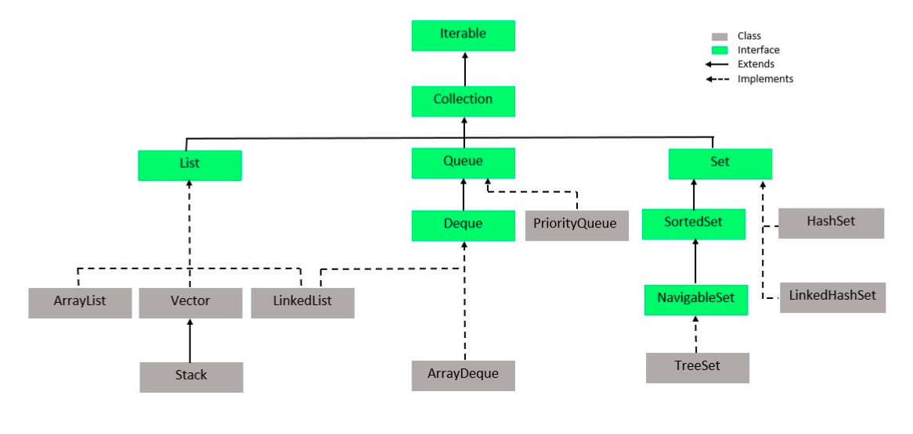
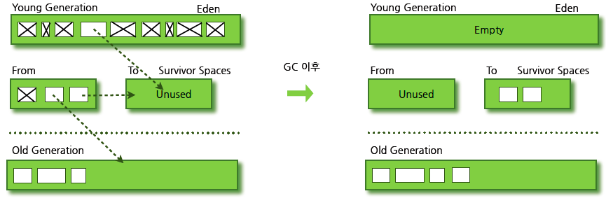
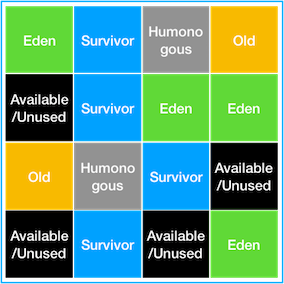

<details>
  <summary><b>Java 의 장단점에 대해 설명해주세요.</b></summary>

### 답변

장점으로는 JVM에서 동작하기 때문에 운영체제에 독립적이고 객체지향 언어이기 때문에 이해하기가 쉽습니다. 또한 가비지 컬렉터에 의해 메모리를 자동으로 관리해준다는 점이 있습니다.
단점으로는 JVM 에 의해 번역되는 과정이 필요하기 때문에 비교적 느립니다. 또한 가비지 컬렉터로 인하여 비교적 많은 메모리 공간이 필요합니다.

### 정리

- 장점
    - JVM에서 동작하기 때문에 운영체제에 독립적
    - 객체지향 언어이기 때문에 이해하기 쉽다.
    - 오픈소스로 사용할 수 있고 커뮤니티가 잘 발달되어 있다.
    - 멀티쓰레드를 쉽게 구현할 수 있다.
    - 가비지 컬렉터에 의해 메모리 관리를 자동으로 해준다.
- 단점
    - 컴파일되고 번역하는 과정을 거치기 때문에 비교적 느리다.
    - 가비지 컬렉터로 인해 메모리 공간 필요

### 참고 링크

- https://github.com/WeareSoft/tech-interview/blob/master/contents/java.md#java-%EC%96%B8%EC%96%B4%EC%9D%98-%EC%9E%A5%EB%8B%A8%EC%A0%90
- https://data-flair.training/blogs/pros-and-cons-of-java/

</details>

---

<details>
  <summary><b>Java 의 데이터 타입에 대해 설명해주세요.</b></summary>

### 답변

자바의 데이터 타입은 기본 데이터 타입과 참조 타입으로 나뉩니다. 기본 데이터 타입으로는 byte, short, int, long, float, double, boolean, char 가 있으며 Stack 영역에
저장됩니다. 참조 타입은 기본형은 제외한 모든 타입이며, Heap 영역에 저장됩니다.

### 정리

- 기본 데이터 타입(Primitive Data Type)
    - 정수형 : byte, short, int, long
    - 실수형 : float, double
    - 논리형 : boolean(ture/false)
    - 문자형 : char
    - 기본 타입의 크기가 작고 고정적이기 때문에 메모리의 Stack 영역에 저장된다.
- 참조 타입(Reference Data Type)
    - 참조 타입 종류: class, array, interface, Enumeration
    - 기본형을 제외하고는 모두 참조형
    - new 키워드를 이용하여 객체를 생성하여 데이터가 생성된 주소를 참조하는 타입이다.
    - String과 배열은 참조 타입과 달리 new 없이 생성이 가능하지만 기본 타입이 아닌 참조 타입이다.
    - 참조 타입의 데이터의 크기가 가변적, 동적이기 때문에 동적으로 관리되는 Heap 영역에 저장된다.
    - 더 이상 참조하는 변수가 없을 때 가비지 컬렉션에 의해 파괴된다.
    - 참조 타입은 값이 저장된 곳의 주소를 저장하는 공간으로 객체의 주소를 저장한다. (Call-By-Value)

### 참고 링크

- https://github.com/WeareSoft/tech-interview/blob/master/contents/java.md#java%EC%9D%98-%EB%8D%B0%EC%9D%B4%ED%84%B0-%ED%83%80%EC%9E%85

</details>

<details>
  <summary><b>Wrapper 클래스와 Boxing, Unboxing 에 대해서 설명해주세요.</b></summary>

### 답변

Wrapper 클래스는 프로그램에 따라 기본 데이터 타입을 객체로 취급해야 하는 경우, 기본 타입들의 데이터를 객체로 포장한 클래스입니다. 기본 타입의 데이터를 Wrapper 클래스의 값으로 변환하면 Boxing,
반대의 경우를 Unboxing이라고 합니다.

### 정리

- Wrapper Class
    - 프로그램에 따라 기본 데이터 타입을 객체로 취급해야 하는 경우, 기본 타입들의 데이터를 객체로 포장한 클래스
    - java.lang 패키지에 존재

| 기본 타입     | 래퍼 클래스      |
|-----------|-------------|
| `byte`    | `Byte`      |
| `short`   | `Short`     |
| `int`     | `Integer`   |
| `long`    | `Long`      |
| `float`   | `Float`     |
| `double`  | `Double`    |
| `char`    | `Character` |
| `boolean` | `Boolean`   |

- Boxing
    - 기본 타입의 데이터를 Wapper 클래스의 인스턴스로 변환하는 과정
- Unboxing
    - Wrapper 클래스의 인스턴스에 저장된 값을 기본 타입의 데이터로 꺼내는 과정

### 참고 링크

- https://github.com/WeareSoft/tech-interview/blob/master/contents/java.md#wrapper-class

</details>

---

<details>
  <summary><b>Java는 Call by Value인가요 Call by Reference인가요?</b></summary> 

### 답변

자바는 Call by Value 를 따릅니다. 기본 자료형의 경우 해당 값이 복사되어 전달되고, 참조 자료형의 경우 힙 메모리의 참조값이 복사되어 전달됩니다.

### 정리

- 자바에서 파라미터는 항상 `값`으로 전달됩니다. (파라미터의 복사본이 메서드에 전달)
- 기본 자료형의 경우 값의 복사본이 전달됩니다.
- 참조 자료형의 경우 힙 메모리의 주소값이 복사되어 전달됩니다.
    - 아래 예시의 경우 User 의 메모리가 복사되어 전달된다. b 의 경우 새로운 주소를 할당하는데 메서드가 종료되면 원본 b 에는 반영되지 않는다.
  ```java
  class User {
      public int age;
  
      public User(int age) {
          this.age = age;
      }
  }
  
  public class ReferenceTypeTest {
  
      void test() {
          User a = new User(10);
          User b = new User(20);
  			  
          System.out.println(a); // age: 10
          System.out.println(b); // age: 20
          modify(a, b);
  
          System.out.println(a); // age: 11 
          System.out.println(b); // age: 20
      }
  
      private void modify(User a, User b) {
          a.age++;
  
          b = new User(30);
          b.age++;
      }
  }
  ```

### 참고 링크

- https://bcp0109.tistory.com/360
- https://github.com/WeareSoft/tech-interview/blob/master/contents/java.md#call-by-reference%EC%99%80-call-by-value%EC%9D%98-%EC%B0%A8%EC%9D%B4

</details>

---

<details>
  <summary><b>Java 의 접근제어자는 어떤 것이 있나요?</b></summary> 

### 답변

자바의 접근 제어자로는 제약 없이 접근 가능한 public, 동일 패키지 또는 상속 관계에서 접근 가능한 protected, 동일 패키지에서만 접근 가능한 package-private, 선언한 객체에서만 사용 가능한
private 이 있습니다.

### 정리

| 접근 제어자	           | 설명                             |
|-------------------|--------------------------------|
| `public`          | `해당 객체를 사용하는 프로그램 어디에서나 접근 가능` |
| `protect`         | `동일 패키지 또는 상속 관계의 객체에서 접근 가능`  |
| `package-private` | `동일 패키지에서 접근 가능`               |
| `private`         | `해당 객체에서만 사용 가능`               |

### 참고 링크

- http://www.tcpschool.com/java/java_modifier_accessModifier
- https://github.com/WeareSoft/tech-interview/blob/master/contents/java.md#java%EC%9D%98-%EC%A0%91%EA%B7%BC-%EC%A0%9C%EC%96%B4%EC%9E%90%EC%9D%98-%EC%A2%85%EB%A5%98%EC%99%80-%ED%8A%B9%EC%A7%95

</details>

---

<details>
  <summary><b>클래스, 객체, 인스턴스를 비교해주세요.</b></summary> 

### 답변

클래스는 객체를 만들어 내기 위한 틀로서 객체가 가질 수 있는 속성과 메서드를 정의하며, 이를 실체화한 것이 객체입니다. 인스턴스는 객체의 구체적인 사례입니다.

### 정리

- 클래스(Class)
    - 객체를 만들어 내기 위한 설계도 혹은 틀
    - 연관되어 있는 변수와 메서드의 집합
- 객체(Object)
    - 소프트웨어 세계에 구현할 대상
    - 클래스에 선언된 모양 그대로 생성된 실체
    - '클래스의 인스턴스(instance)' 라고도 부른다.
- 인스턴스(Instance)
    - 설계도를 바탕으로 소프트웨어 세계에 구현된 구체적인 실체
        - 즉, 객체를 소프트웨어에 실체화 하면 그것을 '인스턴스'라고 부른다.
        - 실체화된 인스턴스는 메모리에 할당된다.

### 참고 링크

- https://github.com/WeareSoft/tech-interview/blob/master/contents/java.md#%ED%81%B4%EB%9E%98%EC%8A%A4-%EA%B0%9D%EC%B2%B4-%EC%9D%B8%EC%8A%A4%ED%84%B4%EC%8A%A4%EC%9D%98-%EC%B0%A8%EC%9D%B4

</details>

---

<details>
  <summary><b>static 키워드에 대해 설명해주세요.</b></summary> 

### 답변

클래스 멤버를 정의할 때 사용되며, 객체가 생성되기 전에 초기화 되며, 모든 인스턴스에서 공유되어 사용됩니다.

### 정리

- 클래스 멤버를 정의할 때 사용
- 객체가 생성되기 전에 클래스의 로딩 과정에서 메모리에 할당되므로, 객체 생성 없이 클래스 이름만으로 접근할 수 있다.
- static 키워드를 적절히 사용하면, 메모리를 효율적으로 사용하거나 객체 생성 없이도 편리하게 접근할 수 있는 장점이 있다.

<details> <summary>클래스 멤버와 인스턴스 멤버</summary>
- 클래스 멤버: 클래스에 존재하는 변수와 메서드.
- 인스턴스 멤버: 객체(인스턴스)에 존재하는 변수와 메서드. static 키워드를 사용하지 않고 정의한다.
- 클래스 멤버에서는 인스턴스 멤버가 접근 가능하지만, 인스턴스 멤버에서는 클래스 멤버로 접근이 불가능하다.
  
</details>

### 참고 링크

- [클래스 멤버와 인스턴스 멤버](https://hyuntaekhong.github.io/blog/java-basic12/)

</details>

<details>
  <summary><b>static 멤버와 non-static 멤버는 무슨 차이가 있나요?</b></summary> 

### 답변

- static 멤버는 클래스가 로딩될 때 메모리에 할당되며, 모든 인스턴스에서 공유됩니다. 반면에 non-static 멤버는 각 인스턴스가 생성될 때 메모리에 할당되고, 인스턴스마다 고유한 값을 가집니다.

### 정리

- 다음과 3가지의 차이점이 존재한다.

| 항목           | 메모리 할당 시기   | 접근 방법                     | 공유 여부             |
|--------------|-------------|---------------------------|-------------------|
| `static`     | 클래스가 로딩될 때  | 인스턴스를 생성하지 않고 클래스 이름으로 접근 | 모든 인스턴스가 동일한 값 공유 |
| `non-static` | 인스턴스가 생성될 때 | 인스턴스를 생성한 후 접근            | 인스턴스마다 고유한 값 존재   |

### 참고 링크

</details>

<details>
  <summary><b>main 메서드는 왜 static 메서드인가요?</b></summary> 

### 답변

- main 메서드는 프로그램이 실행될 때 가장 먼저 호출됩니다. 인스턴스가 생성되기 전에 호출되어야 하기 때문에 static으로 정의되어야 합니다.

### 정리

- main 메서드는 프로그램이 시작할 때 JVM에 의해 호출됩니다. 만약 non-static 메서드라면, main 메서드를 호출하기위해 클래스를 인스턴스화 시켜야 하기 때문에 JVM 에서 직접 호출이 불가능합니다.
  따라서 main 메서드는 static 메서드여야 합니다.

### 참고 링크

- https://www.scaler.com/topics/why-main-method-is-static-in-java/

</details>

<details>
  <summary><b>자바 프로그램 실행 시 static 이 붙은 변수는 어떻게 처리되나요?</b></summary>

### 답변

- static 이 붙은 변수는 해당 클래스가 로딩될 때 Method Area에 한번 초기화되고 값 변경이 일어나지 않습니다. 이후에 인스턴스를 초기화하지 않고 사용할 수 있습니다.

### 정리

- 자바 프로그램이 실행되고 JVM이 프로그램에서 사용되는 클래스를 로드하고, 해당 static 변수를 초기화합니다.
- JVM은 Method Area 에 static 변수에 메모리를 할당합니다.

### 참고 링크

</details>

---

<details>
  <summary><b>오버로딩과 오버라이딩을 비교해주세요.</b></summary> 

### 답변

- 오버로딩은 메서드의 이름은 같고 파라미터를 다르게 한 것이고, 오버라이딩은 부모 클래스의 메서드를 자식 클래스에서 재정의하는 것을 의미합니다.

### 정리

- 오버로딩
    - 이름은 같고 매개변수의 수, 타입 또는 순서가 다른 여러 메서드 정의
    - 반환하는 타입은 달라도 된다.
- 오버라이딩
    - 메서드 이름과 매개변수가 동일한 부모 클래스의 메서드를 자식 클래스에서 재정의하는 것
    - 오버라이딩된 메서드가 자식클래스의 인스턴스에서 호출되면 부모 클래스의 메서드는 무시된다.

### 참고 링크

- https://hyoje420.tistory.com/14

</details>

---

<details>
  <summary><b>인터페이스와 추상클래스를 비교해주세요.</b></summary> 

### 답변

- 둘의 차이는 목적에 있어 차이가 있습니다. 추상클래스는 abstract 키워드로 선언된 클래스로서 기능을 이용하고 확장하도록 의도합니다. 반면, 인터페이스는 추상메서드로만 이루어진 것으로 기능의 구현을 강제하도록 의도합니다. 이때문에 추상클래스는 공통 기능을 가지는 기반 클래스로 적합하며, 인터페이스는 다형성이 필요한 경우에 적합합니다. 
### 정리

#### 추상클래스
- abstract 키워드로 선언된 클래스
- 자식 클래스가 추상클래스의 기능을 이용하고 확장하는데 초점을 둔다.
- 클래스이기 때문에 다중상속은 지원하지 않는다.
- 기능의 확장에 초점을 두기 때문에 공통 기능을 가지는 베이스 클래스에 적합하다.
#### 인터페이스
- 추상 메서드와 상수로만 이루어진 것
- 인터페이스는 선언된 기능을 구현하도록 강제한다.
- 기능의 구현을 강제하기 때문에 같은 기능을 다르게 구현하는 다형성이 필요한 경우에 적합하다.
- 다중 상속이 가능하다.
  - 다중 상속을 할 때 메서드 충돌은 어떻게 해결할까?
    - 다중 상속을 하더라도 인터페이스에는 구현부가 없고, 구현 부분이 하나이기 때문에 컴파일 에러는 나타나지 않는다.
    - 다만, default 메서드를 통해 인터페이스에서 구현하는 경우 컴파일러는 오류를 내보낸다. (모두 구현된 경우)
    - 이 경우 2가지 해결 방법이 존재한다.
      1. 인터페이스에서 구현하지 않고 상속한 클래스에서 구현한다.
      2. 하나의 인터페이스로 구현을 위임한다.
#### 추상 메서드
- abstract 키워드와 함께 구현부는 작성되지 않고 선언부만 작성된 메서드
- final 키워드가 붙은 메서드는 추상 메서드로 만들 수 없다.
- 물론 static 메서드도 추상 메서드로 만들 수 없다.
### 참고 링크

- https://brunch.co.kr/@kd4/6
- [static 메서드가 추상메서드 될 수 없는 이유](https://stackoverflow.com/questions/370962/why-cant-static-methods-be-abstract-in-java)
- [다중상속 시 메서드 충동 해결](https://webfirewood.tistory.com/130)
</details>

<details>
    <summary><b>클래스는 왜 다중 상속을 허용하지 않을까요?</b></summary> 

### 답변

- 다중 상속을 허용하지 않는 이유는 모호성때문입니다. 다중 상속하는 클래스에서 이름이 같은 메서드가 있다면 어떤 메서드를 컴파일러가 호출할지 모호하기 때문에 자바에서는 다중 상속을 지원하지 않습니다.
### 정리

- 자바에서는 모호성때문에 다중 상속을 지원하지 않는다.
- 부모 클래스들에서 같은 이름을 가진 메서드나 변수가 있다면, 자식 클래스에서 어떤 메서드를 컴파일러가 호출할지 모호하기 때문이다.  
### 참고 링크

- https://siyoon210.tistory.com/125
</details>

---

<details>
  <summary><b>Java의 Error, Exception 구조에 대해 설명해주세요.</b></summary> 

### 답변

- 자바의 Error 와 Exception 은 모두 Throwable 객체를 상속받습니다. Error 는 주로 시스템 레벨의 심각한 에러로서 개발자가 처리할 수 없는 에러입니다. 반면, Exception 은 크게 RuntimeException 과 다른 Exception 으로 구분되며, 주로 개발자가 작성한 프로그램에서 발생하는 에러입니다. 
### 정리

#### Error
- 시스템에 발생하는 심각한 예외 상황을 나타냄
- OutOfMemoryError, StackOverflowError 등
- 시스템 자체에서 발생하여 개발자가 대응할 수 없다. -> 따로 처리하지 않아도 된다.
#### Exception 
- 개발자가 작성한 프로그램에서 발생하는 예외 상황을 나타냄
- RuntimeException, IOException 등
- 일반적으로 RuntimeException 과 나머지 Exception 으로 구분되어 구조화한다.
- try-catch-finally 구문을 사용하여 예외 처리를 해야한다.
### 참고 링크

</details>

<details>
  <summary><b>CheckedException 과 UncheckedException 은 무슨 차이인가요?</b></summary> 

### 답변

- UncheckedException 와 CheckedException 의 차이는 예외 처리의 강제성에 있습니다. CheckedException 은 컴파일 과정에서 발생하여 예외를 강제하는 반면, UncheckedException 은 런타입 과정에서 발생하는 예외이기 때문에 컴파일 과정에서 예외 처리를 강제하지 않습니다. 
### 정리

#### UncheckedException

- RuntimeException 과 이를 상속한 예외
- 런타임 과정에서 발생하는 예외
- 예외 처리를 강제받지 않음
  - 다만 예외가 런타임 과정에서 발생하기 때문에 예상하지 못한 에러가 발생할 수 있다.
  - 따라서 예외 상황이 발생할 것을 대비하여 예외 처리를 하는 것이 좋다.
#### CheckedException

- RuntimeException 을 제외한 Exception 예외
- 컴파일 과정에서 발생하는 예외
- 컴파일러에 의해 예외 처리가 강제됨
### 참고 링크

</details>

<details>
    <summary><b>예외처리의 세 가지 방법을 설명해주세요.</b></summary> 

### 답변

- 예외 처리 방법으로 예외 상황을 정상 상태로 돌려놓는 예외 복구, 호출한 메서드로 예외 처리를 넘기는 예외 회피, 다른 예외로 전환하는 예외 전환이 있습니다.
### 정리

#### 예외 복구
- 예외가 발생하더라도 애플리케이션이 정상적인 흐름으로 동작하도록 진행
#### 예외 회피
- 예외가 발생하면 throws 를 통해 호출한 메서드로 예외 처리를 위임하는 것
#### 예외 전환
- 다른 예외로 전환.
- 호출한 메서드에서 예외를 처리할 때 더 명확하게 예외 상황을 인지할 수 있도록 돕는다.
- throw 를 통해 실행
### 참고 링크

- https://www.nextree.co.kr/p3239/
</details>

---

<details>
    <summary><b>final 키워드는 왜 사용할까요? 어떤 이점이 있을까요?</b></summary>

### 답변

- final 키워드는 변수와 메서드, 클래스에 붙어 변하지 않도록 하는 역할을 수행합니다. 의도치 않은 변경을 줄여 코드 안정성을 보장하고 final 변수는 상수이기 때문에 컴파일 과정에서 성능 향상을 가져올 수 있습니다. 또한, 코드 가독성을 높일 수 있습니다.
### 정리

#### 코드 안정성
- 의도치 않은 코드 변경을 줄일 수 있기 때문에 코드 안정성이 높아진다.
#### 성능 향상
- final 변수는 상수로 취급하여 컴파일 과정에서 변수를 계산하는 과정이 준다. 이만큼 성능 향상을 불러올 수 있다.
#### 코드 가독성
- 변수, 메서드, 클래스에 final 키워드를 붙이면 변경되지 않는다는 의미를 명확하게 전달할 수 있다.
### 참고 링크
</details>

<details>
    <summary><b>final, finally, finalize 에 대해 설명해주세요</b></summary> 

### 답변

- final 키워드는 변수, 메서드, 클래스를 변경 불가능하도록 만드는 것이고, finally 는 try-catch 구문 마지막에 항상 실행될 코드 블록을 정의하기 위해 사용됩니다. 마지막으로 finalize 는 GC 가 더이상의 참조가 존재하지 않는 객체를 메모리에서 삭제할 때 사용되는 메서드입니다.
### 정리

#### final
- 기본 데이터 타입에 적용: 변수에 저장된 값의 변경이 불가능
- 참조 데이터 타입에 적용: 참조 변수의 힙 메모리를 재할당 불가능
- 메서드에 적용: 오버라이드 불가능
- 클래스에 적용: 상속 불가능
#### finally
- try-catch 구문이 종료될 때 항상 실행될 코드 블록을 정의하기 위해 사용
- JVM 이 종료되거나 해당 프로세스가 종료되지 않는 이상 무조건 실행된다.
  - return 문이 try 에 있어도 finally 코드 블록이 실행됨
  - try-with-resources 구문을 사용할 수 있으면 try-catch-finally 대신 사용할 것
    - 예외가 중복될 경우 디버깅이 힘듦
    - 가독성이 나빠짐
#### finalize
- Garbage Collector 가 더이상 참조가 존재하지 않는 객체를 메모리에서 삭제할 때 호출하는 메서드
- Object 클래스의 finalize 메서드를 오버라이딩하여 커스텀할 수 있다.
### 참고 링크

- https://wjheo.tistory.com/entry/final-finally-finalize-%EC%B0%A8%EC%9D%B4%EC%A0%90
- https://ckddn9496.tistory.com/62
</details>


<details>
    <summary><b>final 키워드는 컴파일 과정에서 다르게 실행될까요?</b></summary> 

### 답변

- final 키워드가 붙은 변수는 상수와 같이 취급이 됩니다. 메서드는 오버라이딩이 안되기 때문에 오버라이딩한 메서드를 찾는 과정이 생략됩니다. 클래스는 상속이 불가능하기 때문에 자식 클래스를 찾는 과정이 생략됩니다.
### 참고 링크

</details>


---

<details>
    <summary><b>제네릭에 대해 설명해주세요.</b></summary> 

### 답변

- 제네릭은 클래스 내부에서 사용하는 타입을 외부에서 지정할 수 있는 방법입니다. 장점으로는 컴파일 시점에 타입 체크를 진행해 타입 안정성을 보장하고 코드 중복을 줄여줍니다. 반면 단점으로는  문법이 생소하여 가독성이 떨어지고 공변성 때문에 배열과의 호환성이 좋지 않습니다.
### 정리

- 클래스 내부에서 사용하는 타입을 외부에서 지정하는 방법
- 장점
  - 컴파일 시점에 타입 체크를 통해 타입 안정성을 보장
  - 코드 중복을 줄여줌
- 단점
  - 문법이 생소하여 가독성이 떨어짐.
  - 배열의 공변성으로 인해 배열과의 호환성이 떨어짐

#### 무변성(invariant)/무공변
- 하위 타입을 상위 타입의 제네릭에 대입하면 컴파일 에러가 발생한다.
```java
public class Tiger extends Animal {}
```

```java
public class Cage<T> {
	private List<T> animals = ...;
	public void push(T animal) {
		this.animals.add(animal);
    }
	public List<T> getAll() {
		return animals;
    }
}
```

```java
Animal a = new Tiger(); // OK
Cage<Animal> ca = new Cage<Tiger>(); // Compile Error.
```

<br>

- 컴파일 에러가 발생하는 이유를 예를 들어 설명하면
```java
public class Tiger extends Animal {}
public class Lion extends Animal {}
```
```java
Cage<Tiger> ct = new Cage<Tiger>();
Cage<Animal> ca = ct; // 만약 가능하다면

ca.push(new Lion()); // Lion 은 Animal 의 하위 타입이므로 가능

List<Tiger> tigers = ct.getAll(); // 우항의 결과물은 List<Lion> 
```

<br>

- 무공변일 때 문제점
```java
public class Carnivore extends Animal {}
public class Tiger extends Carnivore {}
public class Lion extends Carnivore {}
```
```java
public class Zookeeper {
	public void giveMeat(Cage<Carnivore> cage, Meat m) {
		
    }
}
```
```java
Zookeeper zk = new Zookeeper();
Cage<Tiger> ct = new Cage<>();
zk.giveMeat(ct,m); // Compile Error
```
- 위의 코드를 보면 Cage<Carnivore> 은 Cage<Tiger> 의 상위 타입이 아니기 때문에 에러가 발생한다.
- 공변으로 해결이 가능!

#### 공변(variant)

- 타입 A 가 타입 B 의 상위 타입이고, `T<A>` 가 `T<B>` 의 상위 타입일 때 공변이라고 한다.
- extends 를 이용하여 나타냄
```java
public class Zookeeper {
	public void giveMeat(Cage<? extends Carnivore> cage, Meat m) {
		
    }
}
```
```java
Zookeeper zk = new Zookeeper();
Cage<Tiger> ct = new Cage<>();
zk.giveMeat(ct,m); // 할당 가능

Cage<Lion> cl = new Cage<>();
zk.giveMeat(cl,m); // 할당 가능
```

<br>

- 공변에서의 문제점
  - 공변에서 제네릭 타입을 사용하면 메서드에 값 전달이 되지 않는다.
```java
Cage<Tiger> ct = new Cage<>();

Cage<? extends Carnivore> cage = ct; // OK
cage.push(new Tiger()); // Compile Error
```
- 위의 경우 cage 의 실제 타입이 `Cage<Tiger>` 인지 `Cage<Lion>` 인지 알수 없기 때문에 컴파일 에러 발생
- 반공변으로 해결!

#### 반공변(contravariant)
- A 가 B 의 상위 타입이고, `T<A>` 가 `T<B>` 의 하위 타입이면 반공변
  - super 을 사용하여 나타냄
```java
Cage<Tiger> ct = new Cage<>();

Cage<? super Tiger> ctt = ct; // OK
ctt.push(new Tiger()); // OK, ctt 는 Cage<Tiger> 이거나 상위타입

Cage<Carnivore> cc = new Cage<>();
Cage<? super Tiger> ctt2 = cc; // OK
ctt2.push(new Tiger()); // OK, ctt2 는 Cage<Tiger> 이거나 상위 타입
```

### 참고 링크

- https://www.youtube.com/watch?v=PtM44sO-A6g
</details>


---

<details>
    <summary><b>리플렉션이 무엇이고, 언제 활용 가능한지 설명해주세요.</b></summary> 

### 답변

- 리플렉션은 동적으로 클래스의 정보를 얻어 사용할 수 있는 기법입니다. 주로 런타임에 클래스에 접근하여 정보를 얻어야 할 때 사용됩니다. 예시로는 Spring 의 애노테이션, Jackson 등이 있습니다.
### 정리

- 런타임에 클래스의 이름, 메서드, 필드 등을 동적으로 가져오는 API
- 클래스 정보가 런타임 시점에 필요할 때 이용
- Spring 의 애노테이션, IDE 의 자동완성, Jackson 등이 있다.
### 참고 링크

- https://velog.io/@alsgus92/Java-Reflection%EC%9D%80-%EB%AC%B4%EC%97%87%EC%9D%B4%EA%B3%A0-%EC%96%B8%EC%A0%9C%EC%96%B4%EB%96%BB%EA%B2%8C-%EC%82%AC%EC%9A%A9%ED%95%98%EB%8A%94-%EA%B2%83%EC%9D%B4-%EC%A2%8B%EC%9D%84%EA%B9%8C
</details>


<details>
    <summary><b>리플렉션의 장단점에 대해 설명해주세요.</b></summary> 

### 답변

- 리플렉션의 장점으로는 클래스의 정보를 동적으로 로딩할 수 있다는 장점이 있습니다. 또한 객체를 런타임에 생성하여 유연성을 높일 수 있습니다. 반면 단점으로는 private 메서드에 접근할 수 있는 보안문제와 타입이 정해지지 않는 클래스의 정보를 동적으로 가져오기 때문에 성능 저하가 있습니다.
### 정리

#### 장점

- 클래스의 정보를 동적으로 로딩
- 객체를 런타임에 생성

#### 단점

- 타입이 정해지지 않는 클래스의 정보를 가져오기 때문에 컴파일러의 최적화를 받지 못한다. 이 때문에 성능 저하가 발생한다.
- 동적으로 클래스 정보를 가져오기 때문에 가독성이 떨어진다.
- private 메서드에 접근할 수 있기 때문에 보안문제가 생긴다.
### 참고 링크

- https://middleearth.tistory.com/72
</details>


---

<details>
    <summary><b>자바의 직렬화와 역직렬화에 대해 설명해주세요.</b></summary> 

### 답변

자바에서 직렬화는 시스템 내부에서 사용되는 객체 또는 데이터를 외부 시스템에서도 사용할 수 있도록 바이트 형태로 변환하는 기술입니다. 반면, 역직렬화는 바이트로 변환된 데이터를 객체로 변환하는 기술입니다.  
### 정리

#### 직렬화
- 시스템 내부에서 사용되는 객체 또는 데이터를 외부 시스템에서도 사용할 수 있도록 바이트 형태로 변환하는 기술
- JVM 의 메모리(힙 또는 스택)에 있는 객체 데이터를 변환
- 조건
  - 기본 타입 (primitive)
  - `java.util.Serializable` 인터페이스를 상속받은 객체
- 방법
  - `java.io.ObjectOutputStream` 객체 이용
#### 역직렬화
- 바이트로 변환된 데이터를 객체로 변환하는 기술
- JVM 의 메모리에 저장
- 조건
  - 직렬화 대상이 된 객체의 클래스가 클래스 패스에 존재해야 하며, `import` 되어 있어야 한다.
    - 직렬화와 역직렬화를 진행하는 과정이 다른 시스템에서 일어날 수 있다.
  - 자바 직렬화 대상 객체는 동일한 `serialVersionUID` 를 가지고 있어야 한다.
- 방법
  - `java.io.ObjectInputStream` 객체 이용
#### 고려해야할 점
- 직렬화된 클래스는 추후에 변경하기 어렵다. (serialVersionUID 가 클래스의 해시값에 영향을 받기 때문)
- private, package-private 정보도 공개되기 때문에 정보 은닉의 기본 개념이 사라짐
- Serializable 을 구현하지 않는 부모 객체의 경우 자식 객체를 직렬화하기 위해서는 부모 클래스에 생성자를 만들어줘야 함
- inner class 는 Serializable 을 구현할 수 없다. 바깥 객체에 대한 참조를 가지고 있고, 바깥 유효범위의 지역 변수 값을 보관하기 위해 컴파일러가 자동으로 생성하는 인위생성 필드가 있기 때문.
### 참고 링크
- https://steady-coding.tistory.com/576
- https://wedul.site/393
- https://techblog.woowahan.com/2551
</details>

<details>
    <summary><b>자바의 직렬화는 언제, 어디서 사용되나요?</b></summary> 

### 답변
- JVM 의 메모리에서만 저장된 객체 데이터를 영속화할 때 사용합니다. 장점으로는 시스템이 종료되더라도 사라지지 않는 점이 있습니다. 예시로는 파일로 저장하는 서블릿 세션, 캐시 등이 있습니다.
### 정리
- 언제?
  - JVM 메모리에서만 있는 객체 데이터를 영속화할 때 사용
- 장점
  - 시스템이 종료되더라도 없어지지 않음
- 예시
  1. 서블릿 세션
     - 서블릿 기반의 WAS 들은 대부분 세션의 자바 직렬화를 지원하고 있다.
     - 세션을 통해 파일로 저장하거나 세션 클러스터링, DB 를 저장하는 등에서 세션 자체가 직렬화가 되어 저장되고 전달됨
  2. 캐시
     - 퍼포먼스를 위한 캐시 라이브러리(Ehcache, Redis, Memcached 등)에서 주로 이용
  3. 자바 RMI(Remote Method Invocation)
     - 자바 RMI: 원격 시스템 간의 메시지 교환을 위해서 사용하는 기술
       - 소켓 통신을 하지 않고 추상화하여 메서드를 통해 호출
     - 원격에 있는 메서드를 호출할 때 전달하는 메시지(주로 객체)를 직렬화
### 참고 링크
- https://techblog.woowahan.com/2550/
</details>

---

<details>
    <summary><b>자바의 Synchronized 키워드를 설명해주세요.</b></summary>

### 답변
- Synchronized 키워드를 통하여 메서드나 코드 블록에 Lock 을 걸어 스레드 간 상호 배제를 할 수 있습니다. 메서드에 작성할 경우 해당 클래스 인스턴스에 Lock 을 걸고, 코드 블록에 작성할 경우 블록으로 작성된 부분만 Lock 이 걸리게 됩니다.
### 정리
- Lock 을 걸어 스레드 간의 상호배제를 할 수 있는 키워드.
- 적용 위치: 메서드, 코드 블록
#### 메서드에 적용
- 클래스 인스턴스에 Lock
#### static 메서드에 적용
- 클래스에 Lock
- static synchronized 메서드와 synchronized 메서드의 Lock 은 공유하지 않는다.
#### 메서드의 코드 블록에 적용
- 인스턴스의 블록 단위에 Lock 
- 동기화 전후에는 Lock 이 적용되지 않기 때문에, 효율적 사용 가능
- block 에 `this` 를 명시할 경우 메서드에 붙은 것과 같은 효과
  ```java
  public class Test {
    public void run() {
        // ...
  
        synchronized (this) {
            // ...
        }
  
        // ...
    }
  }
  ```
- block 에는 객체 인스턴스를 지정하거나 클래스를 지정할 수 있다.
#### static 메서드의 코드 블록에 적용
- 클래스에 Lock
- 코드 블록에 this 를 지정할 수 없다.
#### 동기화 순서
- Thread 의 동기화 순서를 보장하지 않는다.
### 참고 링크
- https://backtony.github.io/java/2022-05-04-java-50/
</details>

<details>
    <summary><b>동기화와 비동기화의 차이를 설명해주세요.</b></summary> 

### 답변
- 동기화와 비동기화의 차이는 호출되는 함수의 반환을 신경쓰는지 여부와 연관이 있습니다. 호출되는 함수의 반환값을 기다리면 동기화, 기다리지 않으면 비동기화입니다. 자바에서 동기화는 synchronized 키워드를 통해 구현 가능하고, 비동기화는 Thread 클래스를 통해 구현할 수 있습니다.
### 정리
#### 동기화
- 호출되는 함수의 반환값을 기다린다. 반환이 되었으면 다음 흐름을 진행한다.
- synchronized 키워드
- Atomic 클래스
  - [CAS(Compare-And-Swap)](https://steady-coding.tistory.com/568) 알고리즘을 사용하여 lock 없이 동기화 처리 가능
  - lock 없이 동기화
- volatile
  - Main Memory 에 저장
  - 모든 스레드에서 Main Memory 에 읽기, 쓰기를 하기 때문에 값이 일치함
#### 비동기화
- 호출되는 함수의 반환값을 기다리지 않고 다음 흐름을 진행한다.
- Thread 를 통해 구현
### 참고 링크
- [동기화 처리 방법](https://dev-jj.tistory.com/entry/Java-Synchronize-%EB%8F%99%EA%B8%B0%ED%99%94-%EB%B0%A9%EB%B2%95-3%EA%B0%80%EC%A7%80)
- [동기화 vs 비동기화](https://velog.io/@nittre/%EB%B8%94%EB%A1%9C%ED%82%B9-Vs.-%EB%85%BC%EB%B8%94%EB%A1%9C%ED%82%B9-%EB%8F%99%EA%B8%B0-Vs.-%EB%B9%84%EB%8F%99%EA%B8%B0#3-synchronous%EB%8F%99%EA%B8%B0%EC%99%80-asynchronous%EB%B9%84%EB%8F%99%EA%B8%B0)
</details>

<details>
    <summary><b>동시성 문제가 무엇인가요? 자바에서 동시성 문제를 해결할 수 있는 방법이 있을까요?</b></summary> 

### 답변
- 동시성 문제란 동일한 자원에 대해 여러 스레드가 동시에 접근하면서 발생하는 문제입니다. 자바에서는 해당 쓰레드만 접근할수 있는 ThreadLocal 를 통해 해결할 수 있습니다. 하지만 ThreadLocal 의 사용이 끝나면 반드시 저장된 값을 제거하는 과정을 거쳐야합니다.
### 정리
- 동일한 자원에 대해 여러 스레드가 동시에 접근하면서 발생하는 문제
- 지역 변수에서는 발생하지 거의 발생하지 않고, 싱글톤, static 과 같은 공용 필드에서 주로 발생
- 읽기와 쓰기를 동시에 하는 경우에 발생
### 참고 링크
- https://backtony.github.io/java/2021-12-24-java-41/
</details>

<details>
    <summary><b>Thread Local에 대해 설명해주세요.</b></summary> 

### 답변
- 스레드마다 접근할 수 있는 개인 저장소를 의미합니다. ThreadLocal 의 데이터는 사용이 끝나면 반드시 삭제해야합니다. 스레드 풀 환경에서 사용이 완료된 데이터를 지워주지 않으면 재사용되는 스레드가 올바르지 않는 데이터를 참조할 수 있기 때문입니다.
### 참고 링크
- https://backtony.github.io/java/2021-12-24-java-41/
</details>


---

<details>
    <summary><b>자바의 어노테이션에 대해 설명해주세요.</b></summary> 

### 답변
- 인터페이스를 기반으로 한 문법으로 주석처럼 코드에 달아 특별한 의미를 부여하거나 기능을 주입할 수 있습니다. 어노테이션에는 크게 세가지 종류가 있습니다. JDK 에 포함되어 있는 build-in 어노테이션과 어노테이션의 정보를 나타내기 위한 Meta 어노테이션, 개발자가 직접 정의한 Custom 어노테이션이 있습니다.
### 정리
- 인터페이스를 기반으로 한 문법
- 사용
  - 컴파일러에게 필요한 정보 제공
  - 컴파일/배포 시 필요한 처리 기능
  - 런타임 처리 제공
- build-in 어노테이션
  - @Override
  - @Deprecated
  - @SuppressWarnings
  - @FunctionalInterface
  - ...
- 메타 어노테이션
  - @Target: 어노테이션이 적용 가능한 대상 지정
  - @Retention: 어노테이션이 유지되는 기간 지정
  - @Documented: javadoc 포함 여부 지정
  - @Inherited: 어노테이션의 상속 가능 여부 지정
  - @Repeatable: 어노테이션을 반복하여 적용 가능하도록 지정
#### 주의 사항
- @AllArgsConstructor, @RequiredArgsConstructor
  - 인스턴스 멤버의 순서가 변경되면 생성자의 순서도 변경되기 때문에 타입이 같은 경우 개발자가 인지하지 못할 수도 있다.
- @ToString
  - 양방향 관계에서 해당 어노테이션을 통해 순환참조가 일어날 수 있다.
- @Data
  - 위의 모든 문제가 일어날 수 있다.
### 참고 링크
- https://steady-coding.tistory.com/614
</details>

---

<details>
    <summary><b>자바 8에 추가된 기능들에 대해 간단히 설명해주세요.</b></summary> 

### 답변
- 자바 8에는 익명 함수를 단순하게 표기한 람다 표현식, 하나의 추상 메서드만 갖고 있는 함수형 인터페이스, 인터페이스의 default 메서드, 연속된 정보를 처리하는 Stream 클래스, null 처리를 간편하게 하기 위한 Optional 클래스 등이 있습니다.
### 정리
- 주요하게 추가된 것
  - Lambda
  - Functional Interface
    - 하나의 추상 메서드만 가지는 인터페이스
  - Stream
  - Optional
  - 인터페이스의 Default Method
  - 날짜 관련 클래스 추가
    - `ZoneDataTime`, `LocalDate`, `DateTimeFormatter`, `DayOfWeek`
  - 병렬 배열 정렬
    - parallelSort() 메서드 추가
  - StringJoiner
    - 순차적으로 나열되는 문자열 사이에 특정 문자열을 넣어줄 때 사용
### 참고 링크
- https://bbubbush.tistory.com/23
- https://medium.com/@inhyuck/java-8%EC%97%90-%EC%B6%94%EA%B0%80%EB%90%9C-%EA%B2%83%EB%93%A4-8c66023cbbae
</details>

<details>
    <summary><b>Stream에 대해 설명해주세요.</b></summary> 

### 답변
- 자바 8에 추가된 Collection 타입의 데이터를 처리하는 API 입니다. 주요 특징으로는 병렬 처리 용이하고 원본 데이터를 변경하지 못하며 재사용 불가능하고 최종 연산을 할 때 중간 연산이 실행된다는 점이 있습니다.
### 정리
- 자바 8에 추가된 Collection 타입의 데이터를 처리하는 API
#### 특징
- 병렬 처리 용이
  - parallel() 메서드 제공. (cf. [common fork join pool](https://m.blog.naver.com/tmondev/220945933678))
  - 코어 수가 많을수록, 처리할 데이터가 많을수록, 데이터당 처리 시간이 길수록 병렬 처리 성능 향상
- Immutable
  - 원본 데이터에 대한 변경 불가능
- Lazy
  - 중간 연산은 최종 연산에 이용될 때 값 계산
  - 중간 연산: filter, map, flatMat, limit, sorted, peek, ...
  - 최종 연산: foreach, reduce, findFirst, anyMatch, count, collect, ...
- 재사용 불가능
  - 최종 연산 완료 후 Stream 이 닫히므로 재사용 불가능
### 참고 링크

</details>

<details>
    <summary><b>Stream과 반복문 for문의 성능차이가 있을까요?</b></summary>

### 답변
- for 문은 단순 인덱스 기반으로 접근하고, 컴파일러가 최적화를 하기 때문에 성능이 더 빠릅니다. 특히 for 문은 기본 데이터 타입을 통해 접근하면 wrapper 타입에 비해 Heap 메모리에 접근하지 않아도 되서 성능이 더 올라가게 됩니다.
### 참고 링크
- https://pamyferret.tistory.com/49
</details>

<details>
    <summary><b>Stream에서 사용할 수 있는 함수형 인터페이스에 대해 설명해주세요.</b></summary> 

### 답변
- 사용할 수 있는 함수형 인터페이스로는 인자를 받지 않고 반환만 하는 Supplier, 인자를 받고 반환은 하지 않는 Consumer, 인자를 받고 반환을 하는 Function, 인자를 받아서 참 거짓을 판단하는 Predicate 등이 있습니다. 
### 참고 링크
- https://bcp0109.tistory.com/313
</details>

<details>
    <summary><b>Lambda에 대해 설명해주세요.</b></summary> 

### 답변
- Lambda 는 자바 8에서 추가되어 메서드를 하나의 식으로 표현할 수 있는 익명 함수입니다. 함수형 인터페이스를 통해 정의할 수 있으며 기존 익명 함수로 작성하던 코드를 줄일 수 있다는 장점이 있습니다.
### 정리
- 자바 8에서 추가되어 메서드를 하나의 식으로 표현하는 익명 함수
- 함수형 인터페이스를 통해서 사용 가능
- 장점
  - 기존 익명 함수로 작성하던 코드를 줄일 수 있다.
  - 가독성이 증가된다.
  - 병렬 프로그래밍에 용이하다.
- 단점
  - 남용시 코드 이해가 어렵다.
  - 재귀 활용과 디버깅이 어렵다.
### 참고 링크

</details>

<details>
    <summary><b>익명 클래스(Anonymous Inner Class)와 Lambda의 차이점을 알고계신가요?</b></summary> 

### 답변
- 익명 클래스는 클래스를 의미하고 여러 메서드를 포함할 수 있지만, Lambda 는 익명 메서드를 의미합니다. 또한 익명 클래스의 this 는 새로 생성된 클래스 객체를 의미하고 Lambda 의 this 는 Lambda 를 정의한 클래스를 의미합니다.
### 정리
#### 익명 클래스
- 이름 없는 클래스
- 추상 및 구체 클래스 확장 O
- 여러 추상 메서드를 포함하는 인터페이스 구현 O
- 익명 클래스 생성 시 인스턴스 변수 선언 O
- 익명 내부 클래스 인스턴스화 O
- this 키워드가 생성된 익명 클래스 객체를 의미
#### Lambda
- 이름 없는 메서드
- 추상 및 구체 클래스 확장 X
- 여러 추상 메서드를 포함하는 인터페이스 구현 X
- 익명 클래스 생성 시 인스턴스 변수 선언 X
- 익명 내부 클래스 인스턴스화 X
- this 키워드가 생성된 Lambda 가 정의된 클래스를 의미
### 참고 링크
- https://developer-talk.tistory.com/499
</details>

<details>
    <summary><b>람다식에서, 외부 변수를 사용할 때 final 키워드를 붙여서 사용하는 이유가 무엇일까요? final을 안 붙여도 되지 않을까요?</b></summary> 

### 답변
- 외부 지역 변수를 제어하는 스레드와 람다식을 제어하는 스레드가 다를 수 있기 때문입니다. 이 경우 각 스레드간 스택 영역이 다르기 때문에 값을 공유할 수 없고, 동기화할 수 없기 때문에 외부 변수가 최신 값으로 변경이 되었는지 확신할 수 없습니다. 따라서 매번 다른 결과가 도출될 수 있기 때문에 final 키워드를 붙여야 합니다.
### 참고 링크
- https://vagabond95.me/posts/lambda-with-final/
</details>


<details>
    <summary><b>Optional에 대해 설명해주세요. Optional을 사용하면 무슨 이점이 있을까요?</b></summary> 

### 답변
- Optional 은 Null 이 될 수 있는 값을 감싸는 Wrapper 클래스입니다. 명시적으로 Null 가능성을 표현할 수 있고, Null 체크를 직접 하지 않아도 되고, NPE 가 발생할 가능성이 있는 값을 직접 다룰 필요가 없다는 점이 장점입니다.
### 정리
- Null 이 될 수 있는 값을 감싸는 Wrapper 클래스
- 장점
  - 명시적으로 변수에 대한 Null 가능성을 표현할 수 있다.
  - Null 체크를 직접 하지 않아도 된다.
  - Null Pointer Exception 이 발생할 가능성이 있는 값을 직접 다룰 필요가 없다.
- 단점
  - Wrapper 클래스이기 때문에 생성 비용이 비싸다.
  - 직렬화가 불가능하기 때문에 클래스의 인스턴스 필드로 사용하면 안된다.
  - 필드로 사용하기 위해 고안된 것이 아니므로 값을 반환하는 용도로 사용해야 한다.
### 참고 링크
- https://tecoble.techcourse.co.kr/post/2021-06-20-optional-vs-null/
</details>

<details>
    <summary><b>Optional을 사용하면서 주의해야할 점이 있을까요?</b></summary> 

### 답변
- Optional 은 직렬화를 구현하지 않았기 때문에 필드로 사용하는 것을 주의해야 합니다. 또한 생성자나 메서드 인자로 사용하는 것을 주의해야 합니다. 생성 비용이 비싼 Optional 대신 일반 객체를 넘겨 null 체크를 하는 것이 좋습니다.
### 정리
- 필드로 사용하지 말자
  - Optional 은 Serializable 을 구현하지 않았기 때문에 직렬화가 되지 않는다.
- 생성자나 메서드 인자로 사용하지 말자
  - 생성비용이 비싼 Optional 대신 일반 객체를 넘겨 호출받는 쪽에서 null 체크를 하자. Optional 이 오더라도 Optional 에 null 이 할당되어 있을 수도 있다.
- orElse 대신 orElseGet 을 사용하자
  - null 일 경우에만 반환하는 코드가 호출되므로 더 효율적이다.
- 컬렉션을 Optional 로 감싸지 말자
### 참고 링크
- https://velog.io/@hope1213/Optional%EC%9D%80-%EC%99%9C-%EC%82%AC%EC%9A%A9%ED%95%98%EB%8A%94%EC%A7%80-%EC%82%AC%EC%9A%A9%EC%8B%9C-%EC%A3%BC%EC%9D%98%EC%82%AC%ED%95%AD
</details>

---

<details>
    <summary><b>Object 클래스의 equals()와 hashcode()는 무슨 역할을 하나요?</b></summary>

### 답변
- equals 는 객체의 내부 요소를 비교하여 객체의 동등성을 확인할 떄 사용합니다. hashcode 는 런타임 시점에 객체의 유일한 값을 반환하는 것입니다. 이는 HashMap, HashTable 등 여러 Collection 클래스에서 객체끼리 구분할 때 사용합니다.
### 정리

### 참고 링크
- https://mangkyu.tistory.com/101
- https://olivejua-develop.tistory.com/65
</details>

<details>
    <summary><b>equals()와 hashcode()는 언제 재정의해야할까요? 또, 왜 같이 오버라이딩 하는게 좋을까요?</b></summary> 

### 답변
- equals 를 재정의하지 않으면 객체의 주소값만 비교하는 것이 기본 구현입니다. 하지만 객체가 같은 값을 가질 때 같은 객체로 인식하기 위해서는 클래스의 필드에 맞게 재정의가 필요합니다. hashcode 는 객체간의 구분을 위해 사용하므로 유일하게 객체를 식별할 때 재정의해야 합니다. Object 의 명세에 의하면 equals 가 동일하면 동일한 해시코드를 반환해야 합니다. 이 때문에 같이 오버라이드 해야합니다.
### 정리
- equals 만 구현했을 때 문제점
  - 만약 equals 만 구현하여 동등한 객체로 인식되는데 다른 해시 값이 나온다면, Object 명세에도 어긋나지만, 의미상으로도 이상하다. 동등한 객체인데 HashMap 이나 다른 Collection 객체에서는 다른 객체로 인식되는 문제가 생긴다.
- hashcode 만 구현했을 때 문제점
  - 만약 hashcode 만 구현하여 동일한 해시코드가 나오는데 동등성이 보장되지 않는다면, 마찬가지로 Collection 객체에서 같은 객체로 인식했는데 equals 메서드를 통해 비교할 때는 다르다는 결과가 나오게 된다. 이는 프로그램의 잠재적인 위험이 된다.
- hashcode 를 구현할 때 주의할 점
  - 핵심 필드를 꼭 포함해서 구현하자
    - 성능보다는 핵심필드를 포함하자
  - 자세한 구현 사항을 API 사용자는 모르는 것이 좋다.
    - 사용자가 구현에 의존하지 않을 수 있다.
### 참고 링크

</details>

<details>
    <summary><b>서로 다른 인스턴스가 같은 hashcode값을 가질 수 있을까요?</b></summary> 

### 답변
- 서로 다른 인스턴스더라도 해시코드 값을 가질 수 있습니다. 이때문에 해시 충돌을 해결하는 것이 중요해졌습니다. 해시 충돌을 완화하는 방법에는 크게 Open Addressing 과 Separate Chaining 방식이 존재합니다. 자바의 HashMap 에서는 Separate Chaining 방식을 사용하며, 이는 해시 버킷에 들어갈 수 있는 엔트리의 제한을 두지 않는 방식입니다.
### 정리
#### Open Addressing
- 한 버킷당 들어갈 수 있는 엔트리가 하나
- 해시 충돌이 일어난 경우, 다른 버킷에 저장
- 이를 위해 빈 버킷을 찾는 여러 알고리즘이 존재한다.
  - Linear probing
  - Quadratic probing
  - Dobule hasing
- 특징
  - 전체 버킷 중 사용중인 버킷의 비율이 커지면 탐사 비용이 비약적으로 상승한다.
  - 데이터를 삭제할 때 비효율적이다.
#### Separate Chaining
- 한 버킷에 여러 엔트리가 들어갈 수 있음
- 버킷은 주로 LinkedList 또는 Tree 를 사용
- 특징
  - 위의 방식과 비교하여 추가적인 메모리 공간 필요
  - 적재율에 따라 선형적으로 성능이 저하됨
#### 자바에서의 hash 충돌 발생 해결 방법 (HashMap)
- Separate Chaining
- Java 7 까지는 LinkedList 를 고정적으로 사용
- Java 8 부터 데이터의 개수에 따라 적으면 LinkedList, 많으면 Tree 사용
### 참고 링크
- https://d2.naver.com/helloworld/831311
- https://dkswnkk.tistory.com/679
</details>


---

<details>
    <summary><b>String 클래스는 final로 선언되어있습니다. 왜 그런걸까요?</b></summary> 

### 답변
- String 클래스가 final 로 선언되면서 불변성을 가지게 되었습니다. 이 이유로는 String Pool 을 통한 메모리 절약, 다수의 클래스에 매개변수로 사용되기 때문에 보완 관련 문제, 해시 기반 Collection 의 키 값으로 사용하기 위함 등이 있습니다.
### 정리
#### String Pool
- String 은 자바를 설계할 때 가장 많이 사용할 것으로 예상된 데이터 타입이다.
- 이를 최적화하기 위해 String Pool 에 String 리터럴을 포함하는 방법을 이용했다.
- String 객체를 공유하여 잉여 객체 생산을 막는 것이 목표이다.
- 이를 위해서는 final 또는 불변이어야 가능하다.
#### Security
- String 은 다수의 자바 클래스의 매개 변수로 쓰이고 있다. 
- 만약 String 이 불변이지 않으면, String 의 조작을 통해 시스템의 특점 파일에 대한 액세스 권한을 얻는 등 심각한 보안 문제가 발생한다.
#### Multithreading
- 자바에서 멀티 스레드를 지원하기 위해 String 객체는 thread safe 를 보장해야 한다.
#### Optimization and Performance
- String 을 불변 클래스로 만들면서 성능 최적화를 할 수 있게 되었다.
- 값이 변경되지 않는 것을 이용해서 해시 코드 값을 lazy 하게 계산하고 일단 생성 되면 String Pool 에 캐싱한다.
- 이를 통해 한번 계산된 해시 코드 값을 계속 사용하는 등 성능 개선을 할 수 있다.
- HashMap 등 해시 관련 함수에 이용할 시 성능 향상의 원인이 된다.
### 참고 링크
- https://wildeveloperetrain.tistory.com/34
</details>


<details>
    <summary><b>String을 new 또는 "" 로 생성했을 때의 차이점을 설명해주세요.</b></summary> 

### 답변
- String 을 "" 와 같이 리터럴로 생성했을 때는 String Pool 에 캐시됩니다. 따라서 객체를 재활용하는 특징이 있습니다. 반면, new 키워드로 생성했을 때는 다른 객체와 똑같이 Heap 메모리에 생성되고 객체를 공유하지 못하는 특징이 있습니다.
### 정리
#### String Pool 도 GC 가 될까?
- Java 7 이전
  - String Pool 은 PermGen 이라는 곳에 저장되어 있었습니다.
  - 이 공간은 런타임에 확장할 수 없고, GC 에 적합하지 않습니다.
  - 그리고 일반 Heap 메모리에 비해 공간이 작아서 문자열을 많이 생성할 경우 메모리 부족 에러가 발생했습니다.
- Java 7 이후
  - String Pool 은 이후 일반 Heap 공간에 저장되고 이는 GC 대상이 되는 공간입니다.
  - 이 방식을 통해 참조되지 않은 문자열을 풀에서 제거해 메모리 부족 위험이 줄어들었습니다.
### 참고 링크
- https://www.mimul.com/blog/why-string-class-has-made-immutable-or-final-java/
- https://junghyungil.tistory.com/210
</details>

<details>
    <summary><b>String, StringBuilder, StringBuffer 를 각각 비교해주세요.</b></summary> 

### 답변
- String 은 다른 두 클래스와 다르게 새로운 값을 할당할 때마다 새로운 클래스에 대한 객체가 생성됩니다. 또한 + 연산을 통해 String 객체를 합치는 경우 GC 되기 전까지 메모리에 부하를 주게 됩니다. 이와 반대로 StringBuilder, StringBuffer 는 메모리에 append 하는 방식으로 클래스에 대한 객체를 생성하지 않습니다. 다만 이 둘의 차이는 StringBuilder 는 thread safe 하지 않고, StringBuffer 는 thread safe 하다는 점이 있습니다.
### 정리
- JDK 1.5 이전 버전
  - 문자열 연산을 할 때 각 리터럴마다 새로운 메모리를 할당
- JDK 1.5 이후 버전
  - 문자열 연산을 할 때 컴파일 과정에서 StringBuilder 로 컴파일 되도록 변경
  - 단 반복문을 사용하여 문자열 연산을 할 경우 이전과 똑같이 새로운 메모리 할당
- 성능
  - StringBuilder > StringBuffer >>> String
### 참고 링크
- https://12bme.tistory.com/42
</details>

---

<details>
    <summary><b>컬렉션 프레임워크에 대해 설명해주세요.</b></summary> 

### 답변
- 컬렉션 프레임워크는 다수의 데이터를 쉽고 효과적으로 처리할 수 있는 클래스의 집합입니다. 주요 인터페이스로는 List, Set, Map, Queue 등이 있습니다. 이중 Map 은 다른 것들과 특징이 달라 Collection 을 상속하지 않고 나머지는 Collection 을 상속합니다. 장점으로는 효율적이고 빠른 코드 작성을 할 수 있습니다.
### 정리
- 정의: 다수의 데이터를 쉽고 효과적으로 처리할 수 있는 클래스 집합
- 특징
  - 가변적
  - 데이터 삽입, 탐색, 정렬 등 편리한 API 다수 제공
  - JDK 1.2 버전부터 지원
    - 초기에는 Vector, Properties, Stack, HashTable, Dictionary 등이 제공되고, 통일성있고 표준화된 인터페이스가 존재하지 않았다.
- 장점
  - 다수의 데이터 처리를 직접 구현하지 않고 사용하면 되서 편리하다.
  - 효율적인 데이터 처리로 인해 성능 향상이 있다.
- 종류
  
  - List
  - Queue
  - Set
  - Map
### 참고 링크
- https://hudi.blog/java-collection-framework-1/
- https://www.geeksforgeeks.org/how-to-learn-java-collections-a-complete-guide/
- https://dzone.com/articles/top-java-collection-interview-questions-for-2021?fbclid=IwAR0Tr4Pqpl9wSNlz9AiED50kgZNom329Q_HlaMCS9AuXtthAaoMznl53ScI
</details>

---

<details>
    <summary><b>List 인터페이스의 구현체에 대해 설명해주세요.</b></summary> 

### 답변
- List 의 구현체로는 ArrayList, LinkedList, Vector, Stack 이 존재합니다. ArrayList 는 배열처럼 연속된 메모리에 저장되어 검색은 용이하나 삽입, 삭제에는 부적절합니다. LinkedList 는 양방향 포인터 구조로 데이터 검색보다는 삽입과 삭제가 빈번하게 일어나는 경우에 유용합니다. Vector 는 ArrayList 와 동일하게 배열로 구현되어있고 내부에서 동기 처리가 일어나는 것이 특징입니다. 마지막으로 Stack 은 Vector 를 상속받아 동기 처리가 일어납니다.
### 정리
#### ArrayList
- 내부적으로 배열을 사용하여 메모리가 연속적으로 저장된다.
- 배열과 달리 메모리가 동적이다.
- 데이터 삽입, 삭제 시 해당 데이터 이후 모든 데이터의 복사가 이루어지므로 빈번한 삽입, 삭제는 비효울적이다.
- 인덱스를 통해 검색하므로 검색에 효율적이다.
#### LinkedList
- 양방향 포인터 구조로 저장된다.
- 데이터의 삽입, 삭제 시 포인터의 위치만 바꾸면 되기 때문에 효율적이다.
- 데이터 검색 시 포인터를 타면서 순회하기 때문에 비효율적이다.
#### Vector
- 내부적으로 배열을 사용한다.
- 동기화 처리를 하여 Thread Safe 하다.
- 성능이 좋지 않고 무거워 잘 쓰이지 않는다.
- 멀티 스레드 환경에서도 ArrayList 를 활용하는 것이 좋다.
  ```java
  class MyList {
    ArrayList<T> list = new ArrayList<>(Collections.synchronizedList());
  }
  ```
#### Stack
- Vector 를 상속받아 구현하였다.
- 동기화 처리를 하여 Thread-safe 하다.
### 참고 링크
- https://hudi.blog/java-collection-framework-2/
</details>

<details>
    <summary><b>Array와 ArrayList는 어떤 차이점이 있을까요?</b></summary> 

### 답변
- Array 와 ArrayList 의 차이는 길이의 가변성, 제네릭 지원, 기본 데이터 타입 저장 유무에 차이가 있습니다. 배열은 길이가 불변에 제네릭을 지원하지 않고 기본 데이터 타입을 저장할 수 있고, ArrayList 는 길이가 가변이고 제네릭을 지원합니다. 기본 데이터 타입은 저장할 수 없습니다.
### 정리

### 참고 링크
- https://xperti.io/blogs/difference-between-java-array-vs-arraylist/
</details>

<details>
    <summary><b>ArrayList는 내부적으로 어떻게 구현되어있나요?</b></summary> 

### 답변
- ArrayList 는 내부적으로 Array 로 구현되어 있습니다. 삽입시 데이터를 배열에 저장하고 만약 크기가 가득 찼다면, 크기를 늘린 새로운 ArrayList 에 모든 데이터를 복사한 후 삽입합니다.
### 참고 링크

**🆀 배열로 구현되어있으면 크기가 꽉 찬 경우 일반 배열처럼 예외가 발생할텐데 ArrayList 는 어떻게 무한히 데이터를 받을 수 있을까요?** 
```java
class ArrayList<T> {
  // ...

  private Object[] grow(int minCapacity) {
    int oldCapacity = elementData.length;
    if (oldCapacity > 0 || elementData != DEFAULTCAPACITY_EMPTY_ELEMENTDATA) {
      int newCapacity = ArraysSupport.newLength(oldCapacity,
              minCapacity - oldCapacity, /* minimum growth */
              oldCapacity >> 1           /* preferred growth */);
      return elementData = Arrays.copyOf(elementData, newCapacity);
    } else {
      return elementData = new Object[Math.max(DEFAULT_CAPACITY, minCapacity)];
    }
  }
  
  private void add(E e, Object[] elementData, int s) {
    if (s == elementData.length)
      elementData = grow();
    elementData[s] = e;
    size = s + 1;
  }
  
}
```
**※ Ref**

- https://f-lab.kr/blog/java-backend-interview-1

</details>


<details>
    <summary><b>ArrayList 와 LinkedList를 비교해주세요.</b></summary> 

### 답변
- ArrayList 는 배열로 구현되어 메모리에 순차적으로 데이터가 저장되게 됩니다. 이러한 특성 때문에 데이터를 검색할 때 인덱스를 통해 찾을 수 있어 효율적입니다. 하지만 삽입 또는 삭제 시 해당 데이터의 이후 데이터들을 모두 복사하는 과정이 필요하므로 빈번한 삽입, 삭제에는 비효율적입니다. 반면, LinkedList 는 양방향 포인터 구조로 되어있어 데이터가 메모리에 불연속적으로 저장됩니다. 데이터와 데이터 사이의 포인터를 통해 연결되어 삽입, 삭제 시 포인터만 바꾸면 되서 효율적이지만 검색 시 데이터들을 순회해야 하기 때문에 비효율적입니다.
### 참고 링크

</details>

---


<details>
    <summary><b>Map 인터페이스의 구현체에 대해 설명해주세요.</b></summary> 

### 답변
- Map 의 구현체로는 엔트리가 배열로 저장되고 해시 값을 인덱스로 사용하는 HashMap, 엔트리가 Linked List 를 사용하는 LinkedHashMap, 레드 블랙 트리로 저장되는 TreeMap, 다중 락을 지원하는 ConCurrentHashMap, 싱글 락을 지원하는 HashTable 이 있습니다.
### 정리
#### HashMap
- Entry<Key, Value> 가 배열의 형태로 저장
- 배열의 인덱스로 Key 객체의 해시코드 값 이용
  - 입력과 무관하게 출력.
  - 정렬 제공 X
- Key, Value 모두 null 값을 허용
- Thread-safe 하지 않음
- 검색 및 삽입 시간 복잡도: O(1)
- Fail-Fast Iterators
#### LinkedHashMap
- Entry<Key, Value> 가 LinkedList 형태로 저장
- 입력 받은 순서대로 저장
  - 입력한 순서대로 출력.
- Key, Value 모두 null 값을 허용
- Thread-safe 하지 않음
- 검색 및 삽입 시간 복잡도: O(1)
#### TreeMap
- Red Black 자료구조로 저장
- 키 값을 기준으로 오름차순으로 정렬
  - 입력받은 순서 보장 X
- Key null 값을 허용안함
- Thread-safe 하지 않음
- 검색 및 삽입 시간 복잡도: O(logn)
#### ConCurrentHashMap
- Key, Value 모두 null 값을 허용 X
- Thread-safe 보장
  - 버킷 단위로 lock
  - 버킷의 수 == 동시작업 가능한 쓰레드 수
  - 수정 작업시 동기 처리
#### HashTable
- Key, Value 모두 null 값을 허용 X
- Thread-safe 보장
  - 모든 작업에 동기 처리
- Fail-Safe Iterators
> Red Black Tree
> : 자기 균형 이진 탐색 트리 중 하나. 검색, 삽입, 삭제가 모두 O(logn) 보장.
### 참고 링크
- https://www.baeldung.com/java-synchronizedmap-vs-concurrenthashmap
- https://devlog-wjdrbs96.tistory.com/269
- http://egloos.zum.com/ryukato/v/910704
- https://shanepark.tistory.com/212
</details>

<details>
    <summary><b>HashTable에 대해 설명해주세요.</b></summary> 

### 답변
- 키 벨류 형태로 데이터를 저장하는 자료구조로 배열을 이용합니다. 모든 메서드에 synchronized 키워드가 붙어있어 thread-safe 하다는 특징이 있습니다. 다만 이때문에 성능 저하가 존재할 수 있습니다.
</details>

<details>
    <summary><b>HashMap과 HashTable을 비교해주세요.</b></summary> 

### 답변
- HashMap 과 HashTable 모두 배열의 형태로 저장되는 점에서 동일합니다. 다만 키 값에 null 을 허용하는지, 동기 처리를 하는지에 차이가 존재합니다.
</details>

<details>
    <summary><b>HashMap과 ConcurrentHashMap은 어떤 차이가 있나요?</b></summary> 

### 답변
- HashMap과 ConcurrentHashMap은 키 값에 null 허용 유무, 동기 처리 유무에 차이가 있습니다. ConcurrentHashMap 은 버킷에 lock 을 걸어 버킷의 수만큼 스레드를 동작시킬 수 있습니다. 또한 읽기 작업에는 락을 걸지 않고 수정 시에만 적용한다는 특징이 있습니다.
### 참고 링크
- https://newwisdom.tistory.com/110
</details>

--- 

<details>
    <summary><b>Set 인터페이스의 구현체에 대해 설명해주세요.</b></summary> 

### 답변
- Set 의 구현체로는 해시 값을 사용하는 HashSet, 저장된 순서를 유지하는 LinkedHashSet, 레드 블랙 트리의 형태로 저장되는 TreeSet 등이 있습니다. 
### 정리
#### HashSet
- 저장된 순서 유지 X
- null 입력 가능
- 해시 값으로 저장
  - 검색 속도가 빠르다.
- 내부적으로 HashMap 을 사용함
#### LinkedHashSet
- 저장된 순서 유지 O
- null 입력 가능
- 내부적으로 LinkedHashMap 을 사용함
#### TreeSet
- 데이터가 정렬된 형태로 저장
  - Red Black 트리 자료구조 이용
- null 입력 가능 X
- 내부적으로 TreeMap 을 사용함
### 참고 링크
- https://hun-developer.tistory.com/38
</details>

<details>
    <summary><b>List와 Set을 비교해주세요.</b></summary>

### 답변
- List 와 Set 은 인덱스를 통해 접근하는지, 동일한 요소를 저장할 수 있는지에 차이가 있습니다. 구현체에 따라 다르지만 List 는 인덱스를 통해 접근할 수 있고 동일한 요소를 저장할 수 있습니다. 반면, Set 은 인덱스를 통해 접근할 수 없고 동일한 요소를 저장할 수 없습니다.
### 정리
| List             | Set                  |
|------------------|----------------------|
| indexed sequence | non-indexed sequence |
| 중복 허용            | 중복 허용 X              |
### 참고 링크
- https://www.geeksforgeeks.org/difference-between-list-and-set-in-java/
**※ Reference**

- [기술 면접에서 list와 set의 차이를 물어보는 이유](https://www.youtube.com/watch?v=CMgpTGs_N_w)

</details>

--- 

<details>
    <summary><b>Java의 컴파일(실행) 과정을 설명해주세요.</b></summary> 

### 답변
- 먼저 JVM 이 OS 로부터 메모리를 할당받습니다. 이후 컴파일러에 의해 소스코드가 바이트코드로 변환됩니다. 다음 Class Loader 를 통해 Class 파일들을 JVM 으로 로딩시킨 후 이 파일들을 Execution Engine 이 해석한 후 실행하게됩니다.
### 정리
1. 자바로 개발된 프로그램을 실행하면 JVM은 OS로부터 메모리를 할당합니다.
2. 자바 컴파일러(javac)가 자바 소스코드(.java)를 자바 바이트코드(.class)로 컴파일합니다.
3. Class Loader를 통해 JVM Runtime Data Area로 로딩합니다.
4. Runtime Data Area에 로딩 된 .class들은 Execution Engine을 통해 해석합니다.
5. 해석된 바이트 코드는 Runtime Data Area의 각 영역에 배치되어 수행하며 이 과정에서 Execution Engine에 의해 GC의 작동과 스레드 동기화가 이루어집니다.
### 참고 링크
- https://velog.io/@jifrozen/%EC%9E%90%EB%B0%94-%EB%A9%B4%EC%A0%91%EC%A7%88%EB%AC%B8-%EC%A0%95%EB%A6%AC
</details>

<details>
    <summary><b>JDK, JRE, JVM에 대해 설명해주세요.</b></summary> 

### 답변
- JVM 은 자바 가상머신으로 바이트 코드를 실행시킬 수 있습니다. JRE 는 자바 실행 환경으로 실행하는데 필요한 도구들이 들어있습니다. JVM 이 이 안에 포함됩니다. JDK 는 개발을 위한 도구입니다. 컴파일러와 JRE 가 포함됩니다.
### 정리
#### JVM
- 바이트 코드(.class)를 돌리는 자바 가상머신
- 운영체제 별 제공
  - 플랫폼에 독립적
#### JRE
- 실행 환경을 제공하는 도구들
- JVM 과 Java Class 라이브러리들, Class Loader 로 구성
  - Class Loader: 프로그램을 실행하는데 필요한 클래스를 JVM 에 로딩하는 역할 수행
#### JDK
- 프로그램을 개발하기 위해 필요한 도구 모음
- JRE 와 컴파일러, 디버깅 툴 등으로 구성
### 참고 링크
- https://tecoble.techcourse.co.kr/post/2021-07-12-jvm-jre-jdk/
</details>

<details>
    <summary><b>JVM의 메모리 구조에 대해 설명해주세요.</b></summary> 

### 답변
- JVM 의 Runtime Data 영역에는 클래스의 정보를 저장하는 메서드 영역, 참조타입이 저장되는 힙 영역, 스레드 별 지역 변수, 매개변수 등이 저장되는 스택 영역, 스레드가 실행중인 스택 프레임 주소를 저장하는 PC 레지스터, 자바가 아닌 다른 언어로 작성된 코드를 저장하는 Native 메서드 스택가 있습니다.
### 정리
#### Method Area
- Class Area, Static Area
- 클래스 정보가 저장됨
  - 멤버변수, 메서드 정보(이름, 타입, 접근제어자 등)
  - class 인지 interface 인지, static 변수, final 변수
- 상수 자료형을 위한 Runtime Constant Pool 존재
- 모든 스레드에서 공유
- GC 대상
#### Heap Area
- 레퍼런스 타입이 저장됨
  - new 연산자로 생성된 객체와 배열 저장
  - String Pool
- 모든 스레드에서 공유
- 런타임 시 동적으로 할당되어 사용
- 참조가 없는 객체는 GC 대상이 됨
#### Stack Area
- 프로그램 실행 과정에서 임시로 할당되거나 메서드 영역에서만 존재하는 데이터 저장
  - 지역변수, 매개변수, 임시 데이터 등
- 스레드마다 스택 하나씩 할당
#### PC register
- 스레드에서 실행할 명령어 주소값 저장
- 스레드가 시작될 때 생성됨
#### Native Method Stack
- .class 의 바이트 코드가 아닌 기계어로 작성된 프로그램을 실행시키는 영역
- JAVA 가 아닌 다른 언어로 작성된 코드를 위한 영역
#### Heap 메모리 구조
> **_Young Gen_** : 
- Eden
  - new 를 통해 생성된 인스턴스 위치
  - 가득 차게 되면 GC 가 일어남
  - 살아남은 객체는 Survivor 영역으로 넘어감
- Survivor 0, 1
  - Eden 영역에서 살아남은 객체들이 둘 중 하나에 위치하게 된다.
  - 둘 중 하나가 꽉 차면 GC 가 일어나고 다른 Survivor 영역으로 이동한다.
    - 둘 중 하나는 항상 비워져있는 상태이다.
- Minor GC
  - Young 영역에서 발생하는 GC
> **_Old Gen_**
- Old(Tenured)
  - Survivor 1, 2 를 이동하면서 끝까지 삭제되지 않은 객체가 이곳으로 온다.
    - 객체의 Age 가 일정 이상 찬 경우
    - Age 는 Survivor 를 옮길 때마다 증가한다. 
  - 보통 Young 영역에 비해 크게 할당되고 GC 가 적게 발생된다.
- Major GC(Full GC)
  - Old 영역에서 발생하는 GC
  - 기본적으로 Old 영역이 가득 차면 실행됨 
> **_Permanent Gen(Metaspace)_**
- Permanent(Metaspace)
  - 클래스의 메타 정보 저장
  - Java 8 부터 Metaspace 로 변경되었다.
    - Metaspace 로 남어오면서 native 영역으로 위치가 변경되었다.
    - 고정된 크기가 아닌 가변 크기로 변경되었다.
### 참고 링크
- https://parkadd.tistory.com/20
- https://tecoble.techcourse.co.kr/post/2021-08-09-jvm-memory/
- https://goodgid.github.io/Java-8-JVM-Metaspace/
</details>

---

<details>
    <summary><b>클래스 로더</b></summary> 

### 정리
#### 역할
- 클래스들을 JVM 으로 동적으로 적재 (런타임 시점)
#### Details 
- JRE 의 구성 요소 중 하나
  - JVM 은 클래스 로더로 인해 파일과 파일 시스템에 대해 알 필요가 없다.
- 자바 클래스는 한번에 로딩되지 않음
```java
class ClassLoaderTest {
  public void printClassLoaders() throws ClassNotFoundException {

    System.out.println("Classloader of this class:" + PrintClassLoader.class.getClassLoader());
    // Classloader of this class:jdk.internal.loader.ClassLoaders$AppClassLoader@73d16e93
	
    System.out.println("Classloader of DriverManager:" + DriverManager.class.getClassLoader());
    // Classloader of DriverManager:jdk.internal.loader.ClassLoaders$PlatformClassLoader@1fb700ee
	
    System.out.println("Classloader of ArrayList:" + ArrayList.class.getClassLoader());
	// Classloader of ArrayList:null
  }
}
```
  - PrintClassLoader -> classpath 안에 파일
    - application / system class loader
  - DriverManager -> 표준 core 자바 클래스 확장 파일
    - extension class loader
  - ArrayList
    - bootstrap class loader
#### Bootstrap Class Loader
- core JVM 의 일부
- native 코드로 작성
- 클래스 로더의 인스턴스들을 적재하는 역할 수행
  - 모든 클래스 로더 인스턴스들의 부모 클래스 역할
- 주로 적재하는 것들
  - JDK 내부 클래스들
  - rt.jar
  - `$JAVA_HOME/jre/lib` 디렉토리의 주요 라이브러리들
- 플랫폼에 종속적
  - 다르게 구현된 클래스 로더가 존재
#### Extension Class Loader
- bootstrap 클래스 로더의 자식 클래스
- 표준 코어 자바 클래스의 extension 을 적재하는 역할 수행
- 적재하는 것들
  - JDK extension 디렉토리 -> `$JAVA_HOME/lib/ext`
  - `java.ext.dirs` 시스템 프로퍼티에 명시된 디렉토리
#### System Class Loader
- extension 클래스 로더의 자식 클래스
- 어플리케이션 레벨의 클래스들을 적재하는 역할 수행
- 적재하는 것들
  - 클래스 패스 환경 변수 등에 명시된 파일들
#### 동작 원칙
- Delegation
  1. JVM 의 Method 영역에 클래스가 적재되어 있는지 확인. 있으면 사용
  2. 없을 경우, Application Class Loader 에 해당 클래스를 적재하도록 요청
  3. Application Class Loader -> Extension Class Loader -> Bootstrap Class Loader 순으로 클래스 적재 요청 진행
  4. Bootstrap Class Loader 는 Bootstrap 클래스패스에 해당 클래스가 있는지 확인. 없을 경우 Extension Class Loader 가 요청을 수행하도록 위임
  5. Extension Class Loader 는 Extension 클래스패스에 해당 클래스가 있는지 확인. 없을 경우 Application Class Loader 가 요청을 수행하도록 위임
  6. Application Class Loader 는 Application 클래스패스에 해당 클래스가 있는지 확인. 없을 경우 `ClassNotFoundException` 발생
- Visibility
  - 하위 클래스로더는 상위 클래스로더가 적재한 클래스를 알 수 있다. 반면 상위 클래스로더는 하위 클래스로더가 적재한 클래스를 모른다.
  - 해당 원칙이 없는 경우 격리 레벨 없이 모든 클래스를 적재해야 한다. (flat class loader)
- Uniqueness
  - 클래스가 유일해야 한다.
  - 하위 클래스로더가 상위 클래스로더에서 적재한 클래스를 다시 적재하는 것을 막을 수 있다.
#### Linking
- 로드된 클래스 파일 검증 및 준비 과정
- Verification
  - 클래스 파일이 유효한지 확인
  - 클래스 파일이 JVM 의 구동 조건대로 구현되지 않았을 경우 `VerifyError` 발생
- Preparation
  - 클래스 및 인터페이스에 필요한 static field 메모리 할당 및 기본값으로 초기화
- Resolution
  - Symbolic Reference 값을 Direct Reference 값으로 변경
  - Symbolic Reference: 클래스, 필드, 메서드의 이름
  - Direct Reference: 실제 메모리 주소
  - JVM 의 Method 영역 안에 Runtime Constant Pool 안에 있는 Symbolic Reference 값을 실제 메모리 주소로 변경 
#### Initialization
- 클래스 파일의 코드를 읽어 static 값들을 지정한 값으로 할당
#### Java 8 -> Java 9
| Java 8                  | Java 9                | 달라진 점                                                                                                                            |
|-------------------------|-----------------------|----------------------------------------------------------------------------------------------------------------------------------|
| Bootstrap ClassLoader   | Bootstrap ClassLoader | - rt.jar 등이 없어짐에 따라 로딩할 수 있는 클래스의 범위 축소<br/> - Bootstrap ClassLoader 를 parent classloader 로 사용하던 코드에서 문제가 발생할 수 있음               |
| Extension ClassLoader   | Platform ClassLoader  | - jre/lib/ext, java.ext.dirs 등을 지원하지 않음<br/> - URLClassLoader 가 아닌 BuiltinClassLoader 를 상속받아 ClassLoaders 클래스 내부 static 클래스로 구현됨 |
| Application ClassLoader | System ClassLoader    | - URLClassLoader 가 아닌 BuiltinClassLoader 를 상속받아 ClassLoaders 클래스 내부 static 클래스로 구현됨                                              |
### 예상 질문
- 클래스로더가 어떤 역할을 수행하는지 설명해주세요
- 왜 클래스가 한번에 적재되지 않을까요?
### 참고 링크
- https://www.baeldung.com/java-classloaders
- https://leeyh0216.github.io/posts/java_class_loader/
- https://dzone.com/articles/demystify-java-class-loading#:~:text=Visibility%20%E2%80%93%20The%20visibility%20principle%20ensures,everything%20without%20any%20isolation%20level)
- https://homoefficio.github.io/2018/10/13/Java-%ED%81%B4%EB%9E%98%EC%8A%A4%EB%A1%9C%EB%8D%94-%ED%9B%91%EC%96%B4%EB%B3%B4%EA%B8%B0/
</details>

<details>
    <summary><b>정적 바인딩, 동적 바인딩</b></summary>

### 정리
#### 바인딩
- 값이 할당되어 변경할 수 없는 상태
#### 정적 바인딩
- 값이 컴파일 시점에 확정되는 것
- static, private, final 메서드 및 변수
  - override 가 불가능
- 성능상으로 이점이 있음
#### 동적 바인딩
- 값이 런타임 시점에 확정되는 것
- method overriding
- 다형성에 유리
- 힙 영역에 vtable(가상 메서드 테이블) 생성
  - vtable 은 클래스가 자신이 상속받은 메서드를 포함한 모든 메서드의 주소값을 저장하는 곳이다.
  - vtable ->  4byte
  - 메서드를 오버라이딩 했을 경우 오버라이딩한 메서드의 주소값을 가지기 때문에 부모 클래스 타입으로 선언되어도 오버라이딩한 메서드가 호출된다.
### 예상 질문
- 정적 바인딩과 동적 바인딩의 차이점에 대해 설명해주세요.
- 
### 참고 링크
- https://www.geeksforgeeks.org/static-vs-dynamic-binding-in-java/
</details>

<details>
    <summary><b>가비지 컬렉터</b></summary>

## 정리
### 가비지 컬렉터란?
- Heap 메모리에 있는 사용하지 않는 객체를 제거하는 역할을 수행합니다.
- Weak Generational Hypothesis: Heap 영역 설계 시 고려한 전제
  - 대부분의 객체는 금방 접근 불가능한 상태가 된다.
  - 오래된 객체에서 새로운 객체로의 참조는 아주 적게 존재한다.
- Heap 메모리 영역은 객체의 생존 기간에 따라 Young, Old 2가지 영역으로 설계되었다.
- 장점
  - 메모리를 수동으로 관리하던 것에서 비롯된 에러를 예방할 수 있다.
- 단점
  - GC 의 메모리 해제 타이밍을 개발자가 정확히 알기 어렵다.
  - 삭제될 객체를 탐색하고 삭제하는 과정에서 오버헤드가 발생한다.
#### Young 영역
- 새롭게 생성된 객체가 할당되는 영역
- 대부분의 객체가 금방 Unreachable 상태가 되기 때문에 많은 객체가 Young 영역에서 생성되고 없어진다.
- Young 영역에서 발생하는 GC 를 Minor GC 라고 하낟.
#### Old 영역
- Young 영역에서 Reachable 상태를 유지하여 살아남은 객체가 복사되는 영역
- Young 영역보다 크기가 더 크게 할당되며, 가비지가 적게 발생된다.
- Old 영역에 대한 GC 를 Major GC, Full GC 라고 한다.
- Old 영역이 Young 영역보다 크게 할당되는 이유는?
  - Young 영역은 수명이 짧은 객체들이기 때문에 큰 공간을 필요로 하지 않는다.
### 동작 방식
#### Stop The World
- JVM 이 GC 를 하기 위해 어플리케이션의 실행을 멈추는 작업
- GC 를 실행할 때 GC 를 실행하는 쓰레드를 제외한 모든 쓰레드의 작업이 중단된다.
- 성능을 위해 Stop-The-World 의 시간을 줄이는 것이 중요
#### Mark and Sweep
- Mark: 참조되는 객체를 식별하는 작업
- Sweep: Mark 되지 않은 객체들을 삭제하는 과정
#### Minor GC
- 구조 (1개의 Eden + 2개의 Survivor)
  - Eden 영역: 새로 생성된 객체가 할당되는 영역
  - Survivor 영역: 최소 1번의 GC 이상 살아남은 객체가 존재하는 영역
- 동작 방식

1. 새로 생성된 객체는 Eden 영역에 생성된다.
2. Eden 영역이 가득 찰 경우, Minor GC 가 실행된다.
   - 사용하지 않는 객체는 삭제되고 사용중인 객체는 Survivor 영역으로 이동된다.
3. 1~2 를 반복 하다가 Eden 영역이 가득 차거나 Survivor 영역이 가득 차게 되면 비어있는 Survivor 영역으로 살아남은 객체를 이동시킨다.
   - 하나의 Survivor 은 무조건 비어있다. 
   - 둘 다 비어있거나 둘 다 가득 찬 경우는 비정상적인 상황이다.
4. 이러한 과정을 반복하여 계속 살아남은 객체는 Old 영역으로 이동(Promotion)한다.
- Promotion
  - 객체의 생존 횟수를 Object Header 에 age 로 기록하고 이를 통해 여부를 결정한다.
#### Major GC
- Young 영역에서 Promotion 이 지속되어 Old 영역이 가득 차게 될 경우 Major GC 가 발생한다.
- Old 영역은 Young 영역에 비해 크기 때문에 Major GC 는 Minor GC 에 비해 10 배 이상 시간이 걸릴 수 있다.
### GC 종류
#### Serial GC
- 하나의 쓰레드로 GC 를 수행한다.
#### Parallel GC
- 여러 개의 쓰레드로 GC 를 수행한다.
- 자바 8까지 기본 가비지 컬렉터로 사용했다.
#### G1(Garbage First) GC

- Heap 영역을 일정 크기의 Region 으로 나누어 각 지역을 역할과 함께 논리적으로 구분하여 객체를 할당한다.
- 가비지가 많은 Region 을 우선적으로 GC 수행
- Java 7 부터 지원, Java 9 부터 기본 GC 로 사용
- Region 에 들어갈 수 있는 역할
  - Eden, Survivor, Old
  - Humongous: Region 크기의 50%를 초과하는 큰 객체를 저장하기 위한 공간
  - Available/Unused: 사용되지 않는 Region
- Minor GC
  - 기존 GC 원리와 비슷하나, 멀티쓰레드에서 병렬로 동작한다.
  - 가비지가 가장 많은 Region 을 찾아 GC 를 Mark and Sweep 을 수행한다.
  - 기존 Eden 영역은 Available/Unused 영역이 되고, 새로 복제되는 영역은 Survivor(Young) 영역이 된다.
- Major GC
  - 가비지가 많은 영역에 대해서만 GC 를 Concurrent 하게 수행한다.
## 예상 질문
- 가비지 컬렉터에 대해 설명해주세요
- GC 의 장단점은?
- GC 의 동작방식에 대해 설명해주세요.
- GC 는 언제 실행되는지 설명해주세요
  - Minor GC
  - Major GC
- Heap 영역은 왜 Young Generation 과 Old Generation 으로 나뉠까요?
  - 대부분의 객체는 수명이 짧으므로 특정 부분만 탐색함으로써 GC 의 성능을 높이기 위해
- GC의 실행 방식
  - Serial GC
  - Parallel GC
- G1 GC 가 기존 GC 와 다른 점을 설명해주세요.
- G1 GC 의 Heap 메모리 구조에 대해 설명해주세요.
- G1 GC 가 기존 GC 에 비해 빠른 이유에 대해 설명해주세요.
## 참고 링크
- https://steady-coding.tistory.com/584
- https://steady-coding.tistory.com/590
- https://mangkyu.tistory.com/119
</details>

---

<details>
    <summary><b>객체 지향 프로그래밍(캡상추다)</b></summary>

## 정리
### 객체지향 프로그래밍이란?
- 프로그래밍에서 필요한 데이터를 추상화시켜 상태와 행위를 가진 객체를 만들고 그 객체들 간의 유기적인 상호작용을 통해 로직을 구성하는 프로그래밍 방법
- 장점
  - 코드 재사용 용이
  - 유지보수 용이
  - 대형 프로젝트에 적합
- 단점
  - 처리 속도 느림
  - 설계가 어려움
### 객체지향의 특징
#### 캡슐화
- 클래스 안에 서로 연관있는 속성과 기능들을 하나의 캡슐로 만들어 데이터를 외부로부터 보호하는 것
- 목적
  - 데이터 보호: 외부로부터 클래스에 정의된 속성과 기능들을 보호
  - 데이터 은닉: 내부의 동작을 감추고 외부에는 필요한 부분만 노출 (각 객체 고유의 독립성과 책임 영역을 안전하게 지킬 수 있다.)
- 접근제어자와 getter/setter 를 통해 구현
#### 상속
- 기존의 클래스를 재활용하여 새로운 클래스를 작성하는 자바의 문법요소
- 코드의 재사용을 통해 반복적인 코드를 최소화하고 공유하는 속성과 기능에 간편하게 접근할 수 있다.
- 상속과 구현
  - 상속: 상위 클래스의 속성과 기능들을 하위 클래스에서 그대로 받아 사용하거나 오버라이딩을 통해 선택적으로 재정의해서 사용
  - 구현: 반드시 인터페이스에 정의된 추상 메서드의 내용이 하위 클래스에서 정의
#### 추상화
- 객체의 공통적인 속성과 기능을 추출하여 정의하는 것
- 추상클래스와 인테페이스로 구현
- 제어 추상화
  - 메서드의 작동방식과 같은 내부 로직을 숨기는 것
  - 프로그래밍을 빠르게 설계하고 구현할 수 있다.
- 데이터 추상화
  - 객체를 간단한 개념으로 일반화 시키는 것
  - 공통 기능을 미리 개발함으로써, 구조를 빠르게 확장시킬 수 있다.
#### 다형성
- 객체의 속성이나 기능이 상황에 따라 여러 가지 형태를 가질 수 있는 성질
- 메서드 오버라이딩과 오버로딩을 통해 구현
- 가능한 것 예시
  - 여러 종류의 객체를 배열로 다룰 수 있다.
  - 하나의 타입만으로 여러 가지 타입의 객체를 참조할 수 있다.
## 예상 질문

## 참고 링크
- https://www.codestates.com/blog/content/%EA%B0%9D%EC%B2%B4-%EC%A7%80%ED%96%A5-%ED%94%84%EB%A1%9C%EA%B7%B8%EB%9E%98%EB%B0%8D-%ED%8A%B9%EC%A7%95
- https://jeong-pro.tistory.com/95
- https://inpa.tistory.com/entry/OOP-%EA%B0%9D%EC%B2%B4-%EC%A7%80%ED%96%A5-%ED%94%84%EB%A1%9C%EA%B7%B8%EB%9E%98%EB%B0%8D-%EA%B0%9C%EB%85%90%EA%B3%BC-%EC%B6%94%EC%83%81%ED%99%94-%EC%84%A4%EA%B3%84%EC%9D%98-%EC%9D%B4%ED%95%B4
</details>

<details>
    <summary><b>SOLID 원칙</b></summary>

## 정리
### SRP(Single Responsibility Principle): 단일 책임 원칙
- 어떤 클래스를 변경해야 하는 이유는 오직 하나뿐이어야 한다.
  - 클래스는 하나의 책임만 가진다.
### OCP(Open Closed Priciple): 개방 폐쇄 원칙
- 확장에는 열려있으나 변경에는 닫혀있어야 한다.
- 다형성과 연관이 있다.
### LSP(Listov Substitution Priciple): 리스코프 치환 원칙
- 하위 타입은 상위 타입으로 대체할 수 있다.
### ISP(Interface Segregation Principle): 인터페이스 분리 원칙
- 클라이언트의 목적과 용도에 적합한 인터페이스만 제공하는 것
- 불필요한 간섭을 최소화할 수 있다.
### DIP(Dependency Inversion Principle): 의존 역전 원칙
- 고수준의 모듈은 저수준의 모듈에 의존하면 안된다.
- 추상화된 것은 구체적인 것에 의존하면 안된다.
- 변하기 쉬운 것에 의존하는 것보다 변하지 않는 것에 의존해야 한다.
## 예상 질문
- 
## 참고 링크
- https://limkydev.tistory.com/77
- https://mangkyu.tistory.com/194
</details>

<details>
    <summary><b>객체 지향 프로그래밍 vs 절차 지향 프로그래밍</b></summary>

## 정리
### 설계 방식 
#### 객체지향
- 자료구조와 이를 중심으로한 모듈들을 설계한 후 이들의 실행 순서와 흐름을 조합하는 방식
#### 절차지향
- 프로그램의 순서와 흐름을 먼저 세우고 필요한 자료구조와 함수들을 설계하는 방식
### 목적
#### 객체지향
- 필요한 객체들의 종류과 속성등이 중심
#### 절차지향
- 실행 순서, 절차 중심
### 장단점
#### 객체지향
- 장점
  - 코드의 재사용성이 높다.
  - 디버깅이 쉽다.
- 단점
  - 설계가 어렵다.
  - 처리 속도가 느리다.
#### 절차지향
- 장점
  - 컴퓨터의 처리구조와 유사해 실행 속도가 빠르다.
- 단점
  - 유지보수가 어렵다.
  - 실행 순서가 정해져 있어 순서가 바뀌면 결과가 바뀐다.
  - 디버깅이 어렵다.
## 예상 질문
- 
## 참고 링크
- https://brownbears.tistory.com/407
</details>