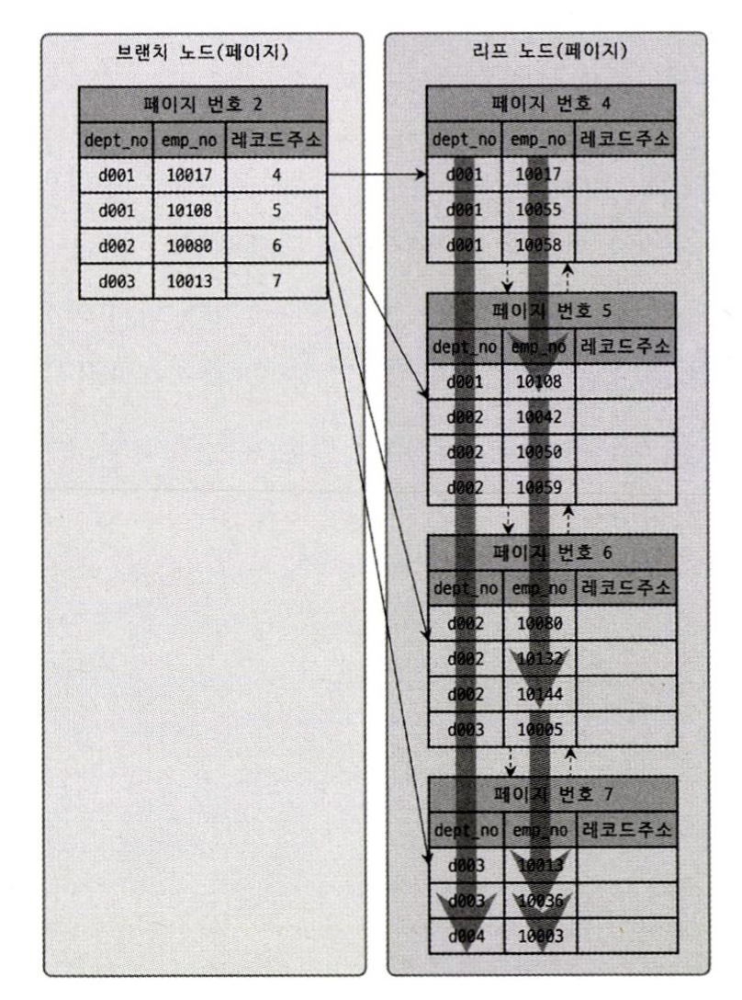
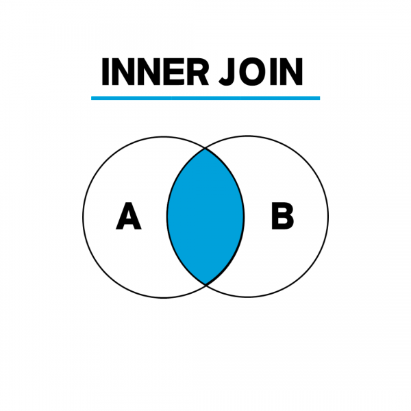
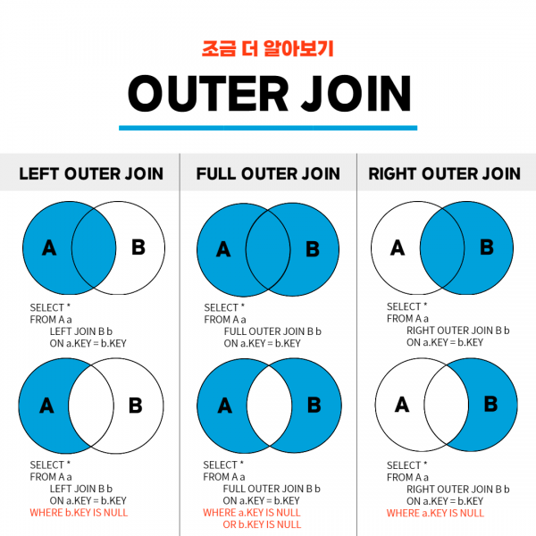
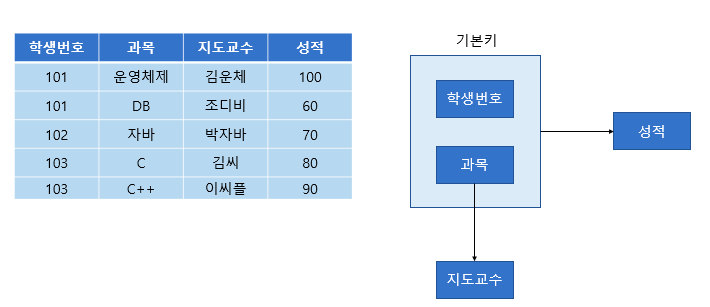
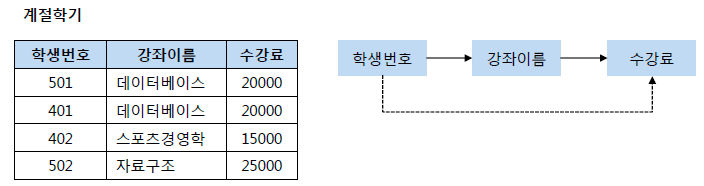
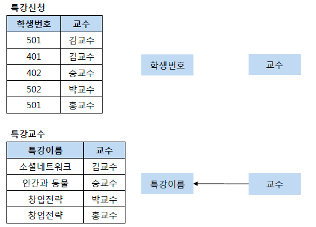
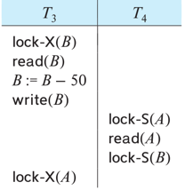

<details>
    <summary><b>관계형 데이터베이스</b></summary> 

## 정리
### 관계형 데이터베이스란?
- 데이터를 테이블에 저장하는 데이터베이스
- 데이터 구조가 명확하고, 변경될 여지가 없을 경우에 사용하면 좋다.
- Scale-up 만 가능하다.
#### 장점
- 데이터 분류, 정렬, 탐색 속도가 빠름
- 데이터의 무결성과 신뢰성 보장
- 정규화에 따른 갱신 비용이 적음
#### 단점
- 기존 작성된 스키마 수정이 어려움
- 데이터 베이스의 부하를 분석하기 어려움
- 빅데이터 처리시 비효율적
### 용어
- 열: 테이블에서 각각의 열은 유일한 이름을 가지고 있으며, 자신만의 타입으로 가지고 있다. 필드 또는 속성으로도 불린다.
- 행: 관계된 데이터의 묶음. 튜플 또는 레코드라고도 불린다.
- 값: 테이블에는 각각의 행과 열에 대응하는 값을 가진다.
- 키: 테이블에서 행의 식별자로 이용되는 열
- 관계: 테이블과 테이블과의 관계를 수에 따라 나타낸 것
  - 일대일 관계
  - 일대다 관계
  - 다대다 관계
- 스키마: 테이블을 설계하기 위한 메타데이터
### 파일시스템과 DBMS
#### 파일시스템
- 파일을 저장장치에 저장하고 사용하기 위한 규칙
- 구성요소는 순차적인 레코드들이며, 레코드는 파일을 다룰 때의 데이터 단위이다.
- 단점:
  - 데이터 종속성: data 가 변경될 때마다 프로그램 수정 필요
  - 데이터 중복성 & 비일관성: 중복된 데이터의 수정 시, 불일치 발생 가능
  - 데이터 접근이 어렵다.
  - 데이터 무결성: 데이터에 대한 제약 조건을 추가하기 어렵다.
  - 원자성 문제
  - 다중 사용자로에의한 동시 접근 안됨
  - 보안 문제: 세밀한 권한 설정이 어렵다.
## 예상 질문
- 관계형 데이터베이스에 대해 설명해주세요
- 장단점에 대해 설명해주세요
- RDBMS와 파일 시스템의 차이에 대해 설명해주세요
- RDB 의 크기를 확장하려면 어떻게 해야할까요?
## 참조
- https://velog.io/@csy9604/%EA%B4%80%EA%B3%84%ED%98%95-%EB%8D%B0%EC%9D%B4%ED%84%B0%EB%B2%A0%EC%9D%B4%EC%8A%A4-%EB%B9%84%EA%B4%80%EA%B3%84%ED%98%95-%EB%8D%B0%EC%9D%B4%ED%84%B0%EB%B2%A0%EC%9D%B4%EC%8A%A4
</details> 

<details>
    <summary><b>Key의 종류</b></summary> 

## 정리
### 키의 속성
- 유일성: 하나의 키 값으로 튜플을 유일하게 식별할 수 있는 성질
- 최소성: 키를 구성하는 속성들 중 꼭 필요한 최소한의 속성들로만 키를 구성하는 성질
### 슈퍼키
- 테이블에서 각 행을 유일하게 식별할 수 있는 속성들의 집합
- 유일성 O, 최소성 X
### 후보키
- 튜플들을 유일하게 식별하기 위해 사용되는 속성들의 부분집합
- 슈퍼키중 최소성을 만족하는 집합을 의미한다.
- 유일성 O, 최소성 O
- 모든 릴레이션은 하나 이상의 후보키를 가져야 한다.
### 기본키
- 후보키 중 선택된 속성
- 유일성 O, 최소성 O
- 중복된 값과 NULL 값이 허용되지 않는다.
- 자주 변경되는 값은 기본키로 적절하지 않다.
### 외래키
- 다른 릴레이션의 기본키를 참조하는 속성 또는 속성들의 집합
- 참조 테이블의 기본키에 없는 값은 외래키의 값으로 입력할 수 없다.
### 대체키
- 후보키에서 기본키를 제외한 나머지

## 예상 질문
- 키의 종류에 대해 간단하게 설명해주세요.
- 기본키와 대체키, 후보키에 대해 비교해주세요.
- 외래키의 제약에 대해 설명해주세요.
- 외래키에 NULL 값이 들어갈 수 있을까요?
- 기본키는 수정할 수 있을까요?
  - 변경될 수는 있지만 기본키가 변경됨으로써 기본키를 제외하고 나머지 속성이 같았던 튜플이 기본키를 바꿈으로써 중복이 될 수 있기 때문에 주의해야 합니다.
- PK 를 대체키로 사용하면 얻는 이점은 무엇이 있을까요?
  - 변경 가능성 제거
  - 성능 향상
  - 데이블 구조 간결
  - 데이터 무결성 보장
## 참조
- https://hyejin.tistory.com/m/118
- https://mangkyu.tistory.com/21
- https://mangkyu.tistory.com/287
</details> 

---

<details>
    <summary><b>인덱스 개념, 필요성</b></summary> 

## 정리
### 인덱스란?
- DBMS 에서 데이터의 조작 성능을 희생하고 그 대신 데이터의 읽기 속도를 높이는 기능
- 키 값을 중심으로 정렬되어 있다.
### 장단점
- 장점
  - 검색 속도 향상
- 단점
  - 인덱스를 관리하기 위한 추가 공간 및 작업 필요
### Inno DB (B-Tree) 에서의 인덱스
- 기본적으로 B-Tree 자료구조 사용
- PK 를 Clustered Index 로 사용
  - 만약 PK 를 지정하지 않으면, NOT NULL 인 UNIQUE 키를 Clustered Index 로 사용. 만약 이것도 없다면 hidden clustered index 를 생성.
  - PK 기반의 검색은 빠르나, 레코드의 저장이나 PK 값의 변경은 상대적으로 느림
#### Inno DB 의 Secondary Index 에 실제 레코드 주소가 들어가지 않는 이유는?
- 만약 실제 레코드 주소가 들어간다면, Clustered Index 의 키 값이 변경될 때마다 Secondary Index 에 있는 레코드 주소가 변경되어야 한다. 때문에 Secondary Index 에 실제 레코드 주소를 넣는 것이 아니라 `PK` 값을 저장한다. 
#### Clustered Index vs Non-Clustered Index
- Clustered Index: 인덱스의 정렬 기준과 레코드의 정렬 기준이 같은 형태
  - 장점: PK 로 범위 검색 하는 경우 매우 빠르다.
  - 단점 
    - Secondary Index 가 PK 를 갖고 있기 때문에 PK 가 커질 경우 전체적으로 인덱스의 크기가 커진다.
    - Secondary Index 로 검색할 때 PK 로 다시 한번 검색하기 때문에 처리 성능이 다소 느리다.
    - Secondary Index 가 PK 와 직접적으로 연관되어 있어 레코드를 삽입하거나 PK 를 변경할 때 처리 성능이 다소 느리다.
- Non-Clustered Index: 인덱스의 정렬 기준과 레코드의 정렬 기준이 다른 형태(보통 삽입된 순서로 저장됨)
#### 인덱스 키 관리 및 검색
- 키 추가
  - Inno DB 에서는 B-Tree 를 기반으로 하므로 노드를 새로 추가하는데 비용이 많이 든다.
  - 하지만 Inno DB 에서는 버퍼를 두어서 디스크 I/O 를 최대한 줄이는 방식을 이용한다.
    - INSERT 뿐만 아니라 UPDATE, DELETE 내용도 저장 (Change Buffer)
- 키 삭제
  - 해당 키값이 저장된 B-Tree 의 리프 노드를 찾아 삭제 마크.
  - 공간은 지워지지 않고 그대로 방치하거나 재활용됨
  - 레코드가 삭제될 경우 인덱스 트리에는 그대로 남아있으므로, 최악의 경우 인덱스 노드의 수가 레코드의 수보다 커져 인덱스를 활용하지 않는게 더 빠른 경우가 존재할 수 있다.
- 키 변경
  - 키 삭제 작업 후 삽입 작업 진행
- 키 검색
  - 100% 일치 또는 부등호 비교, 값의 앞부분이 일치하는 경우에 사용 가능
  - 값의 뒷부분이 일치하는 경우 인덱스 사용 불가능
  - 변형된 키 값의 경우 트리의 값들과 비교할 수 없기 때문에 인덱스 사용 불가능
## 예상 질문
- 인덱스에 대해 설명해주세요.
- 클러스터링 인덱스와 세컨더리 인덱스에 대해 설명해주세요.
- 인덱스를 설정한 것이 항상 빠를까요?
## 참조

</details> 

<details>
    <summary><b>인덱스를 어느 column에 사용할까</b></summary> 

## 정리
### 인덱스를 사용하면 좋은 경우
- 규모가 큰 테이블
- INSERT, UPDATE, DELETE 가 자주 발생하지 않는 컬럼
- JOIN 이나 WHERE, ORDER BY 에 자주 사용되는 컬럼
- 데이터 중복도가 낮은 컬럼
### 인덱스 키 선택 시 고려
#### 키 값의 크기
- Inno DB 에서 Disk I/O 를 하는 기본 단위를 Page 또는 Block 이라고 한다.
- Inno DB 에서 이 값은 16KB 로 고정되어 있다.
- Block 구조는 키 값과 자식 노드 주소로 구성된 노드의 집합체이다.
- 평균적으로 자식 노드 주소의 크기는 일정하므로 키 값에 따라 한 Block 에 들어갈 수 있는 노드의 개수가 정해진다.
- 따라서, 키 값이 커질 수록 한 Block 에 들어가는 노드는 적어지고, 같은 수의 노드를 읽어오기 위해 더 많은 Disk I/O 가 발생할 수 있다.
> 결론: 키 값이 커지면 더 많은 Disk I/O 가 발생할 수 있다.
#### 선택도(기수성)
- 선택도(기수성): 인덱스 키 값이 몇 종류로 구성되어 있는지
  - 전체 인덱스 키 값이 100개라고 가정하고, 10종류로 구성되어 있다고 하면 기수성은 10이다.
- 인덱스 키 값은 중복된 값이 많아지면 많아질수록 기수성과 선택도는 낮아진다.
- 선택도가 올라가면 검색 대상이 줄기 때문에 그만큼 빠르다.
- 성별같은거 고르면 안된다.
> 결론: 인덱스는 종류가 많은 열을 골라야 한다.
#### 읽어야 하는 레코드의 건수
- 인덱스를 통해 테이블의 레코드를 읽는 것은 인덱스를 거치지 않는 것보다 비용이 더 든다.
  - 인덱스 파일을 들렸다 하나의 레코드 데이터를 들고 올 때마다 Disk I/O 가 발생하기 때문
  - 반면 한 블록에 최대한 많은 레코드를 가져올 수 있다.
- 따라서 읽어야 하는 레코드 수가 20% 가 넘을 때는 인덱스를 사용하지 않고 직접 테이블을 모두 읽는 것이 효율적이다.
- 이 때는 옵티마이저에 의해 인덱스를 사용하지 않고 읽어온다.
> 결론: 읽어야 하는 레코드가 많으면 인덱스가 불리할 수 있다.
### PK 설정 시 고려해야 할 것
1. PK 는 되도록 검색에 자주 쓰이는 칼럼으로 사용하는 것이 좋다.
2. PK 는 반드시 명시하자
   - PK 가 없을 경우, 내부적으로 칼럼을 추가하는데 개발자가 이 컬럼을 통해 검색 쿼리를 할 수 없으므로 불이익이 크다.
3. 여러 칼럼의 복합으로 PK 를 설정하는 것보다 AUTO-INCREMENT 칼럼을 사용해보자.
   - 이와 같이 PK 의 크기가 크고 Secondary Index 를 사용한다면, 인조 식별자를 사용하는 것을 고려해보자.
### 다중 칼럼 인덱스

- 2개 이상의 컬럼을 포함하는 인덱스
- 다중 컬럼 인덱스에서 앞의 칼럼의 순서에 위의 칼럼의 순서가 영향을 받는다.
- 인덱스 내에서 각 칼럼의 위치가 중요하다.
### Unique Index
- MySQL 에서 Unique 키워드 사용시 자동으로 Index 설정이 된다.
- Null 은 특정 값이 아니므로 2개 이상 저장 가능하다.
  - Not Null 옵션 설정이 중요해보인다.
#### Unique Index vs Other Secondary Index
- 데이터 읽기
  - 읽어야 하는 레코드의 크기가 동일하다면 성능 차이는 거의 없다.
  - 일반적으로 읽어야 하는 레코드의 크기는 Unique 의 경우가 더 적다.
- 데이터 쓰기
  - Unique Index 의 경우 레코드를 추가할 때 중복된 값이 있는지 확인하는 과정이 추가적으로 들어간다.
    - 중복된 값을 확인하는 과정 때문에 버퍼를 이용하지 못한다. 따라서 Disk I/O 가 필수적으로 일어난다.
  - 따라서 Unique Index 가 다른 Secondary Index 에 비해 느리다.
  - MySQL 에서는 중복된 값을 체크할 때 읽기 잠금을 하고 쓰기를 할 때는 쓰기 잠금을 사용하는데 이 때 데드락이 자주 발생한다.
#### 사용 시 주의 사항
- 일반 인덱스와 Unique 를 같은 칼럼에 동시에 걸 필요는 없다. (동일한 역할을 수행하므로)
- 마찬가지로 PK 와 Unique 를 같은 컬럼에 동시에 걸 필요는 없다.
- 유일성이 필요하지 않다면 Unique 를 걸지 말고 일반 인덱스를 걸자
### 외래키
- 외래키 설정시 자동으로 인덱스가 생성된다.
#### Inno DB 외래키 관리
1. 참조되는 테이블(PK)이 쓰기 잠금 중일 때, 참조하는 테이블(FK)는 외래키에 대해 잠금 대기를 한다.
2. 참조되는 테이블이 쓰기 잠금중이어도 참조하는 테이블에서 외래키가 아닌 칼럼에 대해서는 잠금 대기를 하지 않는다.
   - 외래키가 아니면 락 해제를 기다리지 않음
> 외래키는 이처럼 잠금 경합이 발생할 수 있으므로 이를 고려해야 한다.
## 예상 질문
- 인덱스는 어느 경우에 사용하면 좋을까요?
- 왜 다중 컬럼 인덱스에서 인덱스를 설정할 때 칼럼의 순서가 중요할까요?
- Unique 와 Index 를 한 칼럼에 같이 할 경우 어떻게 되나요?
## 참조
- https://jjingho.tistory.com/170
</details> 

<details>
    <summary><b>인덱스의 자료구조</b></summary>

## 정리
### Hash Table
#### 특징
- 키 값을 해시 함수를 통해 변환하고 그 값을 인덱스로 활용한다.
- 인덱스를 통해 접근하므로 매우 빠른 검색을 지원한다.
  - 검색 시간: O(1)
- 장점
  - 키 값과 상관없이 인덱스의 크기가 작다.
  - 검색이 빠르다.
- 단점
  - 부등호 연산이나 정렬된 결과를 가져올 때는 적절하지 않다.
### B-Tree
#### 특징
- Balanced 트리 형태의 구조
- 노드의 구성 요소
  - 리프 노드: 인덱스 값 + 레코드 주소
  - 이외의 노드: 인덱스 값 + 자식 노드 주소
- Inno DB 에서는 B-Tree 자료구조를 사용한다.
- 부등호, 순차 검색 등에 적합하다.
  - 검색 시간: O(LogN)
#### 데이터 읽기
- 인덱스 레인지 스캔
  - 뒤의 두 방법보다 빠르다.
  - 범위가 결정된 인덱스를 읽는 방식
  - 시작 지점을 찾고 인덱스에 저장된 레코드 주소로 랜덤 I/O 를 실행해 데이터를 읽어온다. 이 과정을 끝 지점 인덱스까지 실행한다.
- 인덱스 풀 스캔
  - 인덱스의 처음부터 끝까지 모두 읽는 방식
  - 조건절에 사용된 칼럼이 인덱스의 첫 번째 칼럼이 아닐 경우 발생
    - 예) 인덱스는 (A, B, C) 칼럼의 순서대로 만들어져 있지만, 쿼리의 조건절은 B 나 C 칼럼으로 검색하는 경우
  - 테이블 풀 스캔보다는 적은 Disk I/O 를 발생시킨다.
  - 이 방식으로 사용하기 위해 인덱스를 설정하면 안된다.
- 루스 인덱스 스캔
  - 불필요한 인덱스는 무시하고 넘어가는 방식
  - GROUP BY 또는 집합 함수 중 MAX(), MIN() 함수에 대해 최적화하는 경우에 사용 
- 인덱스 스킵 스캔
  - 인덱스의 여러 컬럼 중 뒤의 컬럼만으로 검색하는 경우에 옵티마이저에 의해 인덱스를 통해 검색하도록 쿼리를 최적화하는 방식
  - 예) (A, B) 가 하나의 인덱스라면, B로만 검색해도 인덱스를 사용하도록 쿼리 최적화가 된다.
## 예상 질문
- 
## 참조
- https://mangkyu.tistory.com/96
</details> 

<details>
    <summary><b>인덱스는 왜 hash table이 아니라 b+tre로 구현되었을까</b></summary> 

> b+tree 는 hash table 에 비해 동등 비교는 느리지만 이외의 모든 연산에 대해 유리합니다. 
</details> 

<details>
    <summary><b>Join</b></summary> 

## 정리
### Join 이란?
- 두 개의 테이블을 서로 묶어서 하나의 결과를 만들어 내는 것
### Inner Join vs Outer Join
#### Inner Join

- 두 테이블에 모두 데이터가 있는 경우
- 일반적으로 조인이라고 하면 Inner Join 이다.
- 두 테이블의 순서를 바꾸어도 결과가 달라지지 않기 때문에 옵티마이저에 의해 최적화가 수행될 수 있다.
#### Outer Join

- Left Outer Join
  - 왼쪽 테이블의 모든 값이 출력되는 조인
- Right Outer Join
  - 오른쪽 테이블의 모든 값이 출력되는 조인
- Full Outer Join
  - 양쪽 테이블의 모든 값이 출력되는 조인
- 특징
  - MySQL 에서는 Full Outer Join 을 지원하지 않는다.
  - Outer Join 을 사용한 쿼리가 Inner Join 으로 실행되지 않도록 주의해야 한다.
    - 레코드가 없을 수도 있는 쪽의 테이블에 대한 조건은 On 절을 통해 명시하자 (Where 절에 명시 X)
    - 옵티마이저에 의해 Outer Join 을 Inner Join 으로 처리할 수 있다.
    - 아래와 같은 방식은 옵티마이저에 의해 Inner Join 으로 처리될 수 있다. -> On 절에 명시하거나 Inner Join 으로 사용하자
    ```mysql
    SELECT *
    FROM employees e 
      LEFT OUTER JOIN salaries s ON s.emp_no=e.emp_no
    WHERE s.salary > 5000;
    ```
#### 조인 관련 주의사항
- 실행 결과의 정렬 순서
  - 옵티마이저가 선택하는 실행 계획에 의존한 정렬은 피하는 것이 좋다.
  - 실행 계획은 언제 별경될지 알 수 없음
  - 반드시 `Order By` 절을 명시하자
- Inner Join 과 Outer Join 선택
  - 용도에 맞게 사용하자
  - 성능 차이는 거의 없으니 성능 때문에 선택하지는 말자
### Cross Join
- Cartesian Join 이라고도 한다.
- 한쪽 테이블의 모든 행과 다른 쪽 테이블의 모든 행을 조인시키는 기능
  - 연결 조건 없이 가져옴
- MySQL 에서는 Cross Join 과 Inner Join 이 같은 의미로 사용된다.
  - on 절이나 where 절에 조건이 적절히 있으면 Inner Join 으로 처리된다.
### Join 과 인덱스
- Driven Table vs Driving Table
  - Driven Table 은 이너 테이블이라고도 하며 나중에 접근되는 테이블이다. (이중 For 문에서 안에 있는 테이블)
  - Driving Table 은 아우터 테이블이라고 하며 먼저 접근되는 테이블이다. (이중 For 문에서 밖에 있는 테이블)
- 두 테이블을 Join 하는 경우 조건으로 제시하는 컬럼에 인덱스가 걸려있는지에 따라 성능이 달라진다.
  ```mysql
  SELECT *
  FROM employees e , salaries s 
  WHERE s.emp_no=e.emp_no;
  ```
  - 위와 같이 salaries 의 emp_no, employees 의 emp_no 에 인덱스가 걸려있는지가 성능에 중요
  - 만약 둘 다 걸려있다면?
    - 아무거나 이너 또는 아우터 테이블이 되도 됨
  - 하나만 걸려있다면?
    - 걸려있는 쪽이 이너 테이블이 되야함
    - 이너 테이블이면 해당 키를 가지고 인덱스 검색을 이너 테이블의 인덱스 파일에서 할 수 있다.
    - 만약 반대가 되면 테이블 풀 스캔을 해야 한다.
  - 둘 다 걸려있지 않다면?
    - 어느쪽이든 상관 없다.
    - 단 레코드가 적은 테이블이 이너 테이블이 되는 것이 좋다.
### Join 칼럼의 데이터 타입
- 조인을 위한 조건에서 데이터 타입을 일치시켜야 인덱스를 효율적으로 이용할 수 있다.
- 단, 다음의 경우에는 데이터 타입 불일치로 인한 영향이 없다.
  - CHAR vs VARCHAR
  - INT vs BIGINT (단 부호가 다르면 안됨)
  - DATE vs DATETIME
## 예상 질문
- Join 에 대해 설명해주세요
- Join 의 종류에 대해 설명해주세요
## 참조
- https://hongong.hanbit.co.kr/sql-%EA%B8%B0%EB%B3%B8-%EB%AC%B8%EB%B2%95-joininner-outer-cross-self-join/
</details> 

<details>
    <summary><b>정규화</b></summary> 

## 정리
### 이상 현상
#### 삭제 이상
- 튜플 삭제 시 같이 저장된 다른 데이터까지 연쇄적으로 삭제되는 현상
#### 삽입 이상
- 튜플 삽입 시 특정 속성에 해당하는 값이 없어 NULL 을 입력해야 하는 현상
#### 수정 이상
- 튜플 수정 시 중복된 데이터의 일부만 수정되어 일어나는 데이터 불일치 현상
### 정규화
- 이상 현상이 발생하는 테이블을 분해하여 이상 현상을 없애는 것
#### 제1정규화
- 모든 속성은 반드시 하나의 값을 가져야 한다.
- 하나의 속성에 여러 개의 값을 저장하거나 하나의 엔티티에 똑같은 성격의 속성이 여러번 나열되면 안된다.
- 반복된 성격의 속성을 별도의 자식 엔티티로 분리
#### 제2정규화
- 식별자 일부에 종속되는 속성은 제거되어야 한다. (제1정규화는 만족하고,)
- 테이블의 식별자가 여러개(복합키)이고, 식별자가 모든 속성을 식별할 수 있어야 한다.
  - 식별자의 일부 (여러개중 일부)가 어떤 속성을 식별하면 안된다.
  - 아래 그림에서 기본키를 이루는 과목이 지도 교수를 식별하고 있으므로 제2정규화 대상이다.
  
- 조회 성능 향상을 위해 일부 속성을 복사하는 형태로 반정규화할 수도 있다.
  - 하지만 정규화를 수행하기 전에 반정규화를 먼저 수행하지는 말자
#### 제3정규화
- 제2정규화는 만족하고, 기본키를 제외한 속성들 간의 이행 종속성이 없어야 한다.
  - 이행 종속: A->B, B->C 일 때, A->C 가 성립하는 것
  - 식별자 외의 속성간에 종속 관계가 존재하면 안된다.
  - 아래의 예에서는 강좌 이름이 수강료를 결정하고 있다. 따라서 강좌 이름과 수강료는 따로 테이블을 분리해야 한다.
  
#### BCNF
- 제 3정규형을 만족하고, 모든 결정자는 후보키 집합에 속해야 한다.
  - 결정자: 속성 A 의 값을 알면 다른 속성 B 의 값이 유일하게 결정될 때, A 가 B 의 결정자라고 한다.
  - 아래 상황에서 후보키가 아닌 교수가 특강 이름을 결정하고 있다 이 경우 특강 이름과 교수를 다른 테이블로 분리해야 한다.
  
#### 정규화 장단점
- 장점
  - 데이터베이스 변경 시 이상 현상을 제거할 수 있다.
  - 새로운 데이터 형의 추가로 인한 확장 시, 그 구조를 변경하지 않아도 되거나 일부만 변경해도 된다.
- 단점
  - 테이블 분해로 인한 Join 연산이 많아지게 된다.
### 반정규화
- 정규화로 인한 성능저하가 발생했을 때 테이블을 다시 합치거나 컬럼을 복사하는 등의 처리를 하여 성능을 최적화하는 방법
- 반정규화된 컬럼을 동기화하는 것이 중요하다.
  - 그만큼 작업 부하가 커지고, 최대한 배치 형태로 실행하거나 백그라운드 작업으로 처리하는 것이 좋다.
## 예상 질문
- 이상 현상에 대해 설명해주세요
- 제1정규화에 대해 설명해주세요
- 제2정규화에 대해 설명해주세요
- 제3정규화에 대해 설명해주세요
- BCNF 에 대해 설명해주세요
- 정규화를 적용한 경험에 대해 말해주세요
## 참조
- https://mangkyu.tistory.com/28
- https://code-lab1.tistory.com/48
</details> 

---

<details>
    <summary><b>View</b></summary> 

## 정리
### View 란?
- 일종의 가상 테이블로서 실제로는 데이터를 저장하지 않고 데이터를 보여주는 역할을 수행합니다.
- view 조회 시 저장된 쿼리가 실행된다.
- 장점
  - 특정 사용자에게 테이블 전체가 아닌 필요한 필드만 보여줄 수 있다.
  - 복잡한 쿼리를 단순화 하여 사용할 수 있다.
  - 쿼리를 재사용할 수 있다.
- 단점
  - 한번 정의된 뷰는 변경할 수 없다.
  - 삽입, 삭제, 갱신 작업에 많은 제한 사항을 가진다.
  - 자신만의 인덱스를 가질 수 없다.
## 예상 질문
- 
## 참조
</details> 

---

<details>
    <summary><b>트랜잭션</b></summary> 

## 정리
### 트랜잭션이란?
- 데이터베이스의 상태를 변화시키는 하나의 논리적 기능을 수행하기 위한 작업의 단위
  - 장애가 일어날 때 복구의 단위
- Commit
  - 데이터베이스의 상태 변화가 완료된 것을 알리는 것
- Rollback
  - 트랜잭션이 비정상적으로 종료되어 데이터베이스의 일관성을 깨뜨렸을 때, 수행했던 연산을 취소하는 것
### ACID
#### 원자성(Atomic)
- 트랜잭션에 포함된 작업은 전부 수행되거나 전부 수행되지 않아야 한다.
- DBMS 는 원자성을 유지하기 위해 복구 관리자 프로그램을 작동
#### 일관성(Consistency)
- 트랜잭션을 수행하기 전이나 후나 데이터베이스는 항상 일관되게 처리해야 한다.
- DBMS 는 일관성을 유지하기 위해 동시성 제어 알고리즘과 무결성 제약조건을 활용함
#### 고립성(Isolation)
- 수행중인 트랜잭션에 다른 트랜잭션이 끼어들어 변경중인 데이터 값을 훼손하지 않아야 한다.
- DBMS 는 고립성을 유지하기 위해 동시성 제어 알고리즘을 작동
- 관련한 문제들
  - Dirty Read
    - 다른 트랜잭션에 의해 수정되었지만 아직 커밋되지 않은 데이터를 읽는 것
  - Non-Repeatable Read
    - 한 트랜잭션에서 같은 행을 두 번 읽었을 때 값이 없거나 결과가 다르게 나타나는 것
  - Phantom Read
    - 한 트랜잭션 내에서 같은 쿼리를 수행할때, 쿼리 결과가 달라지는 것
#### 지속성(Durability)
- 수행을 성공적으로 완료한 트랜잭션은 변경한 데이터를 영구히 저장해야 한다.
- DBMS 는 지속성을 유지하기 위해 복구 관리자 프로그램 이용
### 트랜잭션의 상태
- Active: 트랜잭션이 실행중인 상태
- Partially Committed: 마지막 연산까지 실행시킨 직후 상태, 실패 또는 완료로 전이됨
- Committed: 트랜잭션이 성공적으로 종료
- Failed: 트랜잭션이 비정상적으로 종료되어 중단된 상태
- Aborted: Rollback 을 수행하는 상태
## 예상 질문
- 
## 참조
- https://mangkyu.tistory.com/30
</details> 

<details>
    <summary><b>Lock</b></summary> 

## 정리
### Lock 이란?
- 여러 사용자들이 같은 데이터를 동시에 접근하는 상황에서 데이터의 무결성과 일관성을 지키기 위해 사용하는 방법
### 설정 범위
- 데이터베이스
  - 전체 데이터베이스를 기준으로 락
  - 하나의 세션만 DB 에 접근 가능
- 테이블
  - 테이블 단위로 설정되는 락
  - 명시적으로 설정할 수도 있고, 묵시적으로 DDL 이 실행될 때 설정될 수도 있다.
- 행
  - DML 에 대한 락을 수행
### 종류
#### 공유 락
- 데이터를 변경하지 않는 읽기 명령에 대해 주어지는 락. Read Lock 이라고도 한다.
- 여러 사용자가 동시에 데이터를 읽어도 데이터 일관성에는 아무런 영향을 주지 않기 때문에 공유 락끼리는 동시에 접근 가능
- 공유락이 설정된 데이터에 베타 락이 접근할 수는 없다.
#### 베타 락
- 데이터에 변경을 가하는 명령들에 주어지는 락. Write Lock 이라고도 한다.
- 다른 세션이 해당 자원에 접근하는 것을 막는다.
### 비관적 락 vs 낙관적 락
#### 비관적 락
- 현재 트랜잭션에서 변경하고자 하는 레코드에 대해 잠금을 획득하고 변경 작업을 처리하는 방식
#### 낙관적 락
- 각 트랜잭션이 같은 레코드를 변경할 가능성이 희박할 것이라고 가정한다.
- 우선 변경 작업을 수행하고 마지막에 잠금 충돌이 있었는지 확인해 문제가 있으면 Rollback 하는 방식
- Rollback 처리는 개발자의 몫이다.
- 버전 관리 기능을 통해 트랜잭션 격리성 관리
#### 판단 기준
- 수정 비율이 높다면 비관적 락, 읽기 비중이 높다면 낙관적 락을 사용한다.
## 예상 질문
-  
## 참조
- https://sewonzzang.tistory.com/76
</details> 

<details>
    <summary><b>동시성 제어, 갱신손실 문제</b></summary> 

## 정리
### 동시성 제어란?
- 동시에 실행되는 여러 트랜잭션이 작업을 성공적으로 마칠 수 있도록 트랜잭션의 실행 순서를 제어하는 기법
### 갱신 손실
- 한 트랜잭션이 갱신한 내용을 다른 트랜잭션이 덮어써 갱신한 내용이 없어지는 것
### Schedule
- 트랜잭션들은 여러 연산들로 이루어져있는데, 그 트랜잭션들의 연산을 시간을 기준으로 실행 순서를 나타낸 것
## 예상 질문
- 동시성 제어에 대해 설명해주세요
- 갱신 손실은 뭔가요?
## 참조
</details>

<details>
    <summary><b>Lock, DeadLock</b></summary> 

## 정리
### Lock
- 동일한 데이터에 병렬적인 접근을 제어하는 것
### DeadLock

- 두 개 이상의 트랜잭션이 각자 데이터에 대한 락을 걸어놓고, 상대방 데이터에 대한 락을 요청할 경우 무한 대기에 빠지는 현상
### 블로킹
- 한 트랜잭션이 처리될 때 락을 걸면, 이 락이 해제되기 전까지 자원을 접근할 수 없는 현상
### 2단계 락킹
- 트랜잭션들이 병렬적으로 실행될 때 데이터의 일관성을 깨지지 않게 하기 위해 로킹 단계를 2개로 나누는 방법
#### 확장 단계(Growing Phase)
- 트랜잭션이 락을 얻는 단계
- 락을 해제하지 못함
#### 축소 단계(Shrinking Phase)
- 락을 해제하는 단계
- 락을 얻지 못함
## 예상 질문
- 락킹에 대해 설명해주세요
- 락을 사용할 때 발생할 수 있는 문제에 대해 설명해주세요
- 2단계 락킹에 대해 설명해주세요
## 참조
</details>

<details>
    <summary><b>트랜잭션 고립(격리) 수준</b></summary> 

## 정리
### 트랜잭션 고립 수준
- 트랜잭션을 병렬적으로 실행시키면서 락보다 좀 더 완화된 방법으로 문제를 해결하기 위해 제공되는 명령어
#### Read Uncommitted
- 자신의 데이터에 공유락을 걸지 않는 방식. 배타락은 건다.
- 다른 트랜잭션의 데이터에 락이 결려있는지 상관없이 접근
- 발생할 수 있는 문제점
  - Dirty Read, Unrepeatable read, Phantom read
#### Read Committed
- 자신의 데이터에 공유락을 걸지만 트랜잭션이 끝나기 전에도 해지가 가능한 방식
- 다른 트랜잭션의 데이터가 공유락이 걸려있으면 접근 가능. 배타락은 접근 불가능 (락 호환성 규칙 적용)
- 발생할 수 있는 문제점
  - Unrepeatable read, Phantom read
#### Repeatable Read
- 자신의 데이터에 공유락과 배타락을 걸며, 트랜잭션이 끝날 때까지 유지하는 방식
- 다른 트랜잭션의 데이터는 락 호환성을 적용하여 접근
  - 수정, 삭제 불가능
  - 삽입은 가능
- 발생할 수 있는 문제점
  - Phantom read
#### Serializable
- 실행중인 트랜잭션은 다른 트랜잭션으로부터 완벽하게 분리
- 다른 트랜잭션의 데이터는 락 호환성을 적용하여 접근
  - 삽입, 수정, 삭제 불가능
### MVCC 란?
- 동시 접근을 허용하는 데이터베이스에서 동시성을 제어하기 위해 사용하는 방법
- 데이터에 접근하는 사용자는 접근한 시점에 데이터베이스의 Snapshot 을 찍는다.
  - 이 스냅샷 데이터에 대한 변경이 완료될 때까지의 변경사항은 다른 데이터베이스 사용자가 볼 수 없다.
- 잠금을 필요로 하지 않기 때문에 매우 빠르다.
- 사용하지 않는 데이터가 계속 쌓이므로 데이터를 정리하는 시스템이 필요
- 데이터 버전이 충돌하면 애플리케이션 영역에서 문제를 해결해야 함
### MVCC vs 락
- 낙관적 락과 비관적 락은 다른 트랜잭션이 수정하는 것 자체를 막는다. 반면 MVCC 는 다른 트랜잭션이 수정하는 것 자체는 막지 못하고 항상 일관된 읽기를 위해서 사용된다. 따라서 갱실 손실 문제를 해결하기 위해 락을 사용한다. 
### 낙관적락 vs Repeatable Read
- 읽기 비율이 높은 경우 트랜잭션을 블로킹 하지 않는 낙관적 락을 사용하는 것이 좋다.
## 예상 질문
- 트랜잭션의 고립 수준에 대해 설명해주세요
- 낙관적 락과 Repeatable Read 을 비교해주세요
## 참조
- https://velog.io/@meme2367/%EB%A9%B4%EC%A0%91-%EC%A4%80%EB%B9%84-%EB%82%99%EA%B4%80%EC%A0%81-%EB%9D%BD-%EB%B9%84%EA%B4%80%EC%A0%81-%EB%9D%BD-MVCC-Repeatable-Read-Non-Blocking
</details> 

<details>
    <summary><b>트랜잭션 회복</b></summary> 

## 정리
### 장애의 유형
- 트랜잭션 실패
  - 트랜잭션이 논리적인 오류로 발생할 수 있는 오류 상황
- 시스템 장애
  - 하드웨어나 소프트웨어에 문제가 생겨 발생하는 상황
- 디스크 장애
  - 디스크의 손상으로 인해 발생하는 상황
### 회복
- 데이터베이스를 장애가 발생하기 이전 상태로 복구하는 것
- 데이터베이스를 복제하는 방법과 로그 파일을 통해 복구하는 방식이 있다.
### 로그
- 데이터베이스에 일어난 활동들을 기록한 파일
- 데이터 복구를 할 때 로그 파일을 이용한다.
  - Undo: 트랜잭션에서 접근한 데이터의 값을 이전의 값으로 되돌리는 것
  - Redo: 트랜잭션에서 변경한 데이터로 다시 시록하는 것
  - 목적:
    - Redo
      - 트랜잭션은 정상적으로 해지만 디스크에 제대로 값이 반영이 안됐을 때 사용
      - 장애가 발생해서 로그만 남은 경우
      - 성능 향상을 위한 데이터 버퍼링을 할 때 디비에 반영할 때
    - Undo
      - Rollback 을 할 경우
      - Redo 를 통해 트랜잭션을 복구할 경우 복구 과정 이전에 Undo 진행
      - 변경 사항을 커밋하지 않았을 때 사용
### 로그 기반 회복
#### 즉시 갱신
- 트랜잭션 완료 이전에 발생한 변경 내용을 로그 파일에 저장하고 이를 즉시 데이터베이스에 반영하는 방식
#### 지연 갱신
- 트랜잭션에서 발생한 변경사항을 로그 파일에 저장하다가 커밋이 발생하면 데이터베이스에 저장하는 방식
### 체크포인트
- 장애가 발생한 경우 체크포인트 이전에 처리된 트랜잭션은 제외하고 이후에 처리된 트랜잭션에 대해서만 회복 작업을 진행하는 방식
- 회복 시 많은 양의 로그를 검색하고 갱신하는 시간을 줄일 수 있다.
## 예상 질문
- 트랜잭션의 회복에 대해 설명해주세요
- 로그 방식 회복에 대해 설명해주세요
- 체크포인트를 사용하는 이유에 대해 설명해주세요
## 참조
- https://rebro.kr/165
- https://mangkyu.tistory.com/30
</details> 

--- 

<details>
    <summary><b>NoSQL</b></summary> 

## 정리
### NoSQL 이란?
- 스키마가 없거나 느슨한 스키마로 데이터 간의 관계없이 자유로운 형태로 데이터를 저장하는 데이터베이스
- 수평적 확장 가능
  - 대용량 데이터 저장 가능
- 분산형 구조
- 데이터의 읽기는 자주 하지만 변경은 자주 없는 경우 사용
### 장단점
#### 장점
- RDBMS 에 비해 저렴한 비용으로 분산 처리와 병렬 처리 가능
- 설계 비용 감소
- Big Data 처리 효율적
#### 단점
- 데이터 업데이트 중 장애가 발생하면 데이터 손실 발생
- 많은 인덱스를 사용하면 충분한 메모리가 필요
- 데이터 일관성이 항상 보장되지 않음
### 종류
#### Key-Value
- 키 밸류 형태
- Redis, Oracle NoSQL Database
#### Wide-Column Datase
- 행마다 키와 해당 값을 저장할 때마다 각각 다른 값의 다른 수의 스키마를 가질 수 있다.
- Hbase, GoogleBigTable
#### Document Database
- 테이블의 스키마가 유동적이다. XML, JSON 과 같은 문서 형태로 저장 
- MongoDB, CouchDB
#### Graph Datase
- 데이터를 노드 표현하여 노드 사이의 관계를 정의하는 데이터베이스
- Neo4j, BlazeGraph
## 예상 질문
- NoSQL 에 대해 설명해주세요
## 참조
</details>

<details>
    <summary><b>NoSQL Vs. RDB</b></summary> 

## 정리
### 장단점
#### RDB
- 장점
  - 명확한 데이터 구조 보장
  - 중복 없음
- 단점
  - 시스템이 커질 경우 복잡한 쿼리가 많아진다.
  - Scale-Up 만 지원하기 때문에 비용이 많이 든다.
  - 스키마 변경이 어렵다.
#### NoSQL
- 장점
  - 자유로운 데이터 구조
  - 데이터 구조 변경이 자유롭다.
  - Scale-Out, Scale-Up 가능
- 단점
  - 데이터 중복 발생. 수정할 경우 모든 컬렉션에 수정 작업 필요
  - 명확한 데이터 구조를 보장하지 않음
### 사용처
- RDB
  - 데이터가 변경이 많이 되는 경우
  - 중복된 데이터가 없어야 하는 경우
- NoSQL
  - 정확한 데이터 구조를 알 수 없는 경우
  - 데이터 변경이 많이 없는 경우
  - 많은 데이터를 저장하는 경우
## 예상 질문
- NoSQL 과 RDB 를 비교해주세요
## 참조
- https://khj93.tistory.com/entry/Database-RDBMS%EC%99%80-NOSQL-%EC%B0%A8%EC%9D%B4%EC%A0%90
</details>