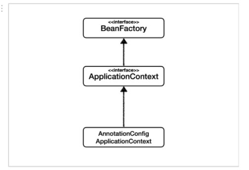

## Spring Core

<details>
    <summary><b>Spring Framework</b></summary>

## 정리
### 스프링 프레임워크란?
- 자바 엔터프라이즈 개발을 편하게 해주는 경량급 오픈소스 애플리케이션 프레임워크
### 특징
- 프레임워크 
  - 응용 프로그램이나 소프트웨어 솔루션 개발을 수월하기 위해 구조, 틀이 제공된 소프트웨어 환경
- 애플리케이션 프레임워크
  - 특정 계층이나 기술, 업무 분야에 국한되지 않고 애플리케이션 전 영역을 포괄하는 범용적인 프레임워크
  - 애플리케이션 개발을 편하게 해준다.
- 경량급
  - 실제 스프링의 코드가 작은 규모로 되어있다는 뜻이 아니라 개발 환경이나 서버 환경이 더 가볍다는 의미이다.
  - EJB 는 WAS 를 이용하여 개발환경을 갖추는데 비용이 컸지만, Spring 은 톰캣이나 제티 등 가벼운 서버 환경에서도 동작한다.
    - 개발 과정이 더 편리해지고 생산성과 품질면에서 유리하다.
- 자바 엔터프라이즈 개발이 편하다.
  - 로우 레벨을 신경쓰지 않고 비즈니스 로직만 구현하는데 집중할 수 있다.
- 오픈 소스
  - 유연한 개발을 통해 버그와 문제점이 빠르게 발견된다.
  - 하지만 개발이 계속 될 것이라는 보장이 없다.
- POJO 기반
  - POJO(Plain Old Java Object) 기반으로 특정한 기술과 환경에 종속되지 않는 코드를 만들고 쉬운 개발을 보장해준다.
  - AOP, DI, PSA
## 예상 질문

## 참조
- https://incheol-jung.gitbook.io/docs/study/tobys-spring/undefined/8
</details>

<details>
    <summary><b>Spring Vs. Spring Boot Vs. Spring MVC</b></summary>

## 정리
### Spring
- 애플리케이션 개발을 편하게 해준는 자바의 프레임워크로 IoC 와 DI 를 통해 느슨한 결합을 유지할 수 있게 합니다.
### Spring Boot
- 스프링 프레임워크의 모듈로 설정 과정을 최소화 하도록 돕습니다. 
- 특징
  - 자동 설정
  - 내장 서버 제공 (톰캣, 제티)
  - in-memory DB 제공(H2)
  - 의존성의 버전 관리 (starter)
  - boilerplate code 빈도 낮춤
### Spring MVC
- 웹 애플리케이션 개발을 위한 MVC 프레임워크로 HTTP 기반입니다.
- 특징
  - MVC 패턴
  - 웹 애플리케이션을 위한 설정이 되어있음
## 예상 질문

## 참조
- https://www.javatpoint.com/spring-vs-spring-boot-vs-spring-mvc
</details>

---

<details>
    <summary><b>DI(Dependency Injection)</b></summary>

## 정리
### DI 란?
- 외부에서 두 객체 간의 관계를 결정해주는 디자인 패턴
- 인터페이스를 사이에 둬서 클래스 레벨에서 의존관계가 고정되지 않도록 하고 런타임 시에 관계를 동적으로 주입하여 유연성을 높이고 결합도를 낮출 수 있다.
### 생성자 주입
- 생성자를 통해 의존관계를 주입하는 방식
- 생성자의 호출 시점에 1회 호출되는 것이 보장된다.
### Setter 주입
- Setter 를 통해 의존 관계를 주입하는 방법
- 주입받는 객체가 변경될 가능성이 있는 경우에 사용
### 필드 주입
- 필드에 바로 의존 관계를 주입하는 방법
- 외부에서 접근이 불가능해서 테스트 코드 작성에 어려움이 존재한다.
- DI 프레임워크가 강제된다.
## 예상 질문

## 참조
- https://mangkyu.tistory.com/150
</details>

<details>
    <summary><b>생성자 주입을 지향하는 이유</b></summary>

## 정리
- 객체의 불변성 확보
- 테스트 코드 작성 용이
- final 키워드 작성
- 스프링에 비침투적인 코드 작성
- 순환 참조 에러 방지
## 예상 질문

## 참조
- https://mangkyu.tistory.com/125
</details>

---

<details>
    <summary><b>IoC(Inversion of Control)</b></summary>

## 정리
### IoC 란?
- 객체의 생성과 의존 관계 설정 등의 제어권을 넘기는 것을 의미한다. 애플리케이션 코드가 아니라 IoC 컨테이너에 의해 제어된다.
## 예상 질문

## 참조

</details>

<details>
    <summary><b>스프링 컨테이너</b></summary>

## 정리
### 스프링 컨테이너 (IoC 컨테이너)란?

- 스프링에서 IoC 를 담당하는 컨테이너로, 객체의 생명주기를 관리한다.
- 빈 팩토리: 오브젝트의 생성과 오브젝트 사이의 런타임 관계를 설정하는 DI 관점으로 볼 때의 컨테이너
- 애플리케이션 컨텍스트: DI 를 위한 여러 컨테이너 기능을 추가한 것
  - 빈 사이에 이벤트를 발생시키고 이를 전달받는 기능
  - 국제화가 지원되는 텍스트 메시지를 관리하는 기능
  - 리스너로 등록된 빈에게 이벤트 발생을 알려주는 기능
- 빈을 등록, 생성, 등록, 반환하는 역할을 수행한다.
## 예상 질문

## 참조
- https://dev-coco.tistory.com/80
</details>

<details>
    <summary><b>싱글톤 컨테이너</b></summary>

## 정리
### 싱글톤이란?
- 하나의 클래스에 하나의 인스턴스만 존재하는 것
- 적합한 객체
  - 상태가 없는 공유 객체
  - 읽기 전용 객체
- 장점
  - 불푤요한 메모리 누수를 방지
  - 클래스 간에 데이터 공유가 쉽다.
- 단점
  - 테스트 하기가 힘들다.
  - 서버 환경에서 싱글톤을 보장할 수 없다. (JVM 이 분산되어 설치된 경우)
  - 의존 관계 상으로 클라이언트가 구체 클래스에 의존하게 된다.(DIP 위반)
### 자바 싱글톤과 스프링 싱글톤
- 스프링에서는 객체들을 싱글톤으로 관리한다. 이 객체들을 빈이라고 한다.
- 객체의 생명주기를 위임함으로써 자바 싱글톤의 단점을 극복할 수 있다.
### 싱글톤 컨테이너
- 스프링에서 싱글톤 형태의 오브젝트를 만들고 관리하는 기능을 수행한다.
- 싱글톤 레지스트리라고도 한다.
## 예상 질문

## 참조
- https://tecoble.techcourse.co.kr/post/2020-11-07-singleton/
- https://mangkyu.tistory.com/153
- https://catsbi.oopy.io/6c4846a1-130d-4aba-94ea-e630cc15056d
</details>

---

<details>
    <summary><b>스프링 빈</b></summary>

## 정리
### 스프링 빈이란?
- 컨테이너 안에 들어있는 객체
- 스프링 컨테이너에 의해 관리되는 자바 객체(POJO)
### 등록
- Component Scan
  - `@Component` 를 명시하여 빈을 추가한다. (이외에도 `@Controller`, `@Service`... 등등)
  - 개발자가 직접 컨트롤이 가능한 클래스들의 경우
  - 클래스 또는 인터페이스에 붙임
- `@Bean`
  - `@Configuration` 이 달린 클래스에서 빈으로 등록하면 된다.
  - 개발자가 컨토롤이 불가능한 외부 라이브러리들을 Bean 으로 등록할 경우
  - 메서드 또는 어노테이션에 붙임
- xml 등록
### Bean Lite Mode
- 다음과 같이 빈을 등록할 수 있다.
```java
@Configuration
public class AppConfig {

    @Bean
    public MemberService memberService() {
        return new MemberServiceImpl(memberRepository());
    }

    @Bean
    public OrderService orderService() {
        return new OrderServiceImpl(memberRepository(), discountPolicy());
    }

    @Bean
    public MemberRepository memberRepository() {
        return new MemoryMemberRepository();
    }
}
```
- 위와 같이 등록한 경우 memberService 와 orderService 에서 각각 다른 MemoryMemberRepository 인스턴스를 사용한다고 생각할 수 있다.
- 스프링에서는 CGLIB 를 통해 바이트코드를 조작하여 인스턴스가 있으면 해당 인스턴스를 사용하고 없으면 인스턴스를 생성하는 방식으로 동작한다.
- 이때 `@Configuration` 대신 `@Component` 를 사용하면 Bean Lite Mode 로 동작하는데
  - Bean Lite Mode 는 CGLIB 를 이용하여 바이트 코드 조작을 하지 않는 방식을 의미한다.
  - 싱글톤을 보장하지 않는다.
## 예상 질문
- 스프링 빈(싱글톤 스코프)는 Thread-safe 한가?
  - 싱글톤 레지스트리를 통해 private 생성자, static 변수 등의 코드 없이 비즈니스 로직에 집중하고 테스트 코드에 용이한 싱글톤 객체를 제공하는 것뿐지지, 동기화 문제는 개발자가 처리해야 한다.
## 참조
- https://steady-coding.tistory.com/594
</details>

<details>
    <summary><b>빈 생명주기 콜백</b></summary>

## 정리
### Singleton 생명주기
1. 스프링 컨테이너 생성
2. 스프링 빈 생성
3. 의존 관계 주입
4. 초기화 콜백
5. 사용
6. 소멸전 콜백
7. 스프링 종료
### Prototype 생명주기
1. 스프링 컨테이너 생성
2. 스프링 빈 생성
3. 의존 관계 주입
4. 초기화 콜백
5. 사용
6. GC 에 의해 수거
## 예상 질문

## 참조

</details>

<details>
    <summary><b>빈 스코프</b></summary>

## 정리
### Singleton 빈
- 스프링 컨테이너에서 한번만 생성되며, 컨테이너가 사라질 때 제거된다.
- 스코프가 명시되지 않으면 싱글톤 빈이다.
- `@Scope("singletone")`
- 적합한 객체
  - 사용할 때마다 상태가 달라져야 하는 객체
  - 쓰기가 가능한 상태가 있는 객체
### Prototype 빈
- DI 가 발생할 때마다 새로운 객체가 생성되어 주입된다.
- 빈 소멸에 스프링 컨테이너가 관여하지 않고 GC 에 의해 빈이 제거된다.
- `@Scope("prototype")`
- 적합한 객체
  - 상태가 없는 공유 객체
  - 읽기 전용으로만 상태를 가진 객체
  - 쓰기가 가능한 상태를 지니면서 사용 빈도가 높은 객체(동기화 필요)
### 웹 스코프
- Spring MVC 를 사용할 경우 제공
- 웹 환경에서만 동작하는 스코프
  - 특정 주기가 끝날 때까지 관리한다.
#### 종류
- Request
  - HTTP 요청 하나가 들어오고 나갈 때까지 유지되는 스코프
  - 각각의 HTTP 요청마다 별도의 빈 인스턴스가 생성되고 관리된다.
- Session
  - HTTP Session 과 동일한 생명 주기를 가지는 스코프
- Application
  - 서블릿 컨텍스트와 동일한 생명 주기를 가지는 스코프
- WebSocket
  - 웹 소켓과 동일한 생명 주기를 가지는 스코프
## 예상 질문

## 참조

</details>

---

<details>
    <summary><b>컴포넌트 스캔</b></summary>

## 정리
### 컴포넌트 스캔이란?
- 빈으로 등록할 클래스들을 스프링 빈으로 등록해주는 과정
- `@Component` 를 가진 클래스가 대상
### 특징
- 빈 이름
  - 가장 앞 문자를 소문자로 바꾼 것이 빈 이름이 된다.
  - MemberService -> memberService
  - 수동 지정: `@Component("name")`
- 컴포넌트 스캔 범위: `@ComponentScan` 이 있는 파일의 패키지 아래를 찾는다.
  - basePackages, basePackageClasses 로 지정 가능
- 주의할 점
  - 하나의 인터페이스에 여러 구현체가 있을 때, 하나의 구현체에만 @Component 를 붙여야 충돌을 피할 수 있다.
    - 만약 여러 곳에 @Component 를 붙인다면, @Qualifier, @Primary 등을 이용해 충돌을 해결할 수 있다.
## 예상 질문

## 참조
- https://velog.io/@neity16/Spring-%ED%95%B5%EC%8B%AC-%EC%9B%90%EB%A6%AC-%EA%B8%B0%EB%B3%B8%ED%8E%B8-6-%EC%BB%B4%ED%8F%AC%EB%84%8C%ED%8A%B8-%EC%8A%A4%EC%BA%94Component-Scan-DI
</details>

<details>
    <summary><b>@ComponentScan, @Component @Controller, @Service, @Repository</b></summary>

## 정리
### @ComponentScan
- 해당 어노테이션이 있는 패키지를 기준으로 스캔 작업이 일어난다.
- stereotype 어노테이션들이 붙은 클래스들을 찾아 컨테이너에 등록한다.
- stereotype 을 여러 개로 나눈 이유는 가독성과 다른 처리를 위함이다.(`@Repository` 의 `DataAccessExection` 처리)
### @Component
- 스프링 빈으로 등록하기 위해 표시하는 기본 어노테이션
### @Configuration
- 빈 등록 클래스인 것을 나타내는 어노테이션
### @Controller
- Web MVC 에서 자주 사용하는 어노테이션으로 Controller 를 명시하기 위해 사용한다.
- vs `@RestController`
  - `@RestController` 는 Restful 서비스를 제공하기 위해 `@Controller` 를 확장한 개념이다.
  - `@Controller` 에 `@ResponseBody` 를 추가한 것이다.
  - View 를 통해 출력되지 않고 데이터 타입에 따라 MessageConverter 를 통해 변환이 된다.
### @Service
- 서비스 레이어라는 것을 표시하기 위한 어노테이션
### @Repository
- Repository 레이어라는 것을 표시하는 레이어
- DAO 메서드에서 발생하는 Unchecked Exception 를 `DataAccessException` 로 변환하는 역할 수행
## 예상 질문

## 참조

</details>

---

<details>
    <summary><b>PSA(Portable Service Abstraction)</b></summary>

## 정리
### PSA 란?
- 추상화 계층을 통해 기반 로직을 숨겨 개발자에게 편의성을 제공해주는 것
- 내부 구현과 관계 없이 외부에서 접근할 수 있는 구조이다.
  - POJO 원칙을 따른 Spring 의 기능으로, Spring 에서 사용하는 라이브러리들은 PSA 를 지켜야 한다.
### Spring Web MVC
- HttpServlet 을 상속받아 서블릿을 작성하는 부분을 추상화하였다.
#### 편의성 제공
- `@Controller` 어노테이션을 통해 요청을 매핑하는 컨트롤러로 역할을 부여할 수 있다.
- `@GetMapping` 과 `@PostMapping` 을 통해 요청을 매핑할 수 있다.
- 어노테이션을 통해 doPost(), doGet() 메서드를 구현하는 작업을 하지 않아도 된다.
> 서블릿 사용
```java
   public class FooServlet extends HttpServlet {
    
       // GET
       @Override
       protected void doGet(HttpServletRequest req, HttpServletResponse resp) throws ServletException, IOException {
           super.doGet(req, resp);
       }
   	
       // POST
       @Override
       protected void doPost(HttpServletRequest req, HttpServletResponse resp) throws ServletException, IOException {
           super.doPost(req, resp);
       }
   }
 ```
> 어노테이션 사용
```java
 @Controller
 class FooController {
 
   @GetMapping("/foo/new")
   public String createFoo(Map<String, Object> model) {
       // do something
   }
   
   @PostMapping("/bar/new")
   public String createBar(@Valid Bar bar, BindingResult result) {
       // do something
   }
 
 }
 ```
#### Portable
- 서블릿 기반에서 reactive 기반으로의 변경이 용이하다.
- 서블릿을 사용하는 코드에서 일부 코드만 바꿔주면 webflux 코드로 사용할 수 있다.
- 또한, WAS 또한 Tomcat 이 아닌 netty 로 변경하는 등 기존 코드를 변경하지 않고 기술 스택을 변경할 수 있다.
### Spring Transaction
#### 편의성 제공
- 다음과 같이 복잡한 트랜잭션 설정 코드를 작성하지 않고 `@Transactional` 을 통해 편리하게 트랜잭션 처리를 할 수 있다.
> [Oracle 페이지 예제](https://docs.oracle.com/javase/tutorial/jdbc/basics/transactions.html)
```java
public class Foo { 
  public void updateCoffeeSales(HashMap<String, Integer> salesForWeek) throws SQLException {
    String updateString =
            "update COFFEES set SALES = ? where COF_NAME = ?";
    String updateStatement =
            "update COFFEES set TOTAL = TOTAL + ? where COF_NAME = ?";

    try (PreparedStatement updateSales = con.prepareStatement(updateString);
         PreparedStatement updateTotal = con.prepareStatement(updateStatement))

    {
      con.setAutoCommit(false);
      for (Map.Entry<String, Integer> e : salesForWeek.entrySet()) {
        updateSales.setInt(1, e.getValue().intValue());
        updateSales.setString(2, e.getKey());
        updateSales.executeUpdate();

        updateTotal.setInt(1, e.getValue().intValue());
        updateTotal.setString(2, e.getKey());
        updateTotal.executeUpdate();
        con.commit();
      }
    } catch (SQLException e) {
      JDBCTutorialUtilities.printSQLException(e);
      if (con != null) {
        try {
          System.err.print("Transaction is being rolled back");
          con.rollback();
        } catch (SQLException excep) {
          JDBCTutorialUtilities.printSQLException(excep);
        }
      }
    }
  }
}
```
#### Portable
- JDBC 를 사용하는 `DatasourceTransactionManager`, JPA 를 사용하는 `JpaTransactionManager`, Hibernate 를 사용하는 `HibernateTransactionManager` 등 구현체를 유연하게 바꿀 수 있다.
#### Spring Cache
- `@Cacheable` 를 통해 추상화할 수 있다. 
- JCacheManager, ConcurrentMapCacheManager, EhCacheCacheManager 등 구현체를 바꿔도 정상적으로 동작한다.
## 예상 질문

## 참조
- https://dev-coco.tistory.com/83
- https://www.youtube.com/watch?v=P3vzrqADl8I
</details>

<details>
    <summary><b>POJO</b></summary>

## 정리
### POJO 란?
- Plain Old Java Object 의 약자로 특정 기술(프레임워크, 라이브러리 등) 에 종속적이지 않은 객체를 의미한다.
### 왜 필요한가?
- Spring 이전에 많이 쓰이던 EJB 는 클래스 코드가 EJB 에 지나치게 종속적이라는 문제가 존재했다.
- 이를 해결하기 위해 즉, 특정 기술에 지나치게 의존적이게 되는 현상을 방지하기 위해 POJO 라는 개념이 나오게 되었다.
### 조건
- 특정 규약에 종속되지 않아야 한다.
  - Java 에서 제공하는 API 외에는 종속되는게 없어야 함
- 특정 환경에 종속되지 않아야 한다.
  - 특정 기업의 프레임워크나 서버에서만 동작 가능한 코드로 작성하면 안된다.
- 객체지향적 원리에 충실해야 한다.
  - 단일 책임 원칙을 지켜야 한다.
### 장점
- 장점
  - 테스트하기 편하다.
  - 로우 레벨과 분리되기 때문에 비즈니스 로직에만 집중할 수 있게 된다.
### 특징
- POJO 클래스는 public 이어야 한다.
- 필드의 접근제어자에 대해 제한이 없다.
### vs Java Bean 
- 자바 빈은 제약 사항이 좀 더 많은 POJO 이다.
- 제약 사항
  - Serializable 을 구현해야 한다.
  - 필드의 접근 지정자는 private 이어야 한다.
  - 기본 생성자를 만들어야 한다.
  - getter, setter 이름을 getX, setX 형태로 해야 한다.(boolean 의 경우 isX 가능)
- Java Bean trade-off
  - 가변성
    - setter 로 인해 동시성이나 일관성 이슈가 있다.
  - Boilerplate
    - getter 와 setter 를 통해 코드가 난잡해짐
## 예상 질문

## 참조
- https://mangkyu.tistory.com/281
- https://www.nowwatersblog.com/springboot/springstudy/POJO
- https://www.baeldung.com/java-pojo-class
</details>

## Spring MVC

<details>
    <summary><b>WAS, WS</b></summary>

## 정리
### WAS 란?
- 특정 로직을 처리하는 동적인 컨텐츠를 제공하는 서버 (정적인 컨텐츠도 제공할 수 있다.)
- 예시로는 Tomcat, JBoss, Jeus 등이 존재한다.
### Web Server 란?
- 정적인 컨텐츠를 제공하는 서비스
- 예시로는 Apache, Nginx 등이 존재한다.
### WAS 로 정적인 컨텐츠를 제공하지 않는 이유?
- WAS 는 로직을 처리하는데 집중해야 한다.
- 기능을 분리하여 서버 부하를 방지해야 한다.
- 동적인 컨텐츠가 지연되면 정적 컨텐츠의 제공에도 영향을 받을 수 있다.
- 
## 예상 질문

## 참조
- https://yozm.wishket.com/magazine/detail/1780/
</details>

<details>
    <summary><b>Tomcat</b></summary>

## 정리
### Tomcat 이란?
- WAS 로서 Java EE 기반으로 만들어져 JSP 와 Servlet 을 구동하기 위한 서블릿 컨테이너 역할을 수행한다.
### Apache 
- Web Server 로 정적인 웹페이지를 응답한다.
### Apache Tomcat
- 아파치의 일부 기능을 가져온 톰캣이다.
- 정적인 웹 페이지는 아파치만 사용하고, 동적인 웹페이즈는 톰캣도 같이 이용한다.
## 예상 질문

## 참조

</details>

---

<details>
    <summary><b>MVC 패턴</b></summary>
</details>

---

<details>
    <summary><b>Servlet</b></summary>
</details>

---

<details>
    <summary><b>Dispatcher Servlet</b></summary>
</details>

<details>
    <summary><b>요청 흐름</b></summary>
</details>

---

<details>
    <summary><b>RequestMapping Handler Adapter</b></summary>
</details>

<details>
    <summary><b>구조 이해</b></summary>
</details>

---

<details>
    <summary><b>스프링 MVC의 어노테이션</b></summary>
</details>

---

<details>
    <summary><b>스프링 예외처리와 @ExceptionHandler</b></summary>
</details>
      
## Spring 심화

<details>
    <summary><b>AOP</b></summary>
</details>

<details>
    <summary><b>JDK Dynamic Proxy</b></summary>
</details>

<details>
    <summary><b>CGLIB</b></summary>
</details>

---

<details>
    <summary><b>ThreadLocal</b></summary>
</details>

---

<details>
    <summary><b>필터와 인터셉터</b></summary>
</details>
      
## JPA

## Test
