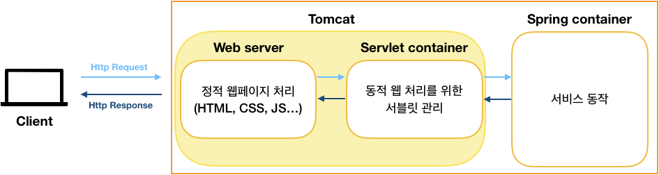

## Spring Core

    
<b>Spring Framework</b>

    
<b>Spring Vs. Spring Boot Vs. Spring MVC</b>

---

    
<b>DI(Dependency Injection)</b>

    
<b>생성자 주입을 지향하는 이유</b>

---

    
<b>IoC(Inversion of Control)</b>

---

    
<b>스프링 컨테이너</b>

    
<b>싱글톤 컨테이너</b>

---

    
<b>스프링 빈</b>

    
<b>빈 생명주기 콜백</b>

    
<b>빈 스코프</b>

---

    
<b>컴포넌트 스캔</b>

## 컴포넌트 스캔

- 클래스를 스캔하여 @Component 애노테이션이 붙은 클래스를 스프링 컨테이너에 자동으로 등록
- 따로 이름을 지정하지 않은 경우, 클래스의 맨 앞 글자가 소문자로 바뀐 클래스명으로 컨테이너에 저장된다.
- @Autowired 애노테이션이 붙어있을 경우 컨테이너에서 찾아 자동으로 의존 관계를 주입한다.
- 등록해야 할 빈이 굉장히 많아질 경우 개발자가 계속 반복해서 등록 코드를 작성하는 것이 매우 번거롭고, 사람이 하다보면 누락되는 것도 발생하기 때문에 자동 등록 기능을 제공한다.

### 컴포넌트 스캔 위치

- @ComponentScan 애노테이션이 붙은 클래스의 패키지를 기준으로 시작되어 하위 패키지를 전부 스캔한다.
- `basePackages`를 통해 스캔을 시작하길 원하는 패키지를 지정할 수 있다.
    - 이것도 마찬가지로 시작 패키지를 기준으로 하위 패키지를 모두 스캔한다.
    - 시작 위치는 여러 개를 지정할 수 있다.
- Spring Boot에서는 {ProjectName}Application 클래스의 @SpringBootApplication 애노테이션이 붙은 것을 기준으로 컴포넌트 스캔이 되는데, 프로젝트의 최상단에 위치시킨다.
    - 영한님도 특별한 경우가 아니라면 @ComponentScan을 가진 설정 정보 클래스 혹은 애플리케이션 시작 클래스는 프로젝트의 최상단에 위치시키는 것을 추천

### 컴포넌트 스캔 필터

- includeFilters : 컴포넌트 스캔 대상을 추가로 지정한다
- excludeFilters : 컴포넌트 스캔 대상에서 제외한다.
- FilterType 옵션
    - ANNOTATION : 기본값, 애노테이션을 인식해서 동작한다.
    - ASSIGNABLE_TYPE : 지정한 타입과 자식 타입을 인식해서 동작한다.
    - ASPECTJ : AspectJ 패턴 사용
    - REGEX : 정규 표현식 사용
    - CUSTOM : TypeFilter 인터페이스를 구현해서 처리

### 컴포넌트가 중복될 경우

- 만약 모두 자동으로 처리하는 빈이 이름이 동일해 충돌될 경우 스프링이 오류를 발생시킨다.
- 하지만 자동으로 처리되는 빈과 수동으로 등록한 빈의 이름이 동일하여 충돌될 경우 이전에는 수동으로 등록한 빈이 자동으로 처리된 빈을 오버라이딩 했었다.
    - 이는 개발자들이 발견하기 어려운 버그를 발생시키는 것이었기 때문에 스프링에서는 현재 이름이 겹쳐 충돌이 일어날 경우 에러를 발생시킨다.

    
<b>@ComponentScan, @Component @Controller, @Service, @Repository</b>

### 컴포넌트 스캔 대상

- @Component 애노테이션이 붙은 클래스를 스프링 빈으로 인식하여 자동으로 등록한다.
- @Controller, @Service, @Repository 애노테이션도 스캔 대상이다.
    - 내부에 @Component 애노테이션이 내장되어 있다.
    - @Controller : 스프링 MVC 컨트롤러로 인식한다.
    - @Service : 특별한 어떤 처리의 역할은 가지지 않지만 개발자들이 비즈니스 계층임을 인식하도록 도와준다.
    - @Repository : 스프링 데이터 계층으로 인식하여, 데이터 계층의 예외를 스프링 예외로 변환해준다.
    - @Configuration : 스프링 설정 정보로 인식하고, 다른 애노테이션과 마찬가지로 빈으로 등록하며, **스프링 빈들이 싱글톤으로 유지되도록 처리하는 추가 작업을 수행한다.**

- @SpringBootApplication
  - 디스패치서블릿 생성해주는 역할 함.
  - 스프링을 구동시키기 위한 모든 설정을 담당해서 해준다.

---

    
<b>PSA(Portable Service Abstraction)</b>

    
<b>POJO</b>

- 객체지향적인 원리에 충실하면서, 환경과 기술에 종속되지 않고 필요에 따라 재활용 될 수 있는 방식으로 설계된 오브젝트를 말한다.

## POJO의 조건

- 특정 규약에 종속되지 않는다.
    - POJO는 자바 언어와 꼭 필요한 API 외에는 종속되지 않아야 한다.
    - 만약 어떤 규약에 의해 특정 클래스를 상속하도록 강요한다면 자바의 단일 상속 때문에 더 이상 객체지향적인 설계 기법을 적용하기가 어려워지기 때문이다.
    - 규약이 적용된 환경에 종속적이면 다른 환경으로의 이전이 힘들어진다.
- 특정 환경에 종속되지 않는다.
    - 특정 환경에서만 동작하는 오브젝트이면 안된다.
    - 특히나 비즈니스 로직을 담고 있는 클래스는 웹이라는 환경 정보나 웹 기술을 담고 있는 클래스나 인터페이스를 사용해서는 안된다.
        - 직접적으로 웹 환경에 제한해버리는 오브젝트나 API에 의존해서는 안되는 것이다.
        - 웹 서버에 올리지 않고서는 테스트도 힘들어진다.
    - 특정 환경에 종속된 비즈니스 코드는 이해하기도 힘들다.
- 객체지향 설계가 적용되어야 한다.
    - 자바의 순수 오브젝트를 사용했다고 하더라도 모든 책임이 하나의 클래스에 몰려있는 오브젝트는 POJO라고 할 수 없다.

## POJO의 장점

- 특정한 기술, 환경에 종속되어 있지 않기 때문에 코드가 굉장히 깔끔해진다.
- 특정한 기술, 환경에 종속되어 있지 않기 때문에 테스트가 쉽다.
    - 특히 테스트를 자동화하기에도 쉽다.
        - 자유롭게 원하는 레벨에서 테스트를 작성할 수 있기 때문이다.
- 객체지향 설계가 잘 적용되어 있기 때문에 비즈니스 요구사항을 쉽고 명확하게 나타낼 수 있다.

## POJO 프레임워크

- POJO 프로그래밍이 가능하도록 기술적인 기반을 제공하는 프레임워크를 POJO 프레임워크라고 한다.
    - Spring, hibernate가 대표적인 POJO 프레임워크
    - hibernate는 DB 이용 기술에 POJO를 적용하는 것이 목적.
    - Spring은 엔터프라이즈 애플리케이션 개발의 모든 영역과 계층에서 POJO 방식의 구현이 가능하게 하려는 목적.
- 시스템의 복잡함을 POJO로 풀어내어 기술적인 부분을 드러내지 않으면서 POJO로 비즈니스를 구현할 수 있도록 한다.

## 스프링의 POJO

- 스프링이 POJO 프로그래밍이 가능하도록 하는 세 가지 기술은 IoC/DI, AOP, PSA이다.

### IoC/DI

- 유연한 확장이 가능하도록 지원한다.
- 핵심 기능을 변경하는 것을 동적으로 가능하도록 지원한다.
    - 인터페이스에 의존하도록 하기 때문에 구현체만 변경해주어도 동작에는 아무 문제가 없다.
- 부가 기능을 추가할 수 있다.
- DI를 통해 모든 오브젝트의 관계를 관제하기 때문에 지연 로딩, 프록시를 사용하여 응용할 수 있고, 오브젝트의 스코프를 자유롭게 제어할 수 있다.
- 의존관계를 외부에서 주입해줄 수 있어 테스트가 편리하다.
    - 원하는 의존 관계에 해당하는 오브젝트를 모킹해서 테스트할 수도 있고, 원하는 대로 마련해서 테스트 할 수 있다.
        - 모킹한 오브젝트를 사용하면 원하는 오브젝트에만 테스트를 집중할 수 있다.

### AOP

- 핵심 기능과 분리하기 위한 부가 기능을 모듈화하기가 전통적인 객체지향 설계 방식으로는 불가능했다.
    - 이것을 극복하기 위해 기존의 객체 지향 패러다임과 분리하여 새로운 특성을 가지도록 해야 한다는 주장이 강했으며, 이 부가기능 모듈을 `애스펙트`라고 부르기 시작했다.
- 애스펙트는 그 자체로는 핵심기능을 담고 있지 않지만 애플리케이션을 구성하는 중요한 한 가지 요소이며, 핵심 기능에 부가되어 의미를 가지는 특별한 모듈을 나타낸다.
- 따라서, AOP는 OOP를 대체하는 새로운 개념이 아닌 OOP를 돕는 보조적인 기술이라고 해야 한다. 핵심 기능을 설계하고 구현할 때 객체지향적인 가치를 지닐 수 있도록 도와주는 것이라고 생각해야 한다.
- AOP는 OOP와 함께하는 기술이고, OOP를 더욱 만족시킬 수 있는 기술이다.

### PSA

- 환경과 세부 기술의 변화에 관계 없이 일관된 방식으로 기술에 접근할 수 있게 해준다.
- 일관성 있는 서비스 추상화 기술을 의미한다.
    - 추상화된 클래스를 일관되게 바라보며 하위 클래스의 기능을 사용하는 것.
    - 어떤 서비스를 이용하기 위한 접근 방식을 일관된 방식으로 유지한다.
        - 변경 사항이 발생해도 최소한의 변경이 발생하도록 하기 위함.

## Spring MVC

    
<b>WAS, WS</b>

# Web Server

- HTTP 기반으로 동작한다.
- 정적 리소스, 기타 부가기능을 제공한다.
- 정적인 리소스만 전달하는 것으로, 사용자 별로 동적인 페이지를 제공할 수 없다.

# Web Application Server

- HTTP 기반으로 동작한다.
- 웹 서버의 기능을 포함하면서, 프로그램 코드를 실행하여 애플리케이션 로직을 수행할 수 있다.
    - 사용자 별로 동적인 페이지를 제공한다.
- HTML, JSP, 서블릿, 스프링 MVC가 WAS에서 동작한다.

# 둘 중에 하나만 사용해야 하나?

- 규모가 작은 프로젝트의 경우 보통 WAS만 사용해도 문제가 없다.
    - WAS가 정적 리소스를 제공하는 기능도 가지기 때문이다.
- 하지만 규모가 굉장히 크고 사용자가 많은 경우 WAS 하나만 사용하면 서버에 부하가 생긴다.
    - WAS 에 장애가 발생하면 정적 리소스도 전달할 수 없어, 오류 페이지조차도 제공할 수 없게 된다.
    - 웹 서버와 WAS를 함께 사용하여 역할에 맞게 작업을 분할한다.
        - WAS에 장애가 발생해도 정적 리소스를 제공할 수 있게 된다.
- 웹 서버와 여러 대의 WAS를 사용하면 웹 서버를 로드 밸런서로 사용하여 적절한 WAS로 요청을 인가하며 프로그램을 안정적으로 구성할 수 있다.

톰캣은 멀티스레드, Nginx 는 멀티 프로세스

    
<b>Tomcat</b>

## Tomcat

- Apache에서 제공하는 WAS
- 웹 서버인 Apache의 일부 기능을 제공하면서 애플리케이션 로직을 수행하여 전달하는 기능을 한다.
- Spring에서는 서블릿을 구동하기 위한 서블릿 컨테이너 역할을 수행한다.
    - Spring Boot에서는 톰캣이 내장되어 있어 별다른 설정 없이 바로 실행할 수 있다.
    - `서블릿` : 웹 서비스를 위한 인터페이스로, 클라이언트 요청에 상응하는 결과를 반환해주기 위해 웹페이지 혹은 결과 값을 동적으로 생성하는 역할을 수행한다.
    - `서블릿 컨테이너` : 서블릿을 관리하는 것으로, 서블릿 클래스 로드, 초기화, 호출, 소멸까지 관리하며, 스프링에서 제공하는 DispatcherServlet도 서블릿 컨테이너인 톰캣 내에서 수행된다.
        - 새로운 요청이 들어올 때마다 새로운 스레드 생성
        - 작업이 끝난 서블릿 스레드 자동 제거
    - 웹 서버와의 통신을 위해 요청을 받아 동적 서비스를 응답하기 위한 통신을 위해 소켓을 만드는 역할도 담당한다.
- 톰캣만으로 정적 리소스 제공이 불가능하다면 아파치와 함께 사용하여 리소스를 더욱 효율적으로 사용할 수 있다.

### Jetty

- 이클립스 재단의 HTTP 서버이자 자바 서블릿 컨테이너.
- 톰캣처럼 서버로 사용이 가능하다.
- 다른 웹 애플리케이션 서버 대비 적은 메모리를 사용하여 가볍고 빠르다.
- 경량 웹 애플리케이션 서버이기 때문에 소형 장비, 소규모 프로그램에 더 적합하며, 대규모 트래픽에는 취약하다.

---

    
<b>MVC 패턴</b>

---

    
<b>Servlet</b>

---

    
<b>Dispatcher Servlet</b>

    
<b>요청 흐름</b>

---

    
<b>RequestMapping Handler Adapter</b>

    
<b>구조 이해</b>

---

    
<b>스프링 MVC의 어노테이션</b>

---

    
<b>스프링 예외처리와 @ExceptionHandler</b>

      
## Spring 심화

    
<b>AOP</b>

    
<b>JDK Dynamic Proxy</b>

    
<b>CGLIB</b>

---

    
<b>ThreadLocal</b>

---

    
<b>필터와 인터셉터</b>

      
## JPA

## Test
