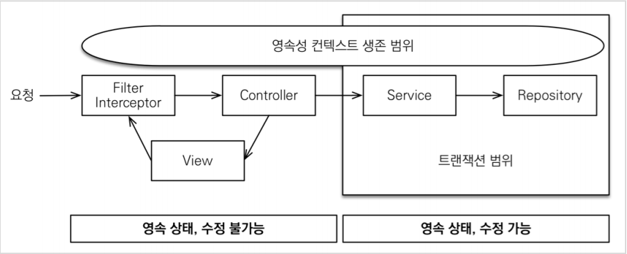

## JPA

---
# JDBC
### 동적쿼리 vs 정적쿼리

- 정적 쿼리 : 어떤 파라미터가 들어와도 쿼리의 형태가 동일한 경우
- 동적 쿼리 : 어떤 파라미터에 따라 쿼리의 형태가 달라지는 경우
    - 조건을 주냐 안주냐로 쿼리의 형태가 달라지는 경우 (if문)

# JDBC 등장 배경

- 데이터베이스마다 사용법이 다른 문제
    - 데이터베이스가 변경되면 애플리케이션의 코드도 모두 변경되어야 한다.
    - 데이터베이스마다 사용방법을 익혀야 한다.

## JDBC란

- 자바에서 데이터베이스에 접속할 수 있도록 지원하는 자바 API
    - 데이터베이스 연결, 요청 등을 추상화하여 표준 인터페이스로 제공
    - 인터페이스를 각각의 DB 벤더에서 자신의 DB에 맞도록 구현해서 라이브러리로 제공 = JDBC 드라이버
- 데이터베이스에서 자료를 쿼리하거나 업데이트하는 방법을 제공한다.
- 추상화하기는 했지만 모든 것을 공통화하지는 못했기 때문에 데이터베이스마다 사용하는 방법이 다른 것이 존재한다.
    - 데이터베이스가 변경되면 JDBC 코드는 변경하지 않아도 SQL을 사용하는 데이터베이스에 맞도록 변경해야 한다.

`Connection` : JDBC에서 제공하는 커넥션 인터페이스

`DriverManager` : JDBC 드라이브 매니저, 해당 데이터베이스에 맞는 커넥션을 가져오는 역할을 한다.

→ 즉, 해당 데이터베이스에 맞는 커넥션 구현체를 형성해서 반환한다.

- 라이브러리에 있는 드라이버 목록을 자동으로 인식하여 드라이버들에게 가져올 수 있는 커넥션을 획득한다.
- 사용자가 전달한 데이터베이스 정보를 기반으로 가능한 커넥션 구현체를 찾아서 제공한다.

## 커넥션 풀
- 데이터베이스에 연결하기 위해서는 커넥션을 항상 가져야 한다.
- 커넥션을 얻기 위한 과정은?
    - DB 드라이버를 통해 커넥션을 조회하고, 가능하다면 TCP/IP 커넥션을 연결한다. → 연결을 위한 네트워크 통신 동작이 발생한다.
    - 커넥션이 연결되면 사용자가 전달한 데이터베이스 정보를 DB에 전달한다.
    - ID, PW를 통해 내부 인증을 완료하고, 내부에 DB 세션을 생성하고, 커넥션이 성공적으로 생성 완료되었다는 응답을 보낸다.
    - 그러면 DB 드라이버는 커넥션 객체를 생성하여 클라이언트에게 반환한다.
- 위의 과정을 매번 수행하면 너무 시간도 리소스도 많이 소모된다. 그래서 이를 해결하기 위해 커넥션을 미리 생성해두고 사용하는 커넥션 풀 방식을 사용.
    - 생성해놓은 커넥션을 재활용하는 방식
    - 애플리케이션 실행 시점에 필요한 만큼의 커넥션을 미리 생성하여 풀에 보관한다.
    - 사용이 완료된 커넥션은 절대 종료하지 않고 살아있는 상태로 커넥션 풀에 반환해야 한다.
    - 일정한 갯수만큼만 커넥션을 유지하기 때문에 DB에 무한정 연결이 생성되는 것을 막아 DB를 보호하는 효과도 있다.
- 적절한 커넥션 풀 숫자는 서비스의 특징과 애플리케이션 서버 스펙, DB 서버 스펙에 따라 다르기 때문에 성능 테스트를 통해서 정해야 한다.
- 대표적인 커넥션 풀 오픈소스는 HikariCP 등등 여러개가 있는데, 스프링부트 2.0 부터는 hikariCP를 기본 커넥션 풀로 제공한다.
    - 성능과 사용의 편리함, 안정성 측면에서 이미 검증이 되었기 때문
    - 스프링부트를 사용하게 되면 JDBC 라이브러리를 받아올 때 HikariCP를 자동으로 가져온다.
- 커넥션 풀에서 커넥션을 생성하는 작업은 애플리케이션의 실행 속도에 영향을 주지 않기 위해 별도의 쓰레드에서 작동한다.
    - 커넥션 풀에 커넥션을 채우는 것이 상대적으로 오래걸린다. → TCP/IP 통신을 통해 커넥션을 가져오기 때문에.
    - 그래서 별도의 스레드를 사용하여 커넥션 풀을 채워야 애플리케이션 실행 시간에 영향을 주지 않는 것이다.
- 커넥션 풀을 사용하게 되면 커넥션 close를 했을때 커넥션이 종료되는 것이 아니라 살아 있는 상태에서 반환이 되는 것이다.
    - HikariCP는 커넥션 프록시를 사용하여 전달하고, 실제 커넥션과 연결하여 사용하도록 한다.
        - 프록시가 실제 커넥션을 가지고 있음

## DataSource

- DriverManager를 사용하면 항상 새로운 커넥션을 생성해서 반환한다. → 커넥션 풀을 사용하지 않음
- 커넥션 풀을 사용하게 되어 변경하면 애플리케이션의 로직이 변경됨.
    - 의존관계가 DriverManager에서 HiakriCp로 변경되는 것이다.
    - **그래서 커넥션을 획득하는 방법 자체를 추상화해버림. = DataSource 인터페이스**
    - 구현은 Driver에게 맡기고 사용자는 인터페이스를 통해 해당하는 드라이버의 구현체를 받아서 사용만 하는 방식으로 변경
- DataSource 인터페이스에만 의존하도록 애플리케이션 로직을 변경하면 새로운 커넥션을 획득하고 싶은 경우에는 DriverManager 사용, 아니면 HikariCP 커넥션 풀 구현체를 사용하도록 하면 된다.
    - 즉, 애플리케이션의 로직 변경이 일어나지 않게 되었다는 것이 포인트
- 하지만 DriverManger는 DataSource 인터페이스를 사용하지 않기 때문에 인터페이스가 아닌 DriverManager를 직접 사용해야 한다.
    - 결국 커넥션 풀 방식을 변경하려면 애플리케이션 로직을 모두 변경해야 한다.
    - 이를 해결하기 위해 스프링은 DataSource를 사용하는 DriverManagerDataSource라는 구현체를 제공하고 있다.

# JDBC vs Spring JDBC

- 커넥션을 관리하고 예외를 처리하고, 등등 부가적인 작업을 해주는 것이 Spring JDBC
- 요청, 실행을 스프링 프레임워크에 위임 → Spring JDBC

### JDBCTemplate → Spring JDBC

- JDBC의 반복되는 코드를 해결하기 위한 기술이다.
    - 템플릿 콜백 패턴 사용
    - 템플릿 : 기본적인 틀은 제공하면서 원하는 것만 변경해서 사용할 수 있도록 해주는 것
- 커넥션을 받아오고, SQL을 실행하고 예외를 전달하는 것까지 모두 처리해준다.
- SQL과 파라미터만 전달하면 원하는 쿼리를 바로 적용할 수 있다.
    - SELECT 하는 경우 원하는 객체의 형태로 받아오기 위해서는 Mapper가 필요하다.
        - RowMapper는 데이터베이스의 반환 결과인 ResultSet을 원하는 객체로 변환해준다.
        - resultSet을 반복적으로 조회하여 객체로 변환하는 과정을 자동으로 수행해준다.
- JdbcTemplate은 편리함을 제공해주기는 하지만 동적 쿼리 작성이 어렵다는 문제가 있다.
    - 값에 따라 변경되는 쿼리문을 동작하기가 힘들다.
- queryForObject() : 단건 조회를 위한 메소드
- query() : 다건 조회를 위한 메소드
- 두 메소드 모두 원하는 객체 형태로 받아오기 위해서는 RowMapper가 필요하다.

### NamedParameterJdbcTemplate

- 기존의 JdbcTemplate는 쿼리에 제공하는 파라미터가 순서대로 바인딩된다.
    - 쿼리의 순서가 바뀌거나 순서가 제대로 지켜지지 않는 경우 문제가 발생하는데, 이것을 발견하기가 매우 어렵다는 것이 문제이다.
    - 그래서 NamedParameterJdbcTemplate를 통해 이름을 지정해서 파라미터를 바인딩할 수 있도록 지원한다.
- 파라미터는 Map의 형태로 (key, value) 형태로 전달해야 한다.

### SimpleJdbcInsert

- insert query sql을 직접 작성하지 않아도 되도록 편리한 기능을 제공한다.
- 생성 시점에 데이터베이스 테이블의 메타 데이터를 조회하기 때문에 어떤 테이블에 어떤 컬럼이 있는지 확인할 수 있다.
- sQL을 전달하지 않고 파라미터 값만 SqlParameterSource 형태로 전달해주면 된다.

## SQL Mapper

- JDBC를 더욱 편리하게 사용하도록 도와준다.
    - SQL 응답 결과를 객체로 편리하게 변환해준다.
    - JDBC 반복 코드를 제거해준다.
- 여전히 SQL을 개발자가 직접 작성해야 한다.
    - 하지만 SQL만 작성해주면 다른 번거로운 작업은 SQL Mapper가 모두 해결해준다.
- 대표예시 : JDBC Template, MyBatis

### MyBatis

- 기본적으로 JdbcTemplate이 제공하는 대부분의 기능을 제공한다.
- SQL을 XML로 작성할 수 있고, 동적 쿼리를 보다 편리하게 작성할 수 있다는 것이 장점이다.
    - SQL 쿼리를 다른 파일에 작성하여 프로그램 코드와 분리할 수 있다.
- MyBatis를 사용하기 위해서는 매핑 XML을 호출해주는 매퍼 인터페이스가 필요하다.
    - @Mapper 애노테이션을 사용하면 해당 인터페이스가 MyBatis에서 사용하는 인터페이스임을 인식한다.
        - 프록시 기술을 사용하여 애플리케이션 로딩 시점에 Mapper 인터페이스의 구현체를 만든다.
    - 사용할 SQL이 작성된 XML은 resources 아래에 두면 자동으로 인식된다.
- [@Mapper vs @Repository](https://pamyferret.tistory.com/69)
- 스프링의 MyBatis는 별다른 설정정보 없이도 MyBatis를 사용할 수 있도록 지원하며, 안정성 있는 기술을 제공하여 사용자가 인터페이스만 작성하여도 편하게 데이터베이스에 접근할 수 있도록 한다.
- 마찬가지로 프록시를 사용하여 커넥션을 가져오고 사용한다.
    - 커넥션을 생성해서 반환해주는 것이 스프링에 의해 자동으로 만들어지고 스프링 컨테이너 내에서 관리된다. = 싱글톤
    - 매퍼 인터페이스 구현체도 마찬가지로 스프링 컨테이너 내에서 관리된다. = 싱글톤

---
# ORM

Object Relational Mapping

- 객체와 관계형 데이터베이스의 데이터를 자동으로 매핑해주는 것을 말한다.
    - 객체와 테이블이 가진 다른 패러다임을 일치시켜준다.
- 객체 지향적인 코드를 사용할 수 있어 비즈니스 로직에 더욱 집중할 수 있도록 하며, 재사용 및 유지보수의 편리성이 증가한다.
- 데이터베이스에 대한 종속성이 줄어든다.

## Hibernate

- JPA 구현체 중 하나 → JPA는 말그대로 인터페이스이다.
- Hibernate는 내부적으로 JDBC API를 이용하여 동작한다.
- SQL을 직접 작성하지 않고, 메소드 호출만으로 쿼리를 수행할 수 있다.
- 추상화된 데이터 접근 계층을 제공하여 특정 데이터베이스에 의존하지 않도록 만든다.
- 엔티티 매니저 팩토리, 엔티티 매니저, 엔티티 트랜잭션을 상속받아 구현하고 있다.

## Spring Data JPA

- JPA를 쓰기 편하게 만들어놓은 모듈이다.
- JPA를 한 단계 추상화시킨 Repository라는 인터페이스를 제공한다.
- Spring Data JPA의 Repository 구현에서 JPA를 사용한다.

## 영속성 컨텍스트란?

- 엔티티를 저장하는 환경이라고 할 수 있다.
- `엔티티 매니저`를 통해 영속성 컨텍스트에 접근할 수 있다.

## 영속성 컨텍스트 사용의 이점

### 1차 캐시

- 영속성 컨텍스트 내부에 존재하는 캐시이다.
- 모든 영속성 컨텍스트가 가지고 있다.
    - 영속성 컨텍스트 내에서 식별자 값을 이용하여 엔티티를 구분한다.
    - 데이터베이스의 식별자 값을 그대로 가져다가 사용한다. → 영속성 컨텍스트 내부의 모든 기준은 데이터베이스의 기본 값을 기반으로 한다.
- 엔티티 매니저를 통해 엔티티를 조회할 경우, 1차 캐시에서 먼저 찾은 후에 없으면 데이터베이스에서 값을 조회한다.
    - 조회한 엔티티는 1차 캐시에 저장된다.
    - 조회된 엔티티는 영속 상태를 가진다.

### 동일성 보장

- 이전에 조회했던 값이 1차 캐시에 남아있기 때문에 다시 조회 시 1차 캐시에서 찾아와 동일한 인스턴스가 반환된다.
- 없으면 새로 조회한 뒤에 1차 캐시에 저장하고, 그 이후에도 또 1차 캐시에서 값을 가져온다.

### 트랜잭션을 지원하는 쓰기 지연

- 엔티티 매니저는 트랜잭션을 커밋하기 직전까지 데이터베이스에 엔티티를 저장하지 않고, 내부 쿼리 저장소에 Insert SQL을 차곡차곡 모아둔다.
    - 영속성 컨텍스트 내에서 엔티티를 1차 캐시에 저장함과 동시에 내부 쿼리 저장소에 해당 엔티티 저장 쿼리를 같이 저장해둔다.
- 트랜잭션이 커밋되면 쿼리 저장소에 쌓아 두었던 쿼리들이 실행되면서 데이터베이스와 동기화된다.
    - 내부 저장소에 저장되었던 쿼리들이 데이터베이스로 전송된것
- 트랙잭션을 지원하는 것이 가능한 이유는 이러한 과정이 하나의 트랜잭션 범위 내에서 실행되기 때문이다.
    - 엔티티를 저장, 수정, 삭제하기 위해서는 반드시 트랜잭션을 열어야 하고, 이를 데이터베이스에 반영하기 위해서는 트랜잭션을 반드시 커밋하고 닫아야 한다.
- 이 기능을 잘 사용하면 등록 쿼리를 매번 날리지 않고 딱 한번만 날려 성능을 최적화 할 수 있다.
    - 쿼리마다 요청을 보내는 것이 아니라 트랜잭션 단위로 쿼리를 요청하기 때문에 성능적으로 이점이 있는 것 같다.

### 변경 감지

- 엔티티의 값이 변경되는 것을 자동으로 감지하고, Update 쿼리를 생성한다.
- 영속성 컨텍스트에 엔티티가 저장될 때, 최초 상태를 복사해서 저장해둔다. = 스냅샷
    - 트랜잭션을 커밋하는 시점에 스냅샷과 비교하여 변경사항이 있으면 그것을 반영 후에 저장한다.
    - 변경된 엔티티가 있으면 수정 쿼리를 생성해서 쓰기 지연 SQL 저장소에 보낸다.
- **변경 감지는 영속 상태인 엔티티에만 적용된다.**
- 수정 쿼리는 모든 필드를 업데이트하도록 작성된다.
    - 이는 쿼리의 재사용성을 위한 것으로 한번만 수정 쿼리를 만들어 두면 쿼리를 수정마다 생성할 필요가 없어진다.

## 엔티티 매니저

- 엔티티 매니저 팩토리에 의해 스레드 별로 엔티티 매니저를 생성한다.
    - 엔티티 매니저 팩토리는 스레드 세이프하기 때문에 여러 스레드가 동시에 접근해도 안전하지만 엔티티 매니저는 그렇지 않기 때문에 반드시 스레드 간에 공유되면 안된다.
    - 엔티티 매니저 팩토리는 하나만 생성되어 애플리케이션 전체에서 공유되도록 설계되어 있다.
    - 엔티티 객체를 생성하는 비용은 크게 들지 않는다.
- 엔티티 매니저는 **데이터베이스와의 연결이 반드시 필요한 경우에 커넥션을 발생**시키는 특징이 있다.

<aside>
☁️ 하이버네이트를 포함하여 JPA 구현체들은 엔티티 매니저 팩토리를 생성할 때 커넥션 풀도 만드는데, 해당 컨테이너가 제공하는 데이터소스를 사용하여 만든다.

</aside>

- 엔티티 매니저로 엔티티를 저장하거나 조회하면 **엔티티 매니저는 영속성 컨텍스트에 엔티티를 보관하고 관리한다.**

## 엔티티의 생명주기

`비영속`, `영속`, `준영속`, `삭제`, 총 4가지 상태가 있다.

### 비영속

- 객체를 생성한 상태이며, 아직 영속성 컨텍스트나 데이터베이스에 저장하지 않아 아무 관련이 없는 상태를 말한다.

### 영속

- 엔티티 매니저를 통해 엔티티를 영속성 컨텍스트에 저장한 상태, 즉 영속성 컨텍스트에 의해 관리되는 상태를 말한다.
- 비영속 상태 혹은 준영속 상태의 데이터를 저장하면 영속 상태로 변경된다.
- 식별자 값을 통해 엔티티를 구분하기 때문에 영속 상태의 엔티티는 반드시 식별자 값을 가져야 한다.
- 영속 상태의 엔티티의 트랜잭션을 커밋하는 순간 데이터베이스에 반영한다.
    - 영속성 컨텍스트 내의 엔티티와 데이터베이스를 동기화하는 것.

### 준영속

- 영속성 컨텍스트가 관리하던 상태의 엔티티를 더 이상 관리하지 않는 상태이다.
- 즉, 영속성 컨텍스트가 관리하던 영속 상태의 엔티티가 영속성 컨텍스트에서 분리되어 더 이상 관리하지 않는 상태를 말한다.
    - 영속성 컨텍스트에 의해 관리가 되었기 때문에 식별자 값이 존재한다. → 비영속 상태와 다른 점
- 영속성 컨텍스트의 관리를 받지 않기 때문에 영속성 컨텍스트가 제공하는 모든 기능을 사용할 수 없다.
    - 영속성 컨텍스트를 사용하는 지연 로딩도 사용할 수 없다.
- 영속성 컨텍스트를 닫거나, 초기화해도 영속성 컨텍스트가 관리하던 엔티티는 준영속 상태가 된다.

## OSIV

- 영속성 컨텍스트를 뷰까지 열어두는 기능
    - 뷰에서도 지연 로딩을 사용할 수 있다.
- 스프링 프레임워크는 비즈니스 계층에서 트랜잭션을 사용하는 OSIV를 제공한다.
    - 영속성 컨텍스트는 사용자의 요청 시점에서 생성되지만, 데이터를 쓰거나 수정할 수 있는 트랜잭션은 비즈니스 계층에서만 일어난다.

- 요청이 종료되면 플러시를 호출하지 않고 영속성 컨텍스트를 그냥 종료시킨다.
    - 컨트롤러에서 값이 변경되어도 변경 감지가 이루어지지 않는 이유이다.
    - 비즈니스 계층이 아닌 곳에서 값을 변경하는 경우에는 데이터를 수정할 수 없다는 예외를 발생시킨다.
- 스프링에서는 OSIV를 true로 사용하면 경고를 날린다.
    - OSIV 전략은 트랜잭션 시작처럼 최초 데이터베이스 커넥션 시작 시점부터 API 응답이 끝날 때까지 영속성 컨텍스트와 데이터베이스 커넥션을 유지한다.
    - 그래서 View Template이나 API 컨트롤러에서 지연 로딩이 가능하다.
    - 즉, 지연로딩을 위해 영속성 컨텍스트는 계속해서 데이터베이스 커넥션을 유지하기 때문에 너무 오랜 시간 동안 데이터베이스 커넥션 리소스를 사용할 수 있다.
        - 이것은 리소스 부족을 일으킬 수 있다.
---