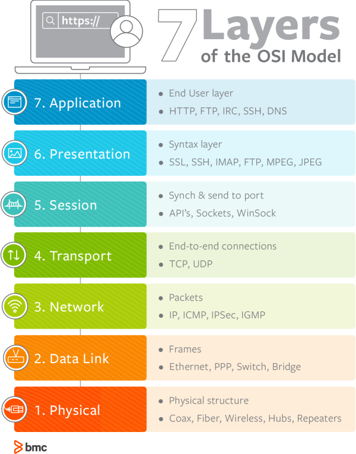

## NETWORK

    
<b>OSI 7계층과 TCP/IP 4계층</b>

# OSI 7 계층

컴퓨터 네트워크 프로토콜 디자인과 통신을 계층으로 나누어서 설명한 것.

= 네트워크에서 통신일 일어나는 과정을 7가지 과정으로 나눈 것이다.

## 왜 7 계층으로 나누었을까?

계층을 나눈 이유는 각 계층이 다른 계층에 대해 몰라도 되며, 그로 인해 각 계층의 캡슐화와 은닉이 가능하게 된다. 따라서 어떤 문제가 발생할 경우, 그 문제와 관련된 계층만 살펴보면 되며, 다른 계층을 신경 쓰지 않아도 된다.

사용자 관점에서 보면 통신이 일어나는 흐름을 한눈에 알아보기 쉽고, 이해하기가 쉬워지는 것도 있다.

<aside>
☁️ `TCP/IP` : 범용적으로 사용하는 TCP 프로토콜과 IP 프로토콜을 OSI 7계층에 맞추어 추상화 시킨 모델이다.

</aside>

## 각 7 계층 특징

### Physical Layer

`데이터 전달`

- 이 계층은 주로 전기적, 기계적, 기능적인 특성을 이용해서 **물리적인 통신 케이블**로 데이터를 전송하는 계층이다.
- 이 계층에서 사용되는 통신 단위는 비트(0과 1로 이루어진)로, 데이터를 전달하는 것에만 집중한다.
    - 즉, 데이터가 무엇인지, 내가 받아야 하는 데이터가 무엇인지, 어떤 에러가 있는지에 대해서는 전혀 신경쓰지 않는다.
- 데이터를 전기적인 신호로 변환해서 주고 받는 기능을 하며, 이 계층에는 대표적으로 통신 케이블, 리피터, 허브 등이 있다.

### Data Link Layer

`에러검출`, `흐름제어`

- **물리 계층을 통해 송수신 되는 정보의 오류과 흐름을 관리하여 안전한 정보의 전달을 수행할 수 있도록 도와주는 역할을 한다.**
    - 즉, 통신에서의 오류를 찾고 재전송하는 기능을 수행하는 계층이다.
    - 포인트 투 포인트 간 신뢰성 있는 전송을 보장하기 위한 계층이다.
- 데이터링크 계층에서는 **맥 주소(물리주소)**를 가지고 통신한다.
    - 또, 이 계층에서 주고 받는 것을 **프레임**이라고 하고, 대표적인 장비로는 브릿지, 스위치 등이 있다.
    - 물리주소 : 해당 네트워크에 연결된 접속 장치의 주소

### Network Layer

`라우팅`, `흐름제어`, `오류제어`

- 데이터를 목적지까지 가장 안전하고 빠르게 전달하는 기능을 가진다.
    - 이 계층의 주요 역할은 **라우팅**으로, 경로를 선택하고 주소를 정하고, 경로에 따라 패킷을 전달해준다.
        - 데이터를 연결하는 다른 네트워크를 통해 전달함으로써 인터넷이 가능하게 만드는 계층이다.
    - 이때에는 **IP 주소(논리주소)**를 사용한다.
        - 네트워크 관리자가 직접 주소를 할당하며, 계층적 구조를 가진다.
    - 라우팅, 흐름제어, 세그멘테이션, 오류 제어 등을 수행한다.

### Transport Layer

`흐름제어`, `오류제어`, `오류제어`, `혼잡제어`

- 통신을 활성화하기 위한 계층이다.
    - 보통 TCP 프로토콜을 이용하며, 포트를 열어서 응용 프로그램들이 전송을 할 수 있게 한다.
- 데이터가 왔다면 4계층에서 해당 데이터를 하나로 합쳐서 5계층으로 던져준다.
    - 메시지를 전송 가능한 세그먼트 단위로 캡슐화 하거나, 세그먼트를 다시 메시지로 재조립 하는 역할을 수행
    - 각 세그먼트도 순서번호를 가진다.
- 양 끝단의 사용자들이 신뢰성있는 데이터를 주고 받을 수 있도록 해주어, 상위 계층들이 데이터 전달의 유효성이나 효율성을 생각하지 않도록 해준다.
- 특정 연결의 유효성을 제어한다.
    - **패킷들의 전송이 유효한지 확인하고 전송 실패한 패킷들을 다시 전송한다는 것을 뜻한다.**

### Session Layer

`세션관리`

- 데이터가 통신하기 위한 논리적인 연결을 한다.
    - 목적지 주소를 붙인다.
    - 세션 계층은 네트워크 계층과 다르게 **응용 프로그램 관점에서 봐야 한다.**
        - 세션 설정, 유지, 종료, 전송 중단 시 복구 등의 기능을 가진다.
- 양 끝단의 응용 프로세스가 통신을 관리하기 위한 방법을 제공한다.
    - TCP/IP 세션을 만들고 없애는 책임을 진다.

### Presentation Layer

`데이터표현관리`

- 데이터 표현이 상이한 응용 프로세스의 독립성을 제공하고, 암호화 한다.
- 코드 간의 번역을 담당하여 사용자 시스템에서 데이터의 형식상 차이를 다루는 부담을 계층으로부터 덜어준다.
    - 인코딩, 암호화 등의 동작이 이 계층에서 이루어진다.

### Application Layer

`응용서비스`

- 최종 목적지로서, HTTP, FTP, Telnet 등과 같은 프로토콜이 있다.
- 통신 패킷들은 위의 프로토콜에 의해 모두 처리되며 우리가 사용하는 브라우저나 메일 프로그램 등은 보다 쉽게 프로토콜을 사용하게 해주는 응용 프로그램이다.
    - 즉, 모든 통신의 양 끝단은 HTTP 와 같은 프로토콜이지, 응용 프로그램이 아니다.
- 응용 프로세스와 직접 관계하여 일반적인 응용 서비스를 수행한다.

---

    
<b>TCP/UDP</b>

### TCP vs UDP

> TCP : 인터넷 상에서 데이터를 메시지의 형태로 보내기 위해 IP와 함께 사용하는 프로토콜
>
- TCP는 **연결형 서비스를 지원**하는 프로토콜로 인터넷 환경에서 기본으로 제공한다.
    - **패킷을 전송하기 위해 논리적 경로를 배정한다.**
    - **가상회선 패킷 교환 방식**을 사용한다.

- 높은 신뢰성을 보장하며, 흐름 제어 및 혼잡 제어를 담당한다.
    - 3-handshaking, 연결 지향형 서비스로 높은 신뢰성을 가지는 것이다.
    - 전송 순서를 보장한다.
        - 패킷에 부여한 번호를 통해 순서를 파악한다.
- 연결 지향형이기 때문에 UDP보다 속도가 느리다.
    - 데이터의 흐름 제어나 혼잡 제어와 같은 기능을 하는데, 이 기능들은 CPU를 사용하기 때문에 속도에 영향을 준다.
- 전이중, 점대점 방식이다.

즉, TCP는 연속성 보다는 신뢰성 있는 전송이 중요할 때에 사용하는 프로토콜이라고 할 수 있다.

> UDP : 데이터를 데이터그램 단위로 처리하는 프로토콜
>
- **데이터그램**이란 독립적인 관계를 지니는 패킷이라는 뜻으로, UDP의 빠른 속도가 가능하도록 한다.
- **비연결형 프로토콜**로, 연결을 위해 할당하는 논리적인 경로가 없다.
    - 각각의 패킷은 다른 경로로 전송되고, 전송된 패킷은 다른 경로로 독립적으로 처리하게 된다.
    - 각 패킷은 최적의 경로를 선택하여 간다.
    - 즉, 패킷의 순서가 다를 수 있다는 것!
- 정보를 주고 받을 때 정보를 보내거나 받는 신호 절차를 거치지 않는다.
- UDP 헤더의 CheckSum 필드를 통해 최소한의 오류만 검출한다.
- 신뢰성이 낮지만, TCP보다 속도가 빠르다.
    - 패킷을 순서에 맡게 재조립하거나, 패킷에 순서를 부여하는 과정이 없고, 흐름 제어 또는 혼잡 제어와 같은 기능도 없기 때문에 속도가 빠르다.
    - 네트워크 부하가 적다는 장점이 있지만 신뢰성이 낮은 것이 단점이다.

즉, UDP는 신뢰성보다는 연속성이 중요한 서비스, 예를 들면 실시간 서비스에 자주 사용된다.

    
<b>3way-handshake, 4way-handshake</b>

- 3-way handshaking 과정을 통해 연결을 설정하고, 4-way handshaking 을 통해 해제한다.
    - `3-handshaking` : 목적지와 수신지를 확실히 하여 정확한 전송을 보장하기 위해 세션을 수립하는 과정

    ☁️ 3-handshaking
    1. SYN : 클라이언트는 ISN을 담아 SYN을 보낸다.
    *(ISN : 새로운 TCP연결의 첫번째 패킷에 할당된 임의의 시퀀스 번호, 초기 네트워크 할당을 위한 고유 시퀀스 번호)*

    2. SYN + ACK : 서버는 클라이언트의 SYN을 수신하고, 서버의 ISN을 보내며 승인번호로 클라이언트의 ISN + 1을 보낸다.

    3. ACK : 클라이언트는 서버의 ISN + 1 한 값인 승인번호를 담아 ACK를 서버에 보낸다.

  이 과정을 통해 신뢰성이 구축된다.

    ☁️ 4-handshaking
    1. 클라이언트가 연결을 닫으려고 할 때 FIN으로 설정된 세그먼트를 보낸다.
    그리고 클라이언트는 FIN_WAIT_1 상태로 들어가고 서버의 응답을 기다린다.

    2. 서버는 클라이언트로 ACK라는 승인 세그먼트를 보낸다. 그리고 해당 서버는 CLOSE_WAIT 상태에 들어간다. 그리고 클라이언트는 FIN_WAIT_2 상태에 들어간다.

    3. 서버는 ACK를 보내고 일정 시간 후에 클라이언트에 FIN이라는 세그먼트를 보낸다.

    4.  클라이언트는 TIME_WAIT 상태가 되고 다시 서버로 ACK를 보내서 서버는 CLOSED 상태가 된다.
        이후 클라이언트는 **어느 정도의 시간을 대기한 후** 연결이 닫히고 클라이언트와 서버의 모든 자원의 연결이 해제된다.

        ———————————————————————————————————————————-

        **왜 일정 시간을 기다리고 끝낼까?** 🤔
        
        → 첫번째는 `지연 패킷`이 발생할 경우를 대비하기 위함이다. 패킷이 뒤늦게 도달하고 이를 처리하지 못한다면 데이터 무결성 문제가 발생한다.

  두번째는 `두 장치가 연결이 닫혔는지 확인`하기 위함이다. 만약 서버가 끝내도 된다라고 보내는 상태에서 닫히게 되면 다시 새로운 연결을 하려고 할 때 서버의 상태가 줄곧 끝내도 된다는 상태이기 때문에 접속 오류가 나타나게 된다.

    
<b>흐름제어, 혼잡제어, 오류제어</b>

`흐름제어`

- 데이터를 송신하는 곳과 수신하는 곳의 **데이터 처리 속도를 조절**하여 수신자의 버퍼 오버플로우를 방지하는 것.

`혼잡제어`

- 네트워크 내의 패킷 수가 넘치게 증가하지 않도록 방지하는 것.

`오류제어`

- 전송시 오류나 분실한 프레임을 찾아 재전송
- 프레임 중복을 막기 위한 메커니즘도 사용한다.

`접근제어`

- 같은 링크에 다수 장치가 연결되어 있을 때, 주어진 순간에 링크를 사용하는 장치 결정

---

    
<b>HTTP</b>

# HTTP

- HTTP란 서버/클라이언트 모델을 따라 데이터를 주고 받기 위한 프로토콜이다.

  → 수신자 측에 의해 요청이 초기화되는 프로토콜이다.

- 인터넷에서 하이퍼텍스트를 교환하기 위한 통신 규약으로 80번 포트를 기본 포트로 사용하고 있다.
  - 서버가 80번 포트에서 요청을 기다리고 있고, 클라이언트는 80번 포트로 요청을 보내게 된다.
- HTTP는 World-Wide-Web 기반에서 세계적인 정보를 공유하는데 큰 역할을 하였다.

## HTTP 구조

- HTTP는 애플리케이션 레벨의 프로토콜로, TCP/IP 위에서 작동한다.
- 상태를 가지지 않는 무상태(Stateless) 프로토콜이고, Method, Path, Version, Headers, Body 등으로 구성된다.
- 클라이언트가 요청(request)하면 서버가 응답(reponse) 하는 형태이다.
- HTTP는 평문 그대로를 담아 전달하기 때문에 보안 측면에서는 우수하지 않다.

### 클라언트와 서버를 분리한 이유?

- 클라이언트는 UI에 집중할 수 있고, 서버는 데이터를 다루는 데에만 집중할 수 있다.
  - 즉, 각 역할을 나누고 해당 역할에만 책임을 부여하여 독립적으로 고도화할 수 있게 하였다.

## HTTP 특징

### 무상태성(stateless)

- `무상태` : 클라이언트와 서버 사이에 **상태를 유지하지 않는다.**
  - 통신에 필요한 모든 상태 정보를 클라이언트가 가지고 있고, 서버와 통신하는 경우 데이터를 실어보낸다.
    - 서버의 관점에서는 단순히 데이터를 받아 응답만 해주면 되기 때문에 **상태 유지에 대한 부하가 감소한다.**
    - 상태 정보를 서버가 저장하지 않으므로 특정 서버에서 문제가 있을 경우 **다른 서버를 사용해서 다시 요청을 처리할 수 있다.**

      → 만약 상태가 있는 서버라면 해당 상태 값을 다른 서버는 모르기 때문에 대신 사용할 수 없음.

- 따라서 서버 확장(스케일아웃)이 용이하다는 장점이 따라오지만, 항상 클라이언트가 요청에 필요한 데이터를 담아 전달하기 때문에 메모리를 더 많이 사용하게 된다는 단점이 있다.
- 따라서 HTTP 통신은 데이터를 전송할 때마다 연결하고 바로 끊어버린다.

    🤔 HTTP 통신에서 상태를 유지할 수 있는 방법은 없을까?
    - 쿠키 : 브라우저에 저장하는 것을 말한다.
    - 세션 : 서버에 사용자 정보를 저장하는 것을 말한다.
    - 토큰 : 보호할 데이터를 토큰화하여 원본 데이터 대신 인증용으로 사용하는 것을 말한다.

### 비연결성(Connectionless)

- HTTP는 연결을 유지하지 않는다.
  - 이 특징 덕분에 서버 자원을 매우 효율적으로 사용할 수 있다.
- 연결이 유지되지 않기 때문에 연결을 위한 리소스가 줄게 되어 더 많은 요청을 처리할 수 있게 된다.
- 하지만 매번 요청마다 다시 연결을 새롭게 해야한다는 것이므로, 연결/해제에 대한 오버헤드가 발생한다는 단점도 있다.
- HTTP는 해당 문제를 해결하기 위해 `HTTP 지속 연결(KeepAlive)`이라는 것을 통해 해결하고자 한다.
  - 소켓 연결을 일정 시간 동안 더 유지함으로써, 필요한 자원들을 모두 다운받을때까지 연결이 종료되지 않고, 요청/응답이 반복된 뒤 종료된다.

    
<b>HTTP status code</b>

## HTTP 상태코드

- 클라이언트가 보낸 요청의 처리 상태를 응답에서 알려주는 기능을 한다.
- 100 ~ 500번대 숫자로 이루어져 있다.
- `1XX` (정보) : 서버가 요청을 수신했으며, 계속 처리 중임을 나타내는 **중간 응답**이다.
- `2XX` (성공) : 클라이언트의 요청이 성공했음을 나타낸다.
- `3XX`(리디렉션) : 클라이언트가 요청을 완료하기 위해 **리디렉션과 같은 추가 작업을 수행해야 함**을 나타낸다.
- `4XX` (클라이언트 오류) : 누락되거나 잘못된 매개변수와 같은 클라이언트 요청으로 오류가 있음을 나타낸다.
- `5XX` (서버 오류) : 요청을 처리하는 동안 서버 측에서 오류가 발생했음을 나타낸다.

    
<b>HTTP METHOD</b>

## HTTP 메서드

- 서버에 주어진 리소스에 수행하길 원하는 행동, 서버가 수행해야 할 동작을 지정하는 요청을 보내는 방법에 해당한다.
- 주요 메소드
  - `GET` : 리소스 조회
    - 정적 자원을 조회할 수 있고, 동적 자원도 조회할 수 있다.
      - 동적 자원은 쿼리 파라미터, Path 파라미터 등을 활용하며 조회할 수 있다.
  - `POST` : 요청 데이터 처리, 주로 등록에 사용한다.
    - 메시지 바디에 요청에 필요한 데이터를 전달하면 서버가 해당 바디의 데이터를 처리하여 업데이트한다.
    - 주로 전달된 데이터로 신규 리소스를 등록하거나 프로세스를 처리하는데에 사용한다.
  - `PUT` : 리소스를 대체(덮어쓰기), 해당 리소스가 없으면 생성한다.
    - 리소스를 대체(수정)하는 메소드
    - 있으면 수정하고, 없으면 새로 생성한다.
  - `PATCH` : 리소스 부분 변경
    - 리소스 일부 부분을 변경하는 메소드
  - `DELETE` : 리소스 삭제
- 기타 메소드
  - HEAD : GET과 동일하지만 메시지 부분(Body)을 제외하고, 상태 줄과 헤더만 반환
    - 리소스를 받지 않고 찾는 것만 원하는 경우, 즉 상태 코드만 확인하고 싶은 경우 사용할 수 있다.
  - OPTIONS : 대상 리소스에 대한 통신 가능 옵션(메서드)을 설명(주로 CORS에서 사용)
    - 본 요청을 하기 전에 안전한지 미리 검사하는 것으로, 서버의 지원 가능한 HTTP 메서드와 출처를 응답 받아 CORS 정책을 검사하기 위해 사용한다.
  - CONNECT : 대상 자원으로 식별되는 서버에 대한 터널을 설정
  - TRACE : 대상 리소스에 대한 경로를 따라 메시지 루프백 테스트를 수행
    - 일종의 검사용으로 서버에 도달 했을 때 최종 패킷의 요청 패킷 내용을 받을 수 있어, 요청했던 패킷 내용과 응답 받은 패킷 내용을 비교하여 변조 유무를 확인할 수 있다.

    ☁️ HTML Form은 GET과 POST만 가능하다.
    HTML Form을 통해 전송된 데이터는 쿼리 파라미터로 전달된다.

--

    ☁️ PUT vs PATCH
    PUT 메소드는 요청한 URI에 담긴 페이로드의 자원으로 대체하는 메서드라고 설명한다. 여기서 대체한다는 의미는 자원을 변경하기도 하는 것이고, 새로운 자원으로 교체한다는 뜻도 있다.

    1. 만약 요청한 URI 아래에 자원이 존재하지 않는다면
    자원이 존재하지 않으면 앞서 말한 것처럼 새로운 자원으로 저장한다.

    2. 요청한 URI 아래에 자원이 존재한다면
    페이로드에 담긴 정보를 이용하여 새로운 자원을 만들어 기존에 존재하던 자원을 대체한다.
    —————————————————————————————————————————————-
     PATCH 메소드는 요청한 자원에 대한 부분적인 수정을 적용하기 위한 메서드로, **PUT 메서드를 사용하는 클라이언트는 해당 자원의 상태를 모두 알고 있다고 가정되어야 한다**는 주의점이 있다.

    즉, PUT 메서드를 통해 전달된 페이로드만으로도 자원의 전체 상태를 나타낼 수 있어야 한다는 것이다.
    PUT 메서드를 통해 전달되는 페이로드는 새로운 자원으로 대체될 수 있기 때문에 반드시 완전한 상태를 가져야 하고, 만약 그렇지 않으면 null 값을 가진 빈 필드가 존재할 수 있게 된다.

    하지만 PATCH 메소드는 그렇지 않기 때문에 부분적인 수정으로 사용할 수 있는 것이다.
    이 부분은 `멱등성`에서 더욱 드러난다.

### 멱등성

- **여러 번 동일한 요청을 보냈을 때 서버에 미치는 의도된 영향이 동일한 경우**, 멱등성이 있다고 말한다.
- SAFE 요청들(GET, HEAD 등)에 더해 PUT, DELETE 가 멱등한 메소드이다.
- 멱등성은 왜 필요할까? 🤔
  - `요청의 재시도` 때문이다.
  - HTTP 요청이 멱등하다면 요청이 실패한 경우 재요청을 보내도 의도한 결과가 동일하기 때문에 안전하다. 하지만 멱등하지 않다면 의도한 결과가 아닌 예상치 못한 결과를 초래할 수 있다.
  - 따라서, 클라이언트는 멱등성을 고려하여 재시도 요청을 시도해야 한다.
- **POST와 PATCH 메서드는 멱등하지 않은 메서드이다.**
  - POST는 새로운 리소스를 계속해서 생성하기 때문에 동일한 요청을 여러번 보내면 동일한 리소스가 여러 개 생길 수 있기 때문이다.
  - PATCH는 메서드 자체가 멱등이면서 멱등이지 않게 설계할 수 있기 때문이다.
    - 예를 들어, 단순히 리소스를 수정하도록 구현되어 있다면 멱등성을 가질 수 있지만, 해당 요청에 의해 값이 일정하게 증가하도록 하거나, 요청에 의존하여 값이 변경된다면 해당 요청은 멱등성을 가지지 않는다.
- **DELETE 메서드가 멱등한 메서드인 이유는?**
  - DELETE 요청을 처음에 보내면 해당 리소스는 성공적으로 삭제될 것이다. 그 이후 동일한 요청을 보냈을 때 리소스가 존재하지 않기 때문에 DELETE 요청은 처리되지 않고 404 NOT FOUND를 반환할 것이다. 따라서, 의도한 결과가 그대로 유지되기 때문에 멱등하다고 한다.

    
<b>HTTP 1.1 VS HTTP 2.0</b>

## HTTP 1.1 vs HTTP 2.0

### HTTP 1.1

- 현재 가장 많이 사용하는 버전이며, **기본적으로 커넥션 하나당 하나의 요청을 처리하도록 설계되어 있다.**
  - 그렇기 때문에 동시 전송 문제와 다수의 리소스를 처리하기에 속도와 성능 이슈를 가지고 있다.
  - 이로 인해 HTTP 1.1이 가진 문제는 다음과 같다.
    - `Head Of Line Blocking`(특정 응답 지연) : 우선 처리 요청의 응답이 지연되어 다음 요청이 무한 대기 상태가 된다.
    - `Round Trip Time` 증가 : 하나의 커넥션에 하나의 요청을 처리하기 때문에 요청별로 커넥션이 생성되며, 이로 인해 3-way handshake가 반복적으로 일어나게 되어 불필요한 Round Trip Time이 증가하게 되어 네트워크 지연을 초래하는 것.
    - `헤비한 헤더 구조` : 매 요청마다 중복된 헤더값을 전송하게 되어 헤더 값이 크다.
- HTTP 1.1에 추가된 기능은 다음과 같다.
  - `Persistent connection` (지속 연결)
  - `Pipelining` : 하나의 커넥션에서 응답을 기다리지 않고 순차적인 여러 요청을 연속적으로 보내 그 순서에 맞춰 응답을 받는 방식으로 지연 시간을 줄인다.
    - 하지만 Head Of Line Blocking과 같이 문제점이 많아 없어졌다.
- 우리가 대부분 이용하는 기능은 HTTP 1.1에 만들어진 것이며 2는 성능 개선에 초점을 맞추었다.

### HTTP 2.0

- HTTP 1.1을 해결하고자 등장하였으며, HTTP 2.0은 성능 뿐만 아니라 속도 면에서도 1.1 보다 월등했다.
- `Multiplexed Streams`
  - 한 커넥션에 여러 개의 메시지를 동시에 주고 받을 수 있다.
- `Stream Prioritization`
  - 요청 리소스간의 의존관계(우선순위)를 설정할 수 있다.
  - 리소스 간의 우선순위를 정해 더 빠르게 처리할 수 있는 요청을 먼저 처리하도록 할 수 있어 지연을 방지할 수 있다.
- `Server Push`
  - HTML 문서 상에 필요한 리소스를 클라이언트 요청 없이 보낼 수 있다.
- `Header Compression`
  - Header 정보를 HPACK 압축방식을 이용하여 압축 후 전송한다.

    
<b>HTTPS</b>

# HTTPS

<aside>
☁️ HyperText Transfer Protocol over Secure Socket Layer

</aside>

- **HTTP의 보안적 약점을 보완한 프로토콜이다.**
- TCP 연결이 이루어진 후 TLS를 통해 암호화 설정이 되고 통신을 하는 방식으로 이루어진다.
- HTTPS는 기본 TCP/IP 포트로 443번 포트를 사용한다.
- 소켓 통신에서 일반 텍스트를 이용하는 대신에, 웹 상에서 정보를 암호화하는 **`SSL`이나 `TLS 프로토콜`을 통해 세션 데이터를 암호화한다.**
  - SSL, TLS 모두 기밀성, 데이터 무결성, ID 및 디지털 인증서를 사용한 인증을 제공하는 것이다.
  - 이를 통해 데이터의 적절한 보호를 보장한다.
  - 보호의 수준은 웹 브라우저에서의 구현 정확도와 서버 소프트웨어, 지원하는 암호화 알고리즘에 달려있다.

## SSL과 TLS

- SSL 인증서는 사용자가 사이트에서 제공하는 정보를 암호화한다.
- TLS 안에 SSL이 속한다.

### 인증서의 장점

- 암호화되어 전송되는 데이터는 중간에 누가 훔치거나 조작하려해도 암호화되어 있어 해독할 수 없다.
- 클라이언트가 접속하려는 서버가 신뢰할 수 있는 서버인지 확인할 수 있다.
  - 자신이 가진 공개키로 해독이 가능하다면 자신이 요청한 서버가 연결되는 비밀키로 암호화했다는 것이 보장되기 때문에
- SSL 통신에 사용할 공개키를 클라이언트에게 제공한다.

## HTTPS 의 원리

- 공개키 알고리즘 방식을 사용한다.
  - 암호화, 복호화할 수 있는 서로 다른 키를 이용한 암호화 방식을 사용하는 것.
  - **공개키로 암호화 하면 개인키로만 복호화 할 수 있다.** = 개인키는 소유한 사람만 가지므로 소유한 사람만 볼 수 있다.
  - **개인키로 암호화 하면 공개키로만 복호화할 수 있다.** = 공개키는 모두 공개되어 있으므로 인증된 정보임을 알려 신뢰성을 보장할 수 있다.
- 공개키 알고리즘 방식은 대칭키에 비해 느리다.
  - 그래서 **실제 전송되는 데이터의 암호화에는 대칭키 암호화 방식**을 사용하고 **키 교환에 공개키 암호화를 사용**하여 속도를 해결하고 있다.
  - HTTPS 연결 과정에서 서버와 클라이언트는 세션키를 교환한다.
    - 세션키 : 데이터를 암호화하기 위해 사용되는 대칭키
    - 세션키를 주고받기 위해 공개키(비대칭키) 방식을 사용한다.

## HTTPS의 동작 과정

1. 클라이언트가 서버로 최초 연결을 시도한다.
2. 서버는 공개키(인증서)를 클라이언트에게 넘겨준다.
3. 클라이언트는 인증서의 유효성을 검사하고 세션키를 발급한다.
4. 클라이언트는 세션키를 보관하고 추가로 서버의 공개키로 세션키를 암호화하여 서버로 전송한다.
5. 서버는 개인키로 세션키를 복호화하여 세션키를 얻고, 클라이언트와 동일한 세션키를 가지게 되어 데이터 전달이 가능해진다.

---

    
<b>REST API</b>

---

    
<b>COOKIE & SESSION</b>

---

    
<b>JWT</b>

---

    
<b>CORS</b>

---

    
<b>DNS</b>

---

    
<b>Blocking/Nonblocking&Synchronous/Asynchronous</b>

---

    
<b>웹 통신의 흐름(www.example.com을 입력했을 때)</b>

---
